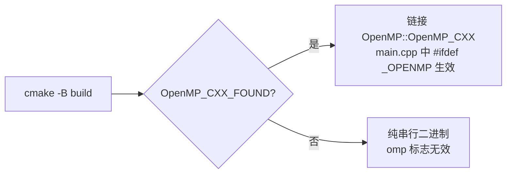
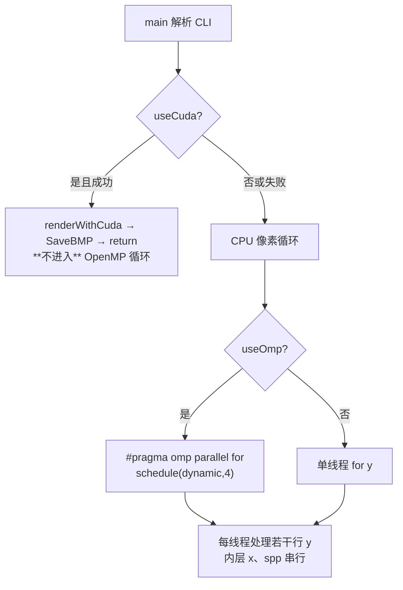
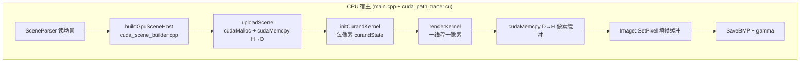
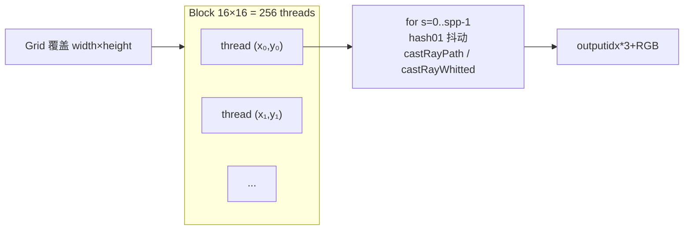
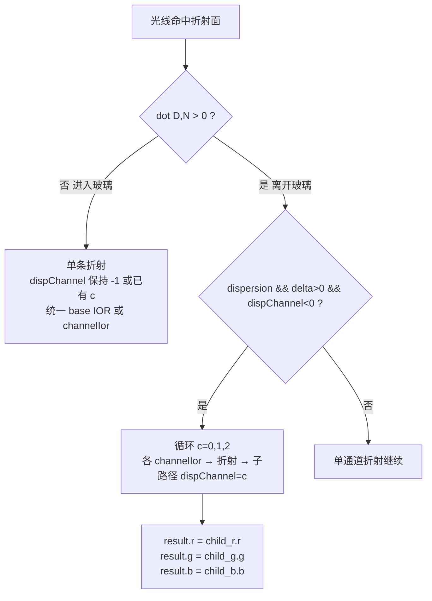
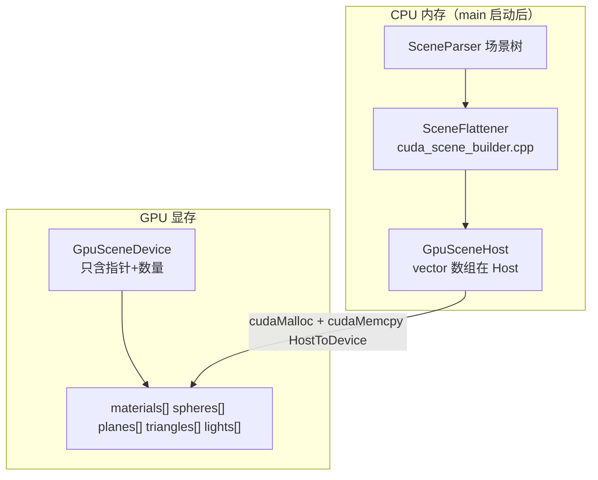
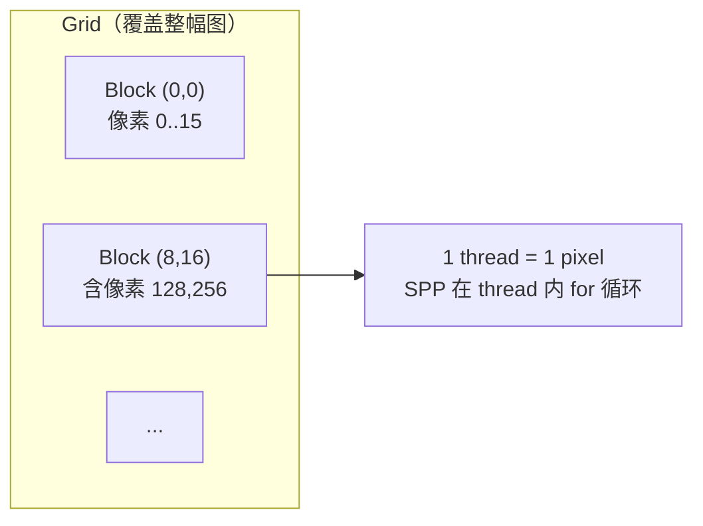

# PA1 基础功能实现说明（验收答辩用）

> 工作目录：`code/`  
> 本文档面向 **今日验收答辩**，按「原理 → 文件/函数 → 关键逻辑 → 常见坑」组织；§1–§6 为 **基础要求**，§7 展开 **Gamma 校正** 与 **OpenMP 并行** 两个加分项，其余加分功能见 §7.3 简表。

---

## 目录

1. [Whitted-Style 光线追踪（基础要求 1）](#1-whitted-style-光线追踪基础要求-1)
2. [路径追踪（基础要求 2）](#2-路径追踪基础要求-2)
3. [Next Event Estimation — NEE（§4.3）](#3-next-event-estimation--nee-43)
4. [Cook-Torrance 光泽材质（§4.2）](#4-cook-torrance-光泽材质-42)
5. [场景文件与命令行](#5-场景文件与命令行)
6. [关键文件对照表](#6-关键文件对照表)
7. [加分项](#7-加分项)
   - [7.1 Gamma 校正](#71-gamma-校正)
   - [7.2 CPU 加速（OpenMP）](#72-cpu-加速openmp)
   - [7.3 其他加分项简表](#73-其他加分项简表)
   - [7.4 GPU/CUDA 并行加速](#74-gpucuda-并行加速)
   - [7.5 MIS（多重重要性采样）](#75-mis多重重要性采样)
   - [7.6 深入：CPU/GPU/色散工作流程](#76-深入cpugpu色散工作流程)
   - [7.7 零基础读懂：CPU/GPU/色散](#77-零基础读懂cpugpu色散)

---

## 1. Whitted-Style 光线追踪（基础要求 1）

### 1.1 原理是什么

Whitted-Style 是一种 **递归确定性** 光线追踪：

- **漫反射（Diffuse）**：在命中点用 **Phong 模型** 计算直接光照；对每个光源发射 **阴影射线（Shadow Ray）**，若中间无遮挡则累加光照贡献。
- **完美镜面（Reflect）**：按反射定律计算反射方向，递归追踪子光线，结果乘以 `reflectColor`。
- **折射（Refract）**：按 **Snell 定律** 计算折射方向（全内反射时退化为镜面反射），递归追踪子光线，结果乘以 `refractColor`。
- **发光体（Emissive）**：直接返回 `emission`，不再弹射。

Whitted 在漫反射面 **终止** 递归，不做间接光积分；玻璃在 Whitted 阴影检测中视为 **透明**（不遮挡点光源）。

### 1.2 在哪些文件/函数实现

| 组件 | 位置 |
|------|------|
| 主入口 | `include/raytracer.hpp` — `RayTracer::trace()` → `castRayWhitted()` |
| 递归追踪 | `castRayWhitted(ray, depth, tmin)` |
| 漫反射着色 | `shadeDiffuse()` |
| 镜面反射 | `castRayWhitted` 内 `MaterialType::REFLECT` 分支 |
| 折射 | `computeRefractDirection()` + `castRayWhitted` 内 `REFRACT` 分支 |
| 阴影检测 | `isInShadow(p, N, light)` |
| 材质类 | `include/material.hpp` — `Material`, `ReflectMaterial`, `RefractMaterial`, `EmissiveMaterial` |
| 场景解析 | `src/scene_parser.cpp` — `ReflectiveMaterial` / `RefractiveMaterial` |

### 1.3 关键代码逻辑

**入口与模式分发**（`raytracer.hpp`）：

```cpp
Vector3f trace(const Ray &ray) const {
    if (mode == RenderMode::WHITTED) {
        return castRayWhitted(ray, 0, RAY_EPSILON);
    }
    return castRayPath(ray, 0, Vector3f(1,1,1), true);
}
```

**`castRayWhitted` 伪代码**：

```
castRayWhitted(ray, depth, tmin):
    if depth > MAX_TRACE_DEPTH: return background
    if no hit: return background
    if EMISSIVE: return emission
    if opaque back face: return black
    if GLOSSY: shadeGlossyWhitted (Whitted 下仍走 Phong 直接光)
    if DIFFUSE: shadeDiffuse (Phong + shadow ray)
    if REFLECT:
        R = reflect(D, faceNormal)
        origin = offsetAlongNormal(hitPoint, N, ORIGIN_OFFSET)
        return reflectColor * castRayWhitted(Ray(origin, R), depth+1)
    if REFRACT:
        T = computeRefractDirection(D, geomN, ior)
        origin = offsetAlongRay(hitPoint, T, REFRACT_ORIGIN_OFFSET)  // 沿折射方向偏移
        return refractColor * castRayWhitted(Ray(origin, T), depth+1, REFRACT_RAY_TMIN)
```

**Snell 折射**（`computeRefractDirection`，封闭网格、几何法线朝外）：

```
dot(D, geomN) < 0  →  进入介质，η = 1/ior
dot(D, geomN) > 0  →  离开介质，η = ior/1，法线取反

k = 1 - η²(1 - cos²θ)
k < 0  →  全内反射，返回镜面反射方向
否则   →  T = normalize(ηD + (η cosθ - √k) N)
```

对应代码（节选）：

```97:114:code/include/raytracer.hpp
    static Vector3f computeRefractDirection(const Vector3f &D, const Vector3f &geomN, float ior) {
        float etai = 1.0f;
        float etat = ior;
        Vector3f n = geomN;
        float cosTheta = Vector3f::dot(D, n);
        if (cosTheta > 0.0f) {
            etai = ior;
            etat = 1.0f;
            n = -n;
            cosTheta = -cosTheta;
        }
        float eta = etai / etat;
        float k = 1.0f - eta * eta * (1.0f - cosTheta * cosTheta);
        if (k < 0.0f) {
            return (D - 2.0f * Vector3f::dot(D, n) * n).normalized();
        }
        return (eta * D + (eta * cosTheta - sqrtf(k)) * n).normalized();
    }
```

**阴影射线**（`isInShadow`）：

```
L = 光源方向（由 light->getIllumination 给出）
shadowOrigin = p + N_shadow * SHADOW_EPSILON   // 沿与 L 同侧的法线偏移，防自相交
maxT = light->getDistance(p)                   // 点光源为到光源距离
若 intersect 且 t < maxT - ε:
    若 blocker 为 REFRACT → 不遮挡（玻璃透明）
    否则 → 在阴影中
```

**材质类型**（`material.hpp`）：

- `ReflectMaterial`：仅 `reflectColor`，漫反射色为 0。
- `RefractMaterial`：`refractColor` + `refractIndex`（IOR）。
- `EmissiveMaterial`：`emission`，Whitted 下直接返回。

### 1.4 常见坑与修复

| 问题 | 原因 | 修复 |
|------|------|------|
| **镜面球/地板变黑（黑镜）** | 反射/折射子光线起点用 **法线偏移** `p + N*ε`，但折射后光线在 **介质内部**，沿法线偏移可能仍落在同一三角形内，立刻再次自相交 | **折射** 改用 `offsetAlongRay(p, newDir, ε)` 沿 **折射方向** 推出；反射仍用 `offsetAlongNormal` |
| 折射全黑/闪烁 | 进入/离开介质时 η 取反错误 | 用 **几何法线** `geomN`（不 flip 成 face normal）配合 `computeRefractDirection` 的进出判定 |
| 阴影 acne | 阴影射线从表面出发无偏移 | `p + shadowN * SHADOW_EPSILON`，且 `shadowN` 与 `L` 同侧 |
| 玻璃挡光 | Whitted 阴影应允许光穿过玻璃 | `isInShadow` 中 `blocker == REFRACT` 时返回 **false**（不遮挡） |
| 背面漏光 | 从物体内部看到背面 | `isOpaqueBackFace`：非折射/非发光材质且 `dot(D,N)>0` 时返回黑色 |

**偏移函数对比**（核心修复点）：

```81:87:code/include/raytracer.hpp
    static Vector3f offsetAlongRay(const Vector3f &p, const Vector3f &dir, float eps) {
        return p + dir.normalized() * eps;
    }

    static Vector3f offsetAlongNormal(const Vector3f &p, const Vector3f &n, float eps) {
        return p + n.normalized() * eps;
    }
```

- **反射**：`offsetAlongNormal(hitPoint, N, ORIGIN_OFFSET)` — 推出到反射侧半空间。
- **折射**：`offsetAlongRay(hitPoint, newDir, REFRACT_ORIGIN_OFFSET)` — 沿折射光线进入玻璃/空气，避免黑镜。

---

## 2. 路径追踪（基础要求 2）

### 2.1 原理是什么

路径追踪求解 **渲染方程**（蒙特卡洛估计）：

$$
L_o(x, \omega_o) = L_e(x, \omega_o) + \int_{\Omega} f_r(x, \omega_i, \omega_o)\, L_i(x, \omega_i)\, \cos\theta_i \,\mathrm{d}\omega_i
$$

实现要点：

- **余弦加权半球采样**（Lambertian）：pdf = cosθ/π，贡献简化为 `albedo × Li`（pdf 与 cos 相消）。
- **Throughput（路径权重）**：沿路径累积 `reflectColor` / `refractColor`；命中发光体返回 `throughput × emission`。
- **俄罗斯轮盘赌（RR）**：深度 ≥ `RR_START_DEPTH(8)` 时，以 `max(0.15, luminance(throughput))` 概率继续，存活时除以该概率保持 **无偏**。
- **深度限制**：`MAX_TRACE_DEPTH = 12`。
- **发光材质 + 面光源场景**：`scene_path.txt` 中天花板为 `EmissiveMaterial`，并配 `AreaLight` 三角形（几何与光源一致）。

### 2.2 在哪些文件/函数实现

| 组件 | 位置 |
|------|------|
| 路径主函数 | `castRayPath(ray, depth, throughput, countEmissive)` |
| 漫反射路径 | `shadeDiffusePath()` |
| 镜面/折射路径 | `traceReflectChild()`, `traceRefractChild()` |
| 半球采样 | `sampleCosineHemisphere()` |
| RR | `survivalProbability()`, `shadeDiffusePath` 内 depth ≥ 8 分支 |
| 发光体 | `EmissiveMaterial`，`castRayPath` 中 `countEmissive` 控制是否计光 |
| 主循环 / SPP | `src/main.cpp` |

### 2.3 关键代码逻辑

**`castRayPath` 伪代码**：

```
castRayPath(ray, depth, throughput, countEmissive):
    if depth > MAX: return 0
    if no hit: return 0
    if EMISSIVE:
        if !countEmissive: return 0    // NEE 模式下间接路径不计发光体（见 §3）
        return clamp(throughput * emission)
    if opaque back face: return 0
    if REFLECT: return traceReflectChild(...)
    if REFRACT: return traceRefractChild(...)
    if GLOSSY: return shadeGlossyPath(...)
    return shadeDiffusePath(...)
```

**漫反射间接光**（`shadeDiffusePath`）：

```
direct = 0
if useNEE(): direct = sampleDirectEmissive + sampleDirectPointLights   // §3

wi, pdf = sampleCosineHemisphere(N)
if depth >= RR_START_DEPTH:
    rrProb = max(0.15, luminance(throughput * albedo))
    if random > rrProb: skip indirect
indirect = albedo * Li / rrProb
return clamp(direct + indirect)
```

**余弦加权采样**（pdf = cosθ/π）：

```139:153:code/include/raytracer.hpp
    Vector3f sampleCosineHemisphere(const Vector3f &normal, float &pdf) const {
        float u1 = uniform();
        float u2 = uniform();
        float phi = 2.0f * M_PI_F * u1;
        float cosTheta = sqrtf(u2);
        float sinTheta = sqrtf(fmaxf(0.0f, 1.0f - cosTheta * cosTheta));
        // ... 构建正交基 ...
        pdf = cosTheta / M_PI_F;
        return tangent * (cosf(phi) * sinTheta) + bitangent * (sinf(phi) * sinTheta) + normal * cosTheta;
    }
```

**main.cpp SPP 与抖动（抗锯齿）**：

```132:149:code/src/main.cpp
    for (int y = 0; y < height; y++) {
        for (int x = 0; x < width; x++) {
            Vector3f accum = Vector3f::ZERO;
            for (int s = 0; s < spp; ++s) {
                float jx = float(x);
                float jy = float(y);
                if (spp > 1) {
                    jx += hash01(x, y, s);
                    jy += hash01(y, x, s + 31);
                }
                unsigned int seed = 1u + x + 7919u * y + 104729u * s;
                RayTracer tracer(scene, mode, seed);
                accum += tracer.trace(camera->generateRay(Vector2f(jx, jy)));
            }
            dImg.SetPixel(x, y, accum * (1.0f / spp));
        }
    }
```

- 路径模式默认 **SPP=64**；Whitted 默认 SPP=1。
- 每像素独立 `RayTracer` + 确定性 seed，保证可复现。
- SPP>1 时子样本随机抖动，等价盒式滤波抗锯齿。

### 2.4 常见坑与修复

| 问题 | 修复 |
|------|------|
| 路径爆炸 / firefly | `clampRadiance`：亮度超过 30 时按比例缩放 |
| 无限递归 | `MAX_TRACE_DEPTH` + RR |
| 路径模式背景过亮 | 未命中返回 **0**（非 background），因路径追踪不采样环境贴图 |
| 镜面/玻璃在路径中行为 | 仍确定性反射/折射（`traceReflectChild` / `traceRefractChild`），throughput 乘材质色 |
| 与 NEE / MIS 配合 | `path_nee` 靠 NEE 算直接光；`path_mis` 在发光命中处加 MIS 权（§7.5） |

---

## 3. Next Event Estimation — NEE（§4.3）

### 3.1 原理是什么

NEE 在每次 **漫反射/光泽** 命中点，**显式向光源采样** 直接光照，而不是仅靠随机弹射碰巧命中小面积发光体。

**渲染方程直接光项**（单光源）：

$$
L_o \mathrel{+}= f_r(x,\omega_i,\omega_o)\, L_e(x,\omega_i)\, \cos\theta_o
$$

**点光源**：方向固定，需 shadow ray；贡献含 **距离平方反比** `1/r²`（由 `getIllumination` 与 BRDF 积分得到）。

**三角形面光源**：

1. 在三角形上 **均匀采样** 一点，面积 pdf：\(p_A = 1/A\)。
2. 转换到 **立体角 pdf**：
   \[
   p_\omega = p_A \cdot \frac{r^2}{\cos\theta_l}
   \]
   其中 \(r = \|x - x_l\|\)，\(\theta_l\) 为光源法线与 \(-\omega_i\) 夹角。
3. Lambertian 贡献（代码中已化简）：
   \[
   L = \frac{\text{albedo}}{\pi} \cdot L_e \cdot \cos\theta_o \cdot \frac{\cos\theta_l}{p_\omega}
     = \text{albedo} \cdot L_e \cdot \cos\theta_o \cdot \cos\theta_l \cdot \frac{A}{\pi r^2}
   \]

**实现架构说明**：代码中 **没有** 单独的 `castRayPathNEE` 函数；`RenderMode::PATH_TRACE_NEE` 时 `useNEE()` 为真，在 `shadeDiffusePath` / `shadeGlossyPath` 内累加直接光项。`PATH_TRACE` 与 `PATH_TRACE_NEE` 共用 `castRayPath`。

**path vs path_nee 对比目的**（§4.1）：同场景 `scene_path.txt`、同 SPP，仅差 NEE。两者 **期望相同**，但无 NEE 时直接光只能靠低概率间接命中发光体，方差极大、收敛慢、画面偏暗噪重；NEE 将直接光变为 O(1) 估计，软阴影与整体亮度显著改善。

> 说明：`path_nee` 用 NEE 估计直接光；`path_mis` 在 NEE 与 BRDF 采样之间加 MIS 权重（详见 [§7.5](#75-mis多重重要性采样)）。

### 3.2 在哪些文件/函数实现

| 组件 | 位置 |
|------|------|
| 模式开关 | `useNEE()` ← `RenderMode::PATH_TRACE_NEE` |
| 面光源 NEE（Lambert） | `sampleDirectEmissive()` → `sampleOneAreaLightDiffuse()` |
| 面光源 NEE（Glossy） | `sampleDirectEmissiveBRDF()` → `sampleOneAreaLightGlossy()` |
| 点光源 NEE | `sampleDirectPointLights()` / `sampleDirectPointLightsBRDF()` |
| 三角形采样 | `sampleTriangle()` |
| 可见性 | `isSegmentOccluded(from, to, N)` |
| 避免双重计光 | `castRayPath(..., countEmissive=!useNEE())` |

### 3.3 关键代码逻辑

**Lambert 面光源 NEE**（注释与实现一致）：

```209:244:code/include/raytracer.hpp
    // L = Le * (albedo/pi) * cos(theta_o) / pdf_omega, pdf_omega = (1/A) * r^2 / cos(theta_l)
    bool sampleOneAreaLightDiffuse(...) {
        lightPoint = sampleTriangle(v0, v1, v2);
        wi = normalize(lightPoint - hitPoint);
        // cosO, cosL 检查，isSegmentOccluded
        contrib += albedo * emission * cosO * cosL * lightArea / (M_PI_F * dist2);
    }
```

**NEE 与间接弹射的配合**（当前源码）：

```718:732:code/include/raytracer.hpp
            if (traceIndirect) {
                Vector3f origin = offsetAlongNormal(hitPoint, N, ORIGIN_OFFSET);
                MisIndirectCtx misCtx;
                const MisIndirectCtx *misPtr = nullptr;
                if (useMIS()) {
                    misCtx.pdfBrdf = pdf;
                    misCtx.wi = wi;
                    misCtx.shadingPoint = hitPoint;
                    misCtx.N = N;
                    misCtx.wo = -D;
                    misCtx.glossyMat = nullptr;
                    misPtr = &misCtx;
                }
                bool indirectEmissive = !useNEE() || useMIS();
                Vector3f Li = castRayPath(Ray(origin, wi), depth + 1, throughput, indirectEmissive, misPtr,
                                          dispChannel);
```

- NEE 开启：**直接光** 由 `sampleDirectEmissive` 等估计。
- **间接** 子路径：`path_nee` 传 `countEmissive=false`（避免与 NEE 双重计光）；`path_mis` 传 `countEmissive=true` 并附 `MisIndirectCtx`，在发光命中处用 MIS 权重（§7.5）；`path`（无 NEE）仍 `countEmissive=true`。
- 镜面/折射子路径仍 `countEmissive=true`（`traceReflectChild` / `traceRefractChild`）。

**`isSegmentOccluded`（NEE 专用段可见性）**：

```
shadowOrigin = from + shadowN * SHADOW_EPSILON
segDist = |to - shadowOrigin|
若最近交点 t >= segDist - ε → 未遮挡（含精确命中光源三角形）
若 blocker == EMISSIVE → 未遮挡（命中光源本身）
否则 → 遮挡（含 REFRACT 玻璃 — NEE 下玻璃仍挡光）
```

与 Whitted `isInShadow` 的区别：**NEE 下玻璃不透明**；**发光体不视为 blocker**。

### 3.4 常见坑与修复

| 问题 | 修复 |
|------|------|
| NEE 后画面过亮 | `path_nee` 间接子路径应 `countEmissive=false`；`path_mis` 用 MIS 合并间接发光 |
| 面光源 NEE 全黑 | 检查 cosO、cosL>0；光源三角形法线方向 |
| Shadow 自相交 | 法线侧向 `SHADOW_EPSILON` 偏移 |
| 命中光源三角形被判遮挡 | `t >= segDist - ε` 视为可见；`EMISSIVE` blocker 放行 |
| 无 NEE 极暗 | 正常现象：小面积发光体间接命中概率极低，用于对比实验 |

---

## 4. Cook-Torrance 光泽材质（§4.2）

### 4.1 原理是什么

**Cook-Torrance 微表面 BRDF**（课程 PPT 53–56 页）：

$$
f_r = k_d \frac{\rho_d}{\pi} + k_s \frac{D \cdot G \cdot F}{4\,(n\cdot\omega_i)(n\cdot\omega_o)}
$$

| 符号 | 含义 | 实现 |
|------|------|------|
| \(D\) | Beckmann 法线分布（粗糙度 \(m\)） | `CookTorranceBRDF::beckmannD` |
| \(G\) | Cook-Torrance 几何遮蔽 | `cookTorranceG` = \(G_1(\omega_o) G_1(\omega_i)\) |
| \(F\) | Schlick 菲涅尔 | `schlickF(F0, cosθ)` |
| \(F_0\) | 法向入射反射率 | 电介质 0.04；金属取 albedo/ks |

**路径追踪采样策略**（`shadeGlossyPath`）：

- 按 \(k_d\)、\(k_s\) **亮度能量比** 选择 **漫反射瓣** 或 **镜面瓣**（金属 \(k_d \approx 0\) 时 100% 镜面）。
- 镜面瓣：Beckmann 采样 **半向量 h**，再 `wi = reflect(wo, h)`，pdf 含 Jacobian \(1/(4\,\omega_o\cdot h)\)。
- 漫反射瓣：余弦加权半球，pdf 乘 \((1-p_\text{spec})\)。

Whitted 模式下光泽物体走 `shadeGlossyWhitted`：对每个光源 Phong 式 **直接光** + shadow ray（与 Diffuse 类似，但 `GlossyMaterial::Shade` 用完整 BRDF）。

### 4.2 在哪些文件/函数实现

| 组件 | 位置 |
|------|------|
| BRDF 数学 | `include/material.hpp` — `CookTorranceBRDF`, `GlossyMaterial` |
| 路径光泽 | `shadeGlossyPath()` |
| Whitted 光泽 | `shadeGlossyWhitted()` |
| Beckmann 半向量采样 | `sampleBeckmannHalfVector()` |
| 场景 | `testcases/scene_glossy.txt` |

### 4.3 关键代码逻辑

**Beckmann D**：

```28:34:code/include/material.hpp
    static float beckmannD(const Vector3f &n, const Vector3f &h, float roughness) {
        float cosTheta = std::max(0.001f, Vector3f::dot(n, h));
        float cosTheta2 = cosTheta * cosTheta;
        float tanTheta2 = (1.0f - cosTheta2) / cosTheta2;
        float m2 = roughness * roughness;
        return expf(-tanTheta2 / m2) / (CT_PI * m2 * cosTheta2 * cosTheta2);
    }
```

**Glossy 路径采样分支**（节选）：

```540:563:code/include/raytracer.hpp
        float specProb = isMetal ? 1.0f : ksLum / std::max(1e-4f, kdLum + ksLum);
        bool specularLobe = isMetal || uniform() < specProb;
        if (specularLobe) {
            h = sampleBeckmannHalfVector(N, wo, roughness, pdfH);
            wi = (2 * dot(wo,h)*h - wo).normalized();
            pdf = pdfH / (4 * dot(wo,h) * specProb);
            brdf = mat->evaluateSpecular(N, wo, wi);
        } else {
            wi = sampleCosineHemisphere(N, pdf);
            pdf *= (1 - specProb);
            brdf = mat->evaluateDiffuse(N, wi, kd);
        }
        indirect = brdf * cosO * Li / (pdf * rrProb);
```

### 4.4 `scene_glossy.txt` 场景要点

- Cornell Box + **5 个 Glossy 球**（无玻璃/镜面球，突出 BRDF）。
- 1 个点光源 `(0, 1.9, 0)`，color `(2,2,2)`。
- 推荐渲染：`path_nee 64`。

| 球 | 类型 | roughness m | F₀ |
|----|------|-------------|-----|
| 红/蓝/绿 | 塑料 | 0.22 / 0.28 / 0.18 | 0.04 |
| 金/银 | 金属（kd=0） | 0.35 / 0.28 | 与 ks 同色 |

### 4.5 常见坑与修复

| 问题 | 修复 |
|------|------|
| 金属高光 firefly 过曝 | 增大 roughness（0.35/0.28）；`clampRadiance` 上限 30 |
| 粗糙度为 0 数值不稳定 | `GlossyMaterial` 构造时 `roughness = max(0.03, roughness)` |
| 采样到半球下方 | `dot(N, wi) <= 0` 时仅返回 direct，不追间接 |

---

## 5. 场景文件与命令行

### 5.1 渲染模式（`main.cpp`）

```bash
./PA1-2 <scene.txt> <output.bmp> [whitted|path|path_nee|path_mis] [spp] [gamma] [omp|parallel] [dispersion] [cuda|gpu]
```

| 模式 | `RenderMode` | 默认 SPP | 用途 |
|------|--------------|----------|------|
| `whitted` | `WHITTED` | 1 | 基础要求 1：反射/折射/阴影 |
| `path` | `PATH_TRACE` | 64 | 路径追踪，**无 NEE**（§4.1 对比） |
| `path_nee` | `PATH_TRACE_NEE` | 64 | 路径追踪 + NEE（§4.3） |
| `path_mis` | `PATH_TRACE_MIS` | 64 | 路径追踪 + NEE + MIS（§7.5） |
| `path_guiding` | `PATH_TRACE_GUIDING` | 64 | 两趟 GPU Path Guiding + NEE（§7.6） |

可选标志（顺序任意，从第 4 个参数起）：`gamma`、`omp`/`parallel`、`dispersion`、`cuda`/`gpu`（详见 §7.1、§7.2、§7.4）。

### 5.2 规范场景文件

| 文件 | 路径 | 说明 |
|------|------|------|
| `scene_whitted.txt` | `code/testcases/` | Whitted 演示：点光源、镜面球+玻璃立方体 |
| `scene_path.txt` | `code/testcases/` | 路径追踪：AreaLight + Emissive 天花板 |
| `scene_glossy.txt` | `code/testcases/` | Cook-Torrance 五球 |
| `scene08_whitted.txt` | `code/testcases/` | 与 `scene_whitted` 同布局（Cornell 编号版） |
| `scene08_path.txt` | `code/testcases/` | 与 `scene_path` 同布局 |
| `scene_guiding_door.txt` | `code/testcases/` | Path Guiding：**门缝狭缝** — 暗室仅后墙竖缝进光，中心球主要靠地板/墙壁二次反弹 |
| `scene_guiding_indirect.txt` | `code/testcases/` | Path Guiding：**无顶棚光** — 仅左墙面光源（暗顶棚/后墙），Cornell 球体主要靠侧墙—地板—物体多次反弹；推荐 `128` SPP 以上 |
| `scene_guiding_window.txt` | `code/testcases/` | Path Guiding：**高窗** — 暗室后墙高处小方窗，地面球体靠漫反射照亮 |
| `scene_guiding_demo.txt` | `code/testcases/` | Path Guiding **报告 A/B 推荐场景**（门缝变体，构图更清晰） |

> 场景 `.txt` 解析器不支持 `#` 行内注释；上表即为各 guiding 场景说明。

**`submit_scenes/`**（仓库根目录）：已恢复与 `testcases/` 中上述场景 **一致** 的提交副本，便于打包验收：

- `submit_scenes/scene_whitted.txt`
- `submit_scenes/scene_path.txt`
- `submit_scenes/scene_glossy.txt`
- `submit_scenes/scene08_whitted.txt`
- `submit_scenes/scene08_path.txt`

### 5.3 推荐渲染命令（在 `code/` 目录）

```bash
cmake -B build && cmake --build build

# 基础要求 1
build/PA1-2 testcases/scene_whitted.txt output/whitted.bmp whitted

# 基础要求 2 + NEE 对比
build/PA1-2 testcases/scene_path.txt output/path_no_nee.bmp path 64
build/PA1-2 testcases/scene_path.txt output/path_nee.bmp path_nee 64

# §4.2 光泽
build/PA1-2 testcases/scene_glossy.txt output/glossy.bmp path_nee 64

# 加分项：gamma / OpenMP / CUDA / MIS（详见 §7）
build/PA1-2 testcases/scene_path.txt output/path_gamma.bmp path_nee 64 gamma
build/PA1-2 testcases/scene_path.txt output/path_omp.bmp path_nee 64 omp
build/PA1-2 testcases/scene_glossy.txt output/glossy_fast.bmp path_nee 64 gamma omp
build/PA1-2 testcases/scene_mis_demo.txt output/mis_demo_mis.bmp path_mis 32 gamma
build/PA1-2 testcases/scene_showcase.txt output/showcase_cuda.bmp path_nee 128 gamma cuda
build/PA1-2 testcases/scene_showcase.txt output/dispersion_after_cuda.bmp path_nee 256 gamma dispersion cuda

# Path Guiding A/B（低 SPP 对比噪声；推荐 scene_guiding_demo.txt）
build/PA1-2 testcases/scene_guiding_demo.txt output/guiding_demo_nee_64.bmp path_nee 64 gamma cuda
build/PA1-2 testcases/scene_guiding_demo.txt output/guiding_demo_guided_64.bmp path_guiding 64 gamma cuda
build/PA1-2 testcases/scene_guiding_door.txt output/guiding_door_nee_64.bmp path_nee 64 gamma cuda
build/PA1-2 testcases/scene_guiding_door.txt output/guiding_door_guided_64.bmp path_guiding 64 gamma cuda
build/PA1-2 testcases/scene_guiding_indirect.txt output/guiding_indirect_nee_64.bmp path_nee 64 gamma cuda
build/PA1-2 testcases/scene_guiding_indirect.txt output/guiding_indirect_guided_64.bmp path_guiding 64 gamma cuda
build/PA1-2 testcases/scene_guiding_window.txt output/guiding_window_nee_64.bmp path_nee 64 gamma cuda
build/PA1-2 testcases/scene_guiding_window.txt output/guiding_window_guided_64.bmp path_guiding 64 gamma cuda
```

### 5.4 两场景关键差异（答辩常问）

| 项目 | `scene_whitted.txt` | `scene_path.txt` |
|------|---------------------|------------------|
| 光源 | 1× PointLight | 2× AreaLight + Emissive 天花板三角形 |
| 后墙材质 | 普通 Diffuse (0.65…) | 索引 8: Emissive，索引 9: 后墙 Diffuse |
| 预期效果 | 硬阴影、无噪声 | 软阴影、路径噪声（SPP 越高越干净） |

**几何**：玻璃立方体 `Translate(-0.55, 0.36, 0.62)` + `UniformScale(0.36)`，底面 **贴地** y=0。

---

## 6. 关键文件对照表

| 文件 | 职责 |
|------|------|
| `include/raytracer.hpp` | **核心**：Whitted / Path / NEE、RR、阴影、Snell、采样 |
| `include/material.hpp` | 材质类型、Cook-Torrance BRDF、Phong Shade |
| `include/light.hpp` | PointLight、DirectionalLight、AreaLight |
| `include/camera.hpp` | PerspectiveCamera、`generateRay` |
| `include/hit.hpp` | 交点信息（法线、UV、材质指针） |
| `include/scene_parser.hpp` + `src/scene_parser.cpp` | 场景/材质/光源解析 |
| `src/main.cpp` | CLI、SPP 循环、像素抖动、计时；`cuda` 时走 `renderWithCuda` |
| `src/cuda_path_tracer.cu` | CUDA 内核：`renderKernel`、`castRayPath`、`castRayWhitted`、MIS、色散 |
| `src/cuda_scene_builder.cpp` | 场景树 → GPU 扁平数组（`buildGpuSceneHost`） |
| `include/cuda_types.h` | GPU 侧结构体与 `GpuRenderMode` 枚举 |
| `include/cuda_renderer.hpp` | `renderWithCuda` / `cudaAvailable` 声明 |
| `include/cuda_device.hpp` | `__device__` / `__host__` 宏 |
| `include/cuda_alloc.hpp` | Unified Memory 辅助（`cudaMallocManaged`）；**主渲染路径未使用** |
| `src/image.cpp` | BMP 输出（可选 gamma，加分项） |
| `testcases/scene_*.txt` | 测试场景 |
| `submit_scenes/scene_*.txt` | 提交用场景副本 |

**常量一览**（`raytracer.hpp`）：

| 常量 | 值 | 含义 |
|------|-----|------|
| `MAX_TRACE_DEPTH` | 12 | 最大递归深度 |
| `RR_START_DEPTH` | 8 | 开始俄罗斯轮盘赌的深度 |
| `RR_MIN_SURVIVAL` | 0.15 | RR 最小存活概率 |
| `ORIGIN_OFFSET` | 1e-3 | 反射/漫反射法线偏移 |
| `REFRACT_ORIGIN_OFFSET` | 2e-3 | 折射 **沿光线** 偏移 |
| `SHADOW_EPSILON` | 1e-3 | 阴影射线偏移 |
| `PATH_RADIANCE_CLAMP` | 30 | 辐射度软钳制 |

---

## 7. 加分项

以下功能 **不属于基础验收核心**，答辩时一笔带过即可；其中 **Gamma** 与 **OpenMP** 已在当前代码中完整实现，本节按与 §1–§4 相同的结构展开。

### 7.1 Gamma 校正

#### 7.1.1 原理是什么

路径追踪在帧缓冲中存储的是 **线性辐射度**（radiance），数值往往偏暗、对比度低。标准显示器按 **sRGB / gamma ≈ 2.2** 编码：像素值 \(V\) 与感知亮度近似满足 \(L \propto V^{2.2}\)。

因此在 **写 BMP 之前** 对 RGB 做 **gamma 编码**（也称 display gamma）：

\[
V = C^{1/2.2}, \quad C \ge 0
\]

其中 \(C\) 为渲染得到的线性颜色分量（已按 SPP 平均，范围通常在 \([0,1]\) 附近，高亮处可能略超 1）。编码后再映射到 8-bit：`round(clamp(V,0,1) × 255)`。

**注意**：gamma 仅作用于 **最终输出**，追踪过程中的 BRDF、NEE、throughput 仍在 **线性空间** 计算；不在 `SetPixel` 或 `trace()` 内做 gamma。

#### 7.1.2 在哪些文件/函数实现

| 组件 | 位置 |
|------|------|
| CLI 开关解析 | `src/main.cpp` — `parseGammaFlag()` / `parseFlag()` |
| 选项 token 识别 | `isOptionToken()`（避免把 `gamma` 误当成 SPP 数字） |
| 保存时编码 | `src/image.cpp` — `EncodeColorComponent()`, `Image::SaveBMP(..., applyGamma)` |
| 接口声明 | `include/image.hpp` — `SaveBMP` 第二参数默认 `false` |

#### 7.1.3 关键代码逻辑

**CLI 解析**（`gamma` / `--gamma` 可出现在第 4 个参数及之后的任意位置）：

```50:52:code/src/main.cpp
static bool parseGammaFlag(int argc, char *argv[]) {
    return parseFlag(argc, argv, "gamma", "--gamma");
}
```

```93:94:code/src/main.cpp
    bool applyGamma = parseGammaFlag(argc, argv);
    bool useOmp = parseOmpFlag(argc, argv);
```

```160:160:code/src/main.cpp
    dImg.SaveBMP(outputFile.c_str(), applyGamma);
```

**编码与写盘**（负值先钳为 0，再 pow，再 8-bit 钳制）：

```24:30:code/src/image.cpp
static float EncodeColorComponent( float c, bool applyGamma )
{
    if ( applyGamma ) {
        c = std::pow( c < 0.0f ? 0.0f : c, 1.0f / 2.2f );
    }
    return c;
}
```

```289:291:code/src/image.cpp
            line[3*j] = ClampColorComponent(EncodeColorComponent(rgb[ipos][2], applyGamma));
            line[3*j+1] = ClampColorComponent(EncodeColorComponent(rgb[ipos][1], applyGamma));
            line[3*j+2] = ClampColorComponent(EncodeColorComponent(rgb[ipos][0], applyGamma));
```

**数据流**：

```
trace() → 线性 Vector3f → SetPixel 累加/平均 → SaveBMP
                                              ↓ applyGamma=true
                                    EncodeColorComponent (pow 1/2.2)
                                              ↓
                                    ClampColorComponent → BMP 字节
```

#### 7.1.4 CLI 用法示例

```bash
# 路径追踪，默认 SPP=64，开启 gamma（中间调变亮，更符合屏幕观感）
build/PA1-2 testcases/scene_path.txt output/path_gamma.bmp path_nee gamma

# 显式指定 SPP，gamma 与 spp 顺序可互换
build/PA1-2 testcases/scene_path.txt output/path_gamma64.bmp path_nee 64 gamma
build/PA1-2 testcases/scene_path.txt output/path_gamma64.bmp path_nee gamma 64

# Whitted 对比：无 gamma 偏暗，有 gamma 高光与中间调更接近常见参考图
build/PA1-2 testcases/scene_whitted.txt output/whitted_linear.bmp whitted
build/PA1-2 testcases/scene_whitted.txt output/whitted_gamma.bmp whitted gamma
```

启动时会打印 `gamma: on/off`，便于确认开关状态。

#### 7.1.5 常见坑与修复

| 问题 | 原因 | 说明 / 修复 |
|------|------|-------------|
| 开 gamma 后仍偏暗 | 线性 radiance 本身未收敛或 NEE 未开 | 先保证 `path_nee` + 足够 SPP；gamma 只改 **显示映射**，不增加真实能量 |
| 与参考图亮度不一致 | 对方可能在线性空间 tonemap，或用了不同 γ | 本实现固定 **1/2.2**；对比实验应统一是否加 `gamma` |
| 高光发灰/过曝 | 线性值 >1 经 pow 后仍可能顶满 255 | `clampRadiance` 限制追踪亮度；`ClampColorComponent` 再钳 8-bit |
| 误以为追踪中要 gamma | 概念混淆 | **仅** `SaveBMP` 路径调用 `EncodeColorComponent`；`SaveTGA` 等其它导出未接 gamma 开关 |

---

### 7.2 CPU 加速（OpenMP）

#### 7.2.1 原理是什么

路径追踪 **像素之间无数据依赖**（每像素独立 RNG seed、独立 `RayTracer`），天然适合 **数据并行**。实现上对 **外层扫描线循环** `for (y …)` 使用 OpenMP `parallel for`，多线程同时处理不同行，从而缩短墙钟时间。

调度策略为 `schedule(dynamic, 4)`：每轮动态分配 4 行一块，减轻各行 SPP/材质复杂度不均导致的 **负载失衡**（例如上半屏空天空、下半屏复杂几何）。

编译期通过 CMake `find_package(OpenMP)` 链接 `OpenMP::OpenMP_CXX`；运行时由 CLI `omp` / `parallel` 开关决定是否启用（`if (useOmp)`），便于同一二进制对比串行与并行耗时。

#### 7.2.2 在哪些文件/函数实现

| 组件 | 位置 |
|------|------|
| CMake 检测与链接 | `code/CMakeLists.txt` — `FIND_PACKAGE(OpenMP)` |
| CLI 开关 | `src/main.cpp` — `parseOmpFlag()`（`omp` / `--omp` / `parallel` / `--parallel`） |
| 并行渲染循环 | `src/main.cpp` — `#pragma omp parallel for` 包裹 `y` 循环 |
| 线程数查询 | `omp_get_max_threads()`（仅 `#ifdef _OPENMP` 编译时） |
| 可复现 RNG | 每像素 `seed = f(x, y, s)`，与是否并行无关 |

#### 7.2.3 关键代码逻辑

**CMake**（找到 OpenMP 则链接，否则串行构建并打印提示）：

```42:48:code/CMakeLists.txt
FIND_PACKAGE(OpenMP)
IF(OpenMP_CXX_FOUND)
    TARGET_LINK_LIBRARIES(${PROJECT_NAME} OpenMP::OpenMP_CXX)
    MESSAGE(STATUS "OpenMP enabled: ${OpenMP_CXX_FLAGS}")
ELSE()
    MESSAGE(STATUS "OpenMP not found; build is serial-only (pass omp/parallel flag has no effect)")
ENDIF()
```

**运行时开关与降级**：

```54:57:code/src/main.cpp
static bool parseOmpFlag(int argc, char *argv[]) {
    return parseFlag(argc, argv, "omp", "--omp") ||
           parseFlag(argc, argv, "parallel", "--parallel");
}
```

```111:119:code/src/main.cpp
#ifdef _OPENMP
    if (useOmp) {
        cout << " (" << omp_get_max_threads() << " threads)";
    }
#else
    if (useOmp) {
        cout << " (OpenMP not available at build time)";
        useOmp = false;
    }
#endif
```

**并行循环**（仅并行 `y`；内层 `x` 与 SPP 仍在单线程内顺序执行）：

```129:154:code/src/main.cpp
#ifdef _OPENMP
#pragma omp parallel for schedule(dynamic, 4) if (useOmp)
#endif
    for (int y = 0; y < height; y++) {
        for (int x = 0; x < width; x++) {
            // ... 每像素新建 RayTracer(scene, mode, seed) ...
            dImg.SetPixel(x, y, accum * (1.0f / spp));
        }
        if (showProgress && !useOmp && (y + 1) % 64 == 0) {
            cout << "Scanline " << (y + 1) << "/" << height << endl;
        }
    }
```

**线程安全要点**：

- `SceneParser scene` 在并行区域 **之前** 构造，各线程 **只读** 场景与相机。
- 每像素独立 `RayTracer` + 确定性 `seed`，无共享 RNG 状态。
- `Image::SetPixel(x,y,…)` 每个 `(x,y)` 只被一个线程写入，无写冲突。
- 开启 OpenMP 时 **关闭** 扫描线进度输出，避免 `cout` 交错乱序。

#### 7.2.4 CLI 用法示例

```bash
# 路径追踪 + 64 SPP + 多线程（线程数由 OpenMP 默认或环境变量决定）
build/PA1-2 testcases/scene_path.txt output/path_omp.bmp path_nee 64 omp

# 等价长选项
build/PA1-2 testcases/scene_path.txt output/path_omp.bmp path_nee 64 parallel

# 与 gamma 组合（标志顺序任意）
build/PA1-2 testcases/scene_glossy.txt output/glossy_fast.bmp path_nee 64 gamma omp

# 限制线程数（标准 OpenMP 环境变量，非程序自定义参数）
export OMP_NUM_THREADS=4
build/PA1-2 testcases/scene_path.txt output/path_omp4.bmp path_nee 64 omp
```

启动日志示例：`Render mode: path_nee, SPP: 64, gamma: on, omp: on (8 threads)`，随后打印 `Render time: … s` 可与不加 `omp` 对比加速比。

#### 7.2.5 常见坑与修复

| 问题 | 原因 | 说明 / 修复 |
|------|------|-------------|
| 加了 `omp` 仍无加速 | 构建时未找到 OpenMP | 查看 cmake 配置输出；macOS 可安装 `libomp` 后重配 `cmake -B build` |
| 日志显示 “OpenMP not available at build time” | 未定义 `_OPENMP` | 程序自动将 `useOmp=false`；需修复 CMake/工具链 |
| 并行与串行图像不一致 | 不应发生（确定性 seed） | 若出现差异，检查是否在 `trace` 内引入共享可变状态 |
| 加速比低于核数 | Amdahl 瓶颈、动态调度开销、内存带宽 | 高 SPP、大分辨率时收益更明显；Whitted SPP=1 时并行仍有效但绝对耗时短 |
| 看不到 Scanline 进度 | 设计如此 | `useOmp` 为真时禁用进度打印；用 `Render time` 判断完成 |
| `OMP_NUM_THREADS` 无效 | 未用 OpenMP 编译 | 先确认 cmake 输出 `OpenMP enabled` |

---

### 7.3 其他加分项简表

| 功能 | 位置 | 说明 |
|------|------|------|
| **纹理 / 法线贴图** | `texture.hpp`, `material.hpp` | 场景 `texture` / 法线贴图字段 |
| **色散（Dispersion）** | `raytracer.hpp` `traceRefractChild`；GPU `castRayPath` 折射分支 | CLI `dispersion`；RGB 分通道 IOR（`channelIor`），详见 §7.4.6 |
| **MIS (`path_mis`)** | `raytracer.hpp`；`cuda_path_tracer.cu` | Power heuristic 合并 NEE 与 BRDF 采样，详见 §7.5 |
| **GPU/CUDA** | `cuda_path_tracer.cu`, `cuda_scene_builder.cpp` | CLI `cuda`/`gpu`，详见 §7.4 |

---

### 7.4 GPU/CUDA 并行加速

#### 7.4.1 为什么需要 GPU？（给零基础同学）

路径追踪的代价主要在：**每个像素要独立发射很多条光线（SPP）**，每条光线又要递归弹射十几次，每次弹射都要和场景里所有球/平面/三角形求交。

- **CPU**：核心少（8～16 个），但单核很强，适合复杂分支逻辑。
- **GPU**：核心极多（数千个），每个核心较弱，但 **同一时间能处理成千上万个彼此无关的任务**。

渲染恰好是「每个像素互不干扰」——像素 A 算到什么深度，跟像素 B 无关。这种任务叫 **数据并行（embarrassingly parallel）**，非常适合 GPU：**一个 CUDA 线程负责一个像素**，所有线程同时跑 `castRayPath`。

类比：CPU 像 8 个高级工程师各画一幅画；GPU 像 4096 个实习生每人只画一个点，但所有人同时动笔，总墙钟时间往往短很多。

#### 7.4.2 整体架构：场景扁平化 + 显式显存上传（不是 Unified Memory 主路径）

CPU 侧场景是一棵 **对象树**（`Group` → `Transform` → `Sphere`/`Mesh`…），带虚函数、`dynamic_cast`，GPU 无法直接遍历。

因此采用 **场景扁平化（Scene Flattening）**：

1. **`cuda_scene_builder.cpp`** 递归遍历场景树，把几何体变成 **纯数组**：`GpuSphere[]`、`GpuPlane[]`、`GpuTriangle[]`；材质变成 `GpuMaterial[]`；光源变成 `GpuAreaLight[]` 等。
2. **`uploadScene`**（在 `cuda_path_tracer.cu`）用 `cudaMalloc` + `cudaMemcpy(HostToDevice)` 把这些数组拷到 **GPU 显存**。
3. 内核里 `intersectScene` 用 **for 循环扫数组** 求最近交点（与 CPU `Group::intersect` 逻辑等价，但无指针跳转）。

**与 Unified Memory 的区别**（`include/cuda_alloc.hpp` 提供了 `cudaMallocManaged`，但 **当前主渲染管线未使用**）：

| 方式 | 做法 | 本项目的选用 |
|------|------|--------------|
| **显式上传** | Host 数组 → `cudaMemcpy` → Device 指针 | ✅ 实际使用；数据布局清晰、可预测 |
| **Unified Memory** | `cudaMallocManaged`，CPU/GPU 共用同一指针，由驱动按需迁移页 | 仅头文件预留；未接入 `renderWithCuda` |

扁平化后，设备端用一个小结构体 `GpuSceneDevice` 保存各数组指针与数量，内核只读这一份「快照」。

#### 7.4.3 新增文件清单

| 文件 | 职责 |
|------|------|
| `include/cuda_types.h` | GPU 结构体：`GpuMaterial`、`GpuTriangle`、`GpuCamera`、`GpuRenderMode` 等 |
| `include/cuda_renderer.hpp` | 对外 API：`cudaAvailable()`、`renderWithCuda()`、`freeCudaSceneCache()` |
| `include/cuda_device.hpp` | `HOST_DEVICE` / `DEVICE` 宏，供 `.cu` 与 C++ 共用 |
| `include/cuda_alloc.hpp` | Unified Memory 的 `new`/`delete` 重载（备用，主路径未用） |
| `src/cuda_scene_builder.cpp` | `SceneFlattener`：解析后场景 → `GpuSceneHost` |
| `src/cuda_path_tracer.cu` | 全部 `__device__` 追踪逻辑 + `renderKernel` + `renderWithCuda` 宿主代码 |
| `CMakeLists.txt` | 检测 `CMAKE_CUDA_COMPILER`，链接 `CUDA::cudart`、`CUDA::curand`，定义 `USE_CUDA=1` |

#### 7.4.4 关键函数对照表

| 函数 | 文件 | 作用 |
|------|------|------|
| `buildGpuSceneHost` | `cuda_scene_builder.cpp` | 入口：扁平化整个 `SceneParser` |
| `SceneFlattener::flattenObject` | 同上 | 递归展开 Group/Transform/Sphere/Plane/Mesh |
| `uploadScene` | `cuda_path_tracer.cu` | `cudaMalloc`/`cudaMemcpy` 上传各数组 |
| `renderWithCuda` | 同上 | 宿主侧：建场景、launch 内核、回读像素 |
| `initCurandKernel` | 同上 | 每像素初始化 `curandState` |
| `renderKernel` | 同上 | **主内核**：一线程一像素，内层 SPP 循环 |
| `castRayPath` | 同上 | GPU 路径追踪（NEE/MIS/色散/RR） |
| `castRayWhitted` | 同上 | GPU Whitted 追踪 |
| `intersectScene` | 同上 | 遍历球/面/三角形求最近 hit |
| `parseCudaFlag` | `main.cpp` | 解析 CLI `cuda` / `gpu` |

#### 7.4.5 数据流（从命令行到 BMP）

```
main.cpp
  ├─ parseCudaFlag → useCuda=true
  ├─ SceneParser 读场景（仍在 CPU）
  └─ renderWithCuda(scene, image, mode, spp, dispersion, time)
        ├─ buildGpuSceneHost(scene)     // CPU：树 → 扁平 vector
        ├─ uploadScene(host, w, h)      // cudaMalloc + cudaMemcpy
        ├─ dim3 block(16,16); dim3 grid(...)
        ├─ initCurandKernel<<<grid,block>>>   // 固定种子，每像素一条 curand 序列
        ├─ renderKernel<<<grid,block>>>       // 并行渲染 → g_device.pixels
        ├─ cudaMemcpy(DeviceToHost) → hostPixels
        └─ Image::SetPixel → SaveBMP（gamma 仍在 CPU 的 image.cpp）
```

内核内单像素逻辑（与 CPU `main` 循环对应）：

```971:1004:code/src/cuda_path_tracer.cu
__global__ void renderKernel(const GpuSceneDevice scene, float *output, curandState *rngStates,
                             int width, int height, int spp, int mode, bool dispersion) {
    int x = blockIdx.x * blockDim.x + threadIdx.x;
    int y = blockIdx.y * blockDim.y + threadIdx.y;
    // ...
    for (int s = 0; s < spp; ++s) {
        // 子像素抖动 hash01（与 CPU 相同公式）
        // castRayWhitted 或 castRayPath
    }
    // 写 output[(y*width+x)*3 + c]
}
```

#### 7.4.6 怎么用：编译与运行

**编译**（需本机安装 CUDA Toolkit，CMake ≥ 3.16）：

```bash
cd code
cmake -B build && cmake --build build
# 配置时应看到：CUDA compiler found: ...
# 且链接 cudart、curand
```

`CMakeLists.txt` 在检测到 `nvcc` 时自动加入 `.cu` 源文件并定义 `USE_CUDA=1`；未检测到则 **仅 CPU** 构建，`cuda` 标志无效。

**运行示例**：

```bash
# GPU 路径追踪 + NEE
build/PA1-2 testcases/scene_path.txt output/path_cuda.bmp path_nee 64 cuda

# GPU + MIS + gamma
build/PA1-2 testcases/scene_mis_demo.txt output/mis_cuda.bmp path_mis 32 gamma cuda

# GPU + 色散（折射材质 dispersionDelta > 0）
build/PA1-2 testcases/scene_dispersion.txt output/disp_cuda.bmp path_nee 256 gamma dispersion cuda
```

若 `cudaAvailable()` 失败或内核报错，`main.cpp` 会打印 `CUDA rendering unavailable or failed; falling back to CPU.` 并自动走 CPU 循环。

**注意**：`cuda` 与 `omp` 互斥使用——开了 `cuda` 时直接 `return`，不会进入 OpenMP 像素循环。

#### 7.4.7 curand、固定种子、Block/Grid

**随机数（curand）**

- 每个像素一个 `curandState`，存在 `g_device.rngStates[width*height]`。
- 启动前 `initCurandKernel` 调用 `curand_init(seed, idx, 0, &states[idx])`：
  - `seed` = 常量 `kCudaRenderSeed = 104729`（固定，便于复现、对比 dispersion/MIS）
  - `idx` = 像素线性下标 `y*width+x`（每像素独立子序列）
- 路径追踪内用 `gpuUniform(rng)` → `curand_uniform`；子像素 **抖动** 仍用确定性 `hash01(x,y,s)`（与 CPU 一致，不消耗 curand 状态）。

**Block / Grid**

```1193:1194:code/src/cuda_path_tracer.cu
    dim3 block(16, 16);
    dim3 grid((width + block.x - 1) / block.x, (height + block.y - 1) / block.y);
```

- **Block**：16×16 = 256 线程（常见选择，占满一个 warp 组的整数倍）。
- **Grid**：覆盖整个图像，边缘 block 内部分线程 `x>=width` 会 early return。
- 映射：`thread (x,y)` ↔ 像素坐标，**并行维度是像素**，SPP 在线程内 **串行 for 循环**（避免过多寄存器/spawn）。

**栈限制**：`cudaDeviceSetLimit(cudaLimitStackSize, 65536)` — 路径递归在设备函数内深度可达 12，需加大默认栈。

#### 7.4.8 GPU 与 CPU 的逻辑对齐

| 项目 | CPU | GPU |
|------|-----|-----|
| 追踪核心 | `raytracer.hpp` `castRayPath` | `cuda_path_tracer.cu` `castRayPath` |
| 场景求交 | `Group::intersect` | `intersectScene` 扫扁平数组 |
| 模式枚举 | `RenderMode` | `GpuRenderMode`（`GPU_PATH_NEE` 等） |
| RR / 深度 / clamp | 同名常量 | `kMaxDepth`、`kRrStartDepth`、`kRadianceClamp` |
| 色散 | `channelIor` + 分通道折射 | 同公式，`dispersion` 标志传入内核 |

色散原理简述：玻璃 IOR 随波长略变，实现上对 R/G/B **各追踪一条折射子路径**（`dispChannel` 0/1/2），IOR 分别为 `base−δ`、`base`、`base+δ`，最后在像素处合成 RGB。CPU 见 `traceRefractChild`；GPU 见 `castRayPath` 中 `GPU_MAT_REFRACT` 分支。

#### 7.4.9 常见坑

| 问题 | 说明 |
|------|------|
| 构建无 CUDA | 未装 `nvcc` 或 CMake 找不到；只能 CPU |
| 图像与 CPU 不完全逐像素相同 | RNG 发生器不同（CPU 为 xorshift，GPU 为 curand），统计分布应一致 |
| `scene_glossy` 上 `path_nee` vs `path_mis` 无差别 | 该场景只有 **点光源**，无面光源；MIS 主要合并 **面光源 NEE vs BRDF**。请用 `scene_mis_demo.txt` |
| 纹理/法线贴图在 GPU 路径 | 扁平化材质只拷贝常数 `diffuse`/`roughness`；带贴图场景 GPU 可能与 CPU 有差异 |

---

### 7.5 MIS（多重重要性采样）

#### 7.5.1 原理：为什么需要 MIS？（直觉版）

估计像素颜色时，我们常常有 **两种（或多种）合法采样手段**：

1. **按材质采样（BSDF/BRDF）**：在命中点随机选一个出射方向 \(\omega_i\)，看能不能打到灯。
2. **按光源采样（NEE）**：直接在小灯上随机选一点，看能不能无遮挡地连到命中点。

单独用任何一种，在「另一种策略更划算」的情形下都会 **方差很大**（画面噪点、亮点/firefly）。

**多重重要性采样（MIS）** 的思想：同一点的光照贡献，可以用多种策略各采一次，再用 **权重** \(w_i\) 合并，使得只要有一种策略的 pdf 合理，整体估计就稳定。合并后仍保持 **无偏**（期望正确）。

#### 7.5.2 Balance Heuristic vs Power Heuristic

对两个采样策略，pdf 分别为 \(p_1, p_2\)。某次样本由策略 1 产生，pdf 为 \(p\)。

| 启发式 | 权重公式 | 特点 |
|--------|----------|------|
| **Balance** | \(w = \dfrac{p}{p_1 + p_2}\) | 简单；当两种 pdf 差几个数量级时，方差仍可能偏大 |
| **Power（β=2）** | \(w = \dfrac{p^2}{p_1^2 + p_2^2}\) | 更 **压制** 极小 pdf 那一方的贡献；实践常用 β=2 |

**本项目实现 Power heuristic（β=2）**：

```291:301:code/include/raytracer.hpp
    static float misPowerDenom(float pdfLight, float pdfBrdf) {
        return pdfLight * pdfLight + pdfBrdf * pdfBrdf;
    }

    static float misWeightPower(float pdf, float pdfLight, float pdfBrdf) {
        float denom = misPowerDenom(pdfLight, pdfBrdf);
        if (denom < 1e-8f) {
            return 0.0f;
        }
        return pdf * pdf / denom;
    }
```

- **直接光（NEE）**：样本由光源采样产生，\(p = p_\text{light}\)，权重 `misWeightPower(pdfLight, pdfLight, pdfBrdf)`。
- **间接命中发光体**：样本由 BRDF 采样产生，\(p = p_\text{brdf}\)，权重 `misWeightPower(pdfBrdf, pdfLight, pdfBrdf)`，并乘 `scale = misW / pdfBrdf` 修正贡献。

#### 7.5.3 三种模式：`path` / `path_nee` / `path_mis`

| 模式 | NEE 直接光 | 间接命中 Emissive | MIS 权重 | 典型场景 |
|------|------------|------------------------|----------|----------|
| `path` | ❌ | ✅ 全额 `throughput×emission` | ❌ | 与 `path_nee` 对比方差 |
| `path_nee` | ✅ 标准 NEE 公式 | ❌ `countEmissive=false`（直接光仅 NEE） | ❌ | 日常渲染、Cornell 软阴影 |
| `path_mis` | ✅ NEE × Power 权 | ✅ 命中时 × MIS 权 | ✅ | 光泽 + 面光源；`scene_mis_demo` |

**重要**：`path_mis` 下 `useNEE()` 与 `useMIS()` 均为真。与 `path_nee` 的核心差别是：**是否在 NEE 样本与间接命中发光体时套用 Power heuristic 权重**，而不是简单关闭间接发光。

**对比实验场景**：

- `scene_path.txt`：`path` vs `path_nee`（NEE 价值）
- `scene_mis_demo.txt`：`path_nee` vs `path_mis`（MIS 价值；**不要用** `scene_glossy.txt`——只有点光源，NEE 与 MIS 几乎一样）

#### 7.5.4 CPU 实现：函数与代码位置

| 组件 | 位置 |
|------|------|
| 模式开关 | `useMIS()`、`useNEE()`（`raytracer.hpp`） |
| 上下文 | `MisIndirectCtx`：记录 `pdfBrdf, wi, shadingPoint, N, wo, glossyMat` |
| 面光源 pdf（给定方向） | `pdfAreaLightDirection` / `computeAreaLightPdf` |
| BRDF pdf | `pdfDiffuseBRDF`（Lambert）；`pdfGlossyBRDF`（Cook-Torrance 混合瓣） |
| NEE + MIS（漫反射） | `sampleOneAreaLightDiffuse` 内 `useMIS()` 分支 |
| NEE + MIS（光泽） | `sampleOneAreaLightGlossy` |
| 间接命中发光体 | `castRayPath` 命中 `EMISSIVE` 且 `misCtx!=nullptr` |

**直接光 MIS（以光泽为例）**——先按灯采样，再算「若用 BRDF 采样得到同一 \(\omega_i\)」的 pdf，套 Power 权：

```410:417:code/include/raytracer.hpp
        if (useMIS()) {
            float pdfLight = dist2 / (lightArea * cosL);
            float pdfBrdf = pdfGlossyBRDF(N, wo, wi, mat);
            float misW = misWeightPower(pdfLight, pdfLight, pdfBrdf);
            // ...
            contrib += brdf * area->getColor() * cosO / pdfLight * misW;
```

**间接光 MIS**——在 `shadeDiffusePath` / `shadeGlossyPath` 向子路径传入 `MisIndirectCtx`：

```722:732:code/include/raytracer.hpp
                if (useMIS()) {
                    misCtx.pdfBrdf = pdf;
                    misCtx.wi = wi;
                    misCtx.shadingPoint = hitPoint;
                    // ...
                    misPtr = &misCtx;
                }
                Vector3f Li = castRayPath(Ray(origin, wi), depth + 1, throughput, true, misPtr,
                                          dispChannel);
```

子路径若打在发光体上：

```656:666:code/include/raytracer.hpp
            if (misCtx != nullptr) {
                float pdfLight = computeAreaLightPdf(misCtx->shadingPoint, misCtx->wi);
                float misW = misWeightPower(misCtx->pdfBrdf, pdfLight, misCtx->pdfBrdf);
                float scale = misW / misCtx->pdfBrdf;
                return clampRadiance(throughput * emission * scale);
            }
```

#### 7.5.5 GPU 实现：`MisCtx` 与 CPU 对应关系

GPU 侧结构体（字段略少，无 `wo`/`glossyMat` 指针，光泽 pdf 在内核用 `pdfGlossy` 重算）：

```609:616:code/src/cuda_path_tracer.cu
struct MisCtx {
    float pdfBrdf;
    float3 wi;
    float3 shadingPoint;
    float3 N;
    bool active;
    bool glossyPath;
};
```

| CPU | GPU |
|-----|-----|
| `MisIndirectCtx` | `MisCtx` |
| `misWeightPower` / `misPowerDenom` | 同名 `__device__` 函数 |
| `sampleOneAreaLightGlossy` | `sampleAreaLightGlossy` |
| `computeAreaLightPdf` | `computeAreaLightPdf` |
| `useMIS()` | `mode == GPU_PATH_MIS` |

直接光：`sampleAreaLightDiffuse` / `sampleAreaLightGlossy` 在 `useMis==true` 时与 CPU 相同公式。

间接发光命中（注意参数顺序与 CPU 一致，均为 Power 权）：

```646:654:code/src/cuda_path_tracer.cu
        if (misCtx != nullptr && misCtx->active) {
            float pdfLight = computeAreaLightPdf(scene, misCtx->shadingPoint, misCtx->wi);
            float misW = misWeightPower(misCtx->pdfBrdf, misCtx->pdfBrdf, pdfLight);
            float scale = misW / misCtx->pdfBrdf;
            return clampRadiance3(mul3(mul3v(throughput, emission), scale));
        }
```

`renderKernel` 将 `RenderMode::PATH_TRACE_MIS` 映射为 `GPU_PATH_MIS` 传入 `castRayPath`。

#### 7.5.6 验收常见问答（Q&A）

**Q1：MIS 和 NEE 是什么关系？**

A：NEE 是「多了一种采样直接光的手段」。MIS 是「当 **NEE 采样** 和 **BRDF 随机采样** 都能解释同一条光路时，用权重把两方合并，避免只信一方导致方差爆炸」。`path_nee` 只有 NEE；`path_mis` = NEE + 对 BRDF 采样路径的权重修正。

**Q2：`path_nee` 和 `path_mis` 在代码里差在哪？**

A：`path_nee` 间接子路径传 `countEmissive=false`（NEE 已计直接光，避免双重计光）。`path_mis` 间接仍 `countEmissive=true`，并额外在（1）面光源 NEE 的 `sampleOneAreaLightDiffuse/Glossy` 里乘 MIS 权；（2）间接弹射前写入 `MisIndirectCtx`，子路径打在发光体上时用 `misWeightPower` 缩放。

**Q3：Power heuristic 比 Balance 好在哪里？**

A：当 \(p_\text{light} \ll p_\text{brdf}\) 或反过来时，Balance 仍可能给 **极差策略** 不小权重；Power（β=2）让权重与 pdf **平方** 成正比，小 pdf 方权重被压得更狠，高光/firefly 更少。本实现固定 β=2，与 PBRT 默认实践一致。

**Q4：为什么对比 MIS 要用 `scene_mis_demo.txt` 而不是 `scene_glossy.txt`？**

A：`scene_glossy` 只有 **点光源**，面光源 MIS 分支几乎不执行，`path_nee` 与 `path_mis` 图像几乎相同。`scene_mis_demo` 含 **面光源 + 光泽/漫反射**，才能看出 MIS 在软阴影边缘、亮斑处的降噪。

**Q5：CPU `path_mis` 和 GPU `path_mis cuda` 结果为何不完全一致？**

A：随机数发生器不同（CPU xorshift vs GPU curand），Monte Carlo 噪声图案不同；**期望**应接近。验收可比相同 SPP 下的平均亮度、软阴影形态，或提高 SPP 后目视收敛。

**Q6：点光源做 MIS 了吗？**

A：**面光源**在 NEE 与间接命中发光体两条路径上做了 MIS。**点光源**仍用常规 shadow ray + BRDF 点乘（`sampleDirectPointLights`），未纳入双策略 pdf 合并——答辩可如实说明范围。

#### 7.5.7 推荐渲染命令

```bash
# CPU MIS 对比（32 spp 即可看出差异）
build/PA1-2 testcases/scene_mis_demo.txt output/mis_nee.bmp path_nee 32 gamma
build/PA1-2 testcases/scene_mis_demo.txt output/mis_mis.bmp path_mis 32 gamma

# GPU 同上
build/PA1-2 testcases/scene_mis_demo.txt output/mis_mis_cuda.bmp path_mis 32 gamma cuda
```

色散与 MIS 可叠加：`... path_mis 128 gamma dispersion cuda`（见 `scene_showcase.txt` / `scene_dispersion.txt`）。

---

### 7.6 深入：CPU/GPU/色散工作流程

本节在 §7.2（OpenMP 概要）、§7.4（CUDA 概要）之上，按 **「从命令行到像素」** 的完整流水线展开，便于零基础同学答辩时讲清 **数据怎么走、线程怎么分、色散在哪一步分裂**。

---

#### 7.6.1 CPU OpenMP 工作流程

##### 编译期：CMake 链接 OpenMP

| 步骤 | 位置 | 行为 |
|------|------|------|
| 1 | `CMakeLists.txt` | `FIND_PACKAGE(OpenMP)` |
| 2 | 找到则 | `TARGET_LINK_LIBRARIES(... OpenMP::OpenMP_CXX)`，编译器定义 `_OPENMP` |
| 3 | 未找到 | 仍可构建；运行时传 `omp` 会打印提示并 **自动降级为串行** |



##### 运行期：main.cpp 决策树



**关键点**：`cuda` 与 `omp` **互斥**——`useCuda` 成功时 `main` 在 `renderWithCuda` 后直接 `return`，OpenMP 循环根本不会执行。

##### 并行粒度与数据流

```
SceneParser scene          ← 并行区域之前构造，全程只读
Camera *camera             ← 只读
Image dImg                 ← 各线程写不同 (x,y)，无竞争

#pragma omp parallel for schedule(dynamic, 4) if (useOmp)
for y in 0..height-1:          ← **唯一并行维度**
    for x in 0..width-1:       ← 线程内串行
        for s in 0..spp-1:     ← 线程内串行
            seed = f(x,y,s)    ← 确定性，与是否并行无关
            RayTracer tracer(scene, mode, seed, useDispersion)
            accum += tracer.trace(...)
        dImg.SetPixel(x, y, accum/spp)   ← 每个像素只被一个线程写
```

| 对象 | 线程安全？ | 原因 |
|------|-----------|------|
| `SceneParser` / `Group` | ✅ 只读 | 并行前已解析完毕 |
| `RayTracer` | ✅ | **每像素新建**，RNG 状态私有 |
| `Image::SetPixel(x,y)` | ✅ | 不同 `(x,y)` 无写冲突 |
| `cout` 进度 | ❌ | `useOmp` 时 **故意关闭** Scanline 输出，防乱序 |
| `hash01` 抖动 | ✅ | 纯函数，无全局状态 |

##### 与串行对比

| 项目 | 串行（无 `omp`） | OpenMP（`omp` / `parallel`） |
|------|------------------|------------------------------|
| 循环结构 | 相同三重循环 | 仅外层 `y` 被多线程切分 |
| 像素结果 | 基准 | **应逐像素一致**（同 seed 公式） |
| 墙钟时间 | 基准 | 高 SPP、大分辨率时通常明显缩短 |
| 进度输出 | 每 64 行打印 Scanline | 关闭（避免多线程交错） |
| 线程数 | 1 | `omp_get_max_threads()` 或 `OMP_NUM_THREADS` |

##### CLI 与示例

```bash
# 串行 CPU（对比基准）
build/PA1-2 testcases/scene_path.txt out_serial.bmp path_nee 64 gamma

# 多线程 CPU
build/PA1-2 testcases/scene_path.txt out_omp.bmp path_nee 64 gamma omp

# 限制 4 线程（环境变量，非程序参数）
export OMP_NUM_THREADS=4
build/PA1-2 testcases/scene_path.txt out_omp4.bmp path_nee 64 gamma omp
```

启动日志：`Render mode: path_nee, SPP: 64, gamma: on, omp: on (8 threads)`。

##### 代码锚点

| 函数/pragma | 文件 | 作用 |
|-------------|------|------|
| `parseOmpFlag()` | `main.cpp` | 识别 `omp` / `parallel` |
| `#pragma omp parallel for schedule(dynamic,4) if(useOmp)` | `main.cpp` | 按行并行 |
| `FIND_PACKAGE(OpenMP)` | `CMakeLists.txt` | 编译期启用 |

---

#### 7.6.2 GPU CUDA 工作流程

##### 端到端流水线（main → BMP）



| 阶段 | 函数 | 输入 | 输出 |
|------|------|------|------|
| 1 扁平化 | `buildGpuSceneHost` | `SceneParser`（OOP 场景树） | `GpuSceneHost`（Host 侧 vector 数组） |
| 2 上传 | `uploadScene` | `GpuSceneHost` | `g_device.*` 设备指针 |
| 3 RNG 初始化 | `initCurandKernel` | `width×height` | `g_device.rngStates[]` |
| 4 渲染 | `renderKernel` | `GpuSceneDevice`, `spp`, `mode`, `dispersion` | `g_device.pixels`（线性 RGB float） |
| 5 回读 | `cudaMemcpy` | 设备 pixels | `hostPixels` → `Image` |

##### 为什么场景要「扁平化」？（不用 OOP on GPU）

CPU 场景是 **多态对象树**：

```
Group
 ├─ Transform × Mesh(prism.obj)  → 虚函数 intersect
 ├─ Sphere
 └─ Plane
```

GPU 内核 **不能** `dynamic_cast`、不能安全遍历 `vector<Object3D*>`。因此 `SceneFlattener`（`cuda_scene_builder.cpp`）在 **CPU 上**递归展开：

| CPU 概念 | GPU 扁平数组 | 设备端用法 |
|----------|--------------|------------|
| `Material[]` | `GpuMaterial[]` | `scene.materials[hit.matId]` |
| `Sphere` | `GpuSphere[]` | `intersectScene` 线性 for |
| `Plane` | `GpuPlane[]` | 同上 |
| `Mesh` 三角 | `GpuTriangle[]` | 每个三角一条记录（世界坐标已烘焙） |
| `AreaLight` 等 | `GpuAreaLight[]` 等 | NEE 直接读数组 |
| `PerspectiveCamera` | `GpuCamera` | `generateCameraDir` |

`Transform` 在扁平化时 **乘入顶点/球心**，GPU 侧不再保留层级。

##### cudaMemcpy 与 GpuSceneDevice

`uploadScene` 对每种数组分别：

1. `cudaMalloc(&ptr, count * sizeof(T))`
2. `cudaMemcpy(ptr, host.data(), ..., cudaMemcpyHostToDevice)`
3. 填入 `GpuSceneDevice`：`materials`, `numMaterials`, `spheres`, …, `camera`

内核参数 `const GpuSceneDevice scene` 按值传入的是 **指针集合的副本**（指针本身指向设备显存），只读快照。

##### renderKernel：一线程一像素



| 维度 | CPU `main.cpp` | GPU `renderKernel` |
|------|----------------|-------------------|
| 并行单位 | OpenMP：多行 `y` | **每个像素一个 CUDA 线程** |
| SPP | 线程内 `for s` | 同：线程内 `for s` |
| 抖动 | `hash01(x,y,s)` | 相同公式 |
| 追踪 | `RayTracer::trace` | `castRayPath` / `castRayWhitted`（`__device__`） |
| 随机 | 每像素 `RayTracer` xorshift | `curand_uniform(localState)` |
| 输出 | `SetPixel` 直接 | 写 `output[]`，回读后 `SetPixel` |

**线程映射公式**：

```
x = blockIdx.x * blockDim.x + threadIdx.x
y = blockIdx.y * blockDim.y + threadIdx.y
idx = y * width + x
```

边缘 block 中 `x >= width` 或 `y >= height` 的线程直接 `return`。

##### curand 初始化

| 参数 | 值 | 含义 |
|------|-----|------|
| `seed` | `kCudaRenderSeed = 104729` | 全局固定，便于复现 |
| `sequence` | `idx = y*width+x` | 每像素独立子序列 |
| 子像素抖动 | `hash01` | **不走 curand**，与 CPU 一致 |

##### castRayPath（device）与 CPU 对应

| CPU（`raytracer.hpp`） | GPU（`cuda_path_tracer.cu`） |
|------------------------|------------------------------|
| `castRayPath` | `__device__ castRayPath` |
| `castRayWhitted` | `__device__ castRayWhitted` |
| `Group::intersect` | `intersectScene`（扫球/面/三角数组） |
| `useNEE()` / `useMIS()` | `mode >= GPU_PATH_NEE` / `GPU_PATH_MIS` |
| `traceRefractChild` 色散 | `GPU_MAT_REFRACT` 分支内 exit split |
| `MisIndirectCtx` | `MisCtx` |

算法常量（深度、RR、clamp、epsilon）在两侧 **同名对齐**。

##### CLI 与 CUDA 回退

```bash
build/PA1-2 testcases/scene_path.txt out.bmp path_nee 128 gamma cuda
```

| 条件 | 行为 |
|------|------|
| 构建无 `USE_CUDA` | 忽略 `cuda`，走 CPU |
| `cudaAvailable()` 失败 | 打印回退信息，走 CPU + 可选 `omp` |
| `renderWithCuda` 成功 | **直接 SaveBMP 并 return**，不用 OpenMP |

##### 代码锚点

| 符号 | 文件 |
|------|------|
| `buildGpuSceneHost` / `SceneFlattener` | `cuda_scene_builder.cpp` |
| `uploadScene` / `renderWithCuda` / `renderKernel` | `cuda_path_tracer.cu` |
| `parseCudaFlag` / CUDA 早退 | `main.cpp` |

---

#### 7.6.3 色散（Dispersion）工作流程

##### 物理直觉（答辩用）

真实玻璃折射率 \(n\) 随波长 \(\lambda\) 略变 → 不同颜色偏折角不同 → 棱镜出射 **彩虹**。本实现不做连续光谱，而是用 **三条单色路径**（R/G/B）近似。

##### CLI → 代码开关

```
argv 含 dispersion / --dispersion
    → main: useDispersion = true
    → CPU: RayTracer(..., useDispersion)
    → GPU: renderKernel(..., dispersion=true) → castRayPath(..., dispersionEnabled, ...)
```

场景侧需 `RefractiveMaterial { dispersionDelta 0.10 }`（如 `scene_prism.txt` 材质索引 4）。

##### 核心公式

**`channelIor(base, delta, channel)`**（CPU/GPU 相同）：

| channel | 含义 | IOR |
|---------|------|-----|
| 0 (R) | 红 | `base - delta/2` |
| 1 (G) | 绿 | `base` |
| 2 (B) | 蓝 | `base + delta/2` |

**`scaleDispAttenuation(throughput, refractColor, dispChannel)`**：分裂后每条子路径只保留 **一个波长通道** 的 throughput，避免三条路径能量叠加翻倍。

##### 何时分裂？——**仅出射面（exit），不在入射面（entry）**

判定：`exiting = dot(D, geomN) > 0`（光线从 **玻璃内部** 射向空气，几何法线朝外）。



| 边界 | 是否 RGB 分裂 | 原因 |
|------|--------------|------|
| **入射**（空气→玻璃） | ❌ | 白光一起进入，棱镜 **内部** 仍应为无色透明 |
| **出射**（玻璃→空气） | ✅（`dispChannel<0` 时） | 不同 IOR → 不同折射角 → 屏幕上 **横向分离** 成彩虹 |
| 已进入某通道（`dispChannel≥0`） | ❌ 不再分裂 | 子路径已是单色，用 `channelIor` 继续 |

**路径追踪** 实现：`traceRefractChild`（`raytracer.hpp`）；**Whitted** 在 `castRayWhitted` 折射分支同样有 exit split；**GPU** 在 `castRayPath` 的 `GPU_MAT_REFRACT` 分支（`cuda_path_tracer.cu`）。

##### 单通道 throughput 贯穿

分裂时：

```cpp
chTp = scaleDispAttenuation(throughput, refractColor, c);  // 仅第 c 通道非零
child = castRayPath(..., dispChannel=c);
result[c] = child[c];   // 只取同通道返回值合成 RGB
```

进入玻璃后 `dispChannel=c` 的路径在后续折射/反射中 **保持单通道**，`scaleDispAttenuation` 继续只衰减对应通道。

##### 场景光路（`scene_prism.txt`）

```
窄缝 AreaLight（天花板 0.15m 开口）
    → 平行光束向下
    → 三角棱镜 mesh（RefractiveMaterial, ior=1.52, delta=0.10）
    → 出射面 RGB 分离
    → 后墙 Diffuse 屏幕（暗灰）上形成彩虹条带
```

推荐对比命令（高 SPP，噪声仍可能明显）：

```bash
# 无色散：出射仍单 IOR，后墙近似白亮斑
build/PA1-2 testcases/scene_prism.txt disp_before.bmp path_nee 1024 gamma cuda

# 有色散：出射三分裂，后墙彩虹
build/PA1-2 testcases/scene_prism.txt disp_after.bmp path_nee 1024 gamma dispersion cuda
```

##### 为什么画面仍很噪？

| 因素 | 说明 |
|------|------|
| 蒙特卡洛路径追踪 | 即使用 NEE，焦散（caustics）+ 窄缝几何导致 **高方差** |
| 三分路径 | 出射一次变三条递归，有效样本分散到三个方向 |
| 高亮窄带 | 彩虹落在后墙细条区域，每像素命中概率低 |
| 与 SPP 关系 | 1024 spp 仍可能可见颗粒；提高 spp 或后期降噪可改善 |

色散 **不增加** 新的随机采样器，只是确定性多分叉，噪声主要来自 **路径追踪本身** 而非「分 RGB」。

##### 代码锚点对照

| 逻辑 | CPU | GPU |
|------|-----|-----|
| `channelIor` | `raytracer.hpp` | `cuda_path_tracer.cu` |
| exit split | `traceRefractChild` | `castRayPath` `GPU_MAT_REFRACT` |
| `scaleDispAttenuation` | `raytracer.hpp` | `cuda_path_tracer.cu` |
| CLI | `parseDispersionFlag` in `main.cpp` | 传入 `renderWithCuda` |

---

### 7.7 零基础读懂：CPU/GPU/色散

> **写给完全没接触过并行编程的同学**：§7.2 / §7.4 / §7.6 偏「工程师速查」；本节用生活比喻 + 逐步推演 + 对照表，把三个最容易答辩卡壳的概念讲透。  
> 建议阅读顺序：先扫一眼 §7.6 的流程图，再读本节；两节 **互补**，本节不删 §7.6 任何内容。

---

#### 7.7.1 CPU OpenMP：像 10 个人各画不同行

##### 「并行」到底是什么？（不用术语版）

想象你要给一面 **1024 行 × 1024 列** 的大墙刷漆：

- **串行（默认）**：只有你一个人。你从第 0 行刷到第 1023 行，一行一行来。
- **并行（加 `omp`）**：叫来 8～10 个帮手。大家 **同时** 刷，但 **每人负责不同的行**——你刷第 0～3 行，他刷第 4～7 行……墙刷完的总时间 ≈ 原来的 1/8（理想情况）。

关键：**每个人刷自己那块，不用和别人商量「这一格刷什么色」**——因为路径追踪里，每个像素的颜色只取决于「从相机穿过这个像素发出的光线」，和隔壁像素无关。

##### 为什么路径追踪的像素可以并行？

路径追踪在 `main.cpp` 里本质是一个三重循环：

```
for 每一行 y:
    for 每一列 x:
        for 每一个采样 s (SPP):
            算这个像素的颜色
        写入 Image[x,y]
```

对固定 `(x, y, s)`：

1. `seed = f(x, y, s)` 是 **确定性公式**，不依赖全局计数器；
2. `RayTracer tracer(scene, mode, seed, …)` 是 **新建对象**，RNG 状态在 tracer 内部，不共享；
3. `scene` 全程 **只读**（解析完就不再改）；
4. `dImg.SetPixel(x, y, …)` 保证 **每个坐标只被一个线程写**。

所以：**先算哪一行、用几个线程，最终每个像素的颜色应该一样**（只要 seed 公式不变）。OpenMP 只改变「谁先算完」，不改变「算什么」。

##### 一步一步：单像素串行 vs 多行并行

下面用 **像素 (128, 256)**、**SPP=2** 举例，对照 `main.cpp` 真实代码。

**串行时（只有你一个线程）**，程序大致按这个顺序执行：

| 步骤 | 代码在做什么 | 对应行号 |
|------|-------------|----------|
| 1 | 读场景、建 `Image`、解析 `useOmp=false` | ```129:131:code/src/main.cpp``` |
| 2 | `y` 从 0 递增；当 `y==256` 时进入该行 | ```177:177:code/src/main.cpp``` |
| 3 | `x` 从 0 递增；当 `x==128` 时处理该像素 | ```178:178:code/src/main.cpp``` |
| 4 | `s=0`：抖动 `jx,jy`，算 `seed`，新建 `RayTracer`，`trace()` | ```180:192:code/src/main.cpp``` |
| 5 | `s=1`：再来一次，累加到 `accum` | 同上 |
| 6 | `SetPixel(128, 256, accum/2)` | ```194:194:code/src/main.cpp``` |
| 7 | 继续 `x=129…`，直到整行结束，再 `y=257…` | 循环继续 |

**并行时（例如 8 线程 + `omp`）**，变化只有一处：

```172:176:code/src/main.cpp
    // Parallelize scanlines only: each (x,y) owns a RayTracer + seed — no shared mutable state.
    // dynamic,4 hands out 4-row chunks so sky-heavy rows don't starve geometry-heavy rows.
#ifdef _OPENMP
#pragma omp parallel for schedule(dynamic, 4) if (useOmp)
#endif
```

| 步骤 | 发生了什么 |
|------|-----------|
| 1 | OpenMP **启动线程池**（例如 8 个 worker） |
| 2 | 运行时把 `y` 循环 **拆成任务**；每个任务是一段连续的行 |
| 3 | 空闲线程从任务队列 **领下一批行** 去做；**某时刻** 可能线程 A 在做 `y=256`（含像素 128,256），线程 B 在做 `y=0` |
| 4 | 像素 (128,256) 内部的 `x` 循环、`spp` 循环、seed、`RayTracer` —— **仍在单个线程里串行**，和串行版逻辑相同 |
| 5 | 全部 `y` 完成后，主线程打印 `Render time`，`SaveBMP` |

**比喻**：串行 = 你一个人按页码读书；并行 = 8 人各拿几章同时读，但 **每人读自己那章的字**，不会两人改同一页。

##### 命令行里写 `omp` 后，程序内部发生了什么？

以命令为例：

```bash
build/PA1-2 testcases/scene_path.txt out.bmp path_nee 64 gamma omp
```

**一步一步：**

1. **参数扫描**（`argc≥4` 起）：`parseOmpFlag` 在 `argv` 里找 `omp` / `parallel` → `useOmp = true`  
   ```61:64:code/src/main.cpp```
2. **打印状态**：`omp: on (8 threads)` —— 8 来自 `omp_get_max_threads()`  
   ```133:141:code/src/main.cpp```
3. **CUDA 检查**：若还带 `cuda` 且 GPU 成功，会 **直接 return**，根本不会进 OpenMP 循环（见下文「两个厨房」）  
   ```153:164:code/src/main.cpp```
4. **计时开始** → 进入带 `#pragma omp parallel for` 的 `y` 循环  
5. **计时结束** → `Render time: … s` → `SaveBMP`

若构建时没链 OpenMP，会看到 `OpenMP not available at build time`，并 **强制 `useOmp=false`**：

```142:146:code/src/main.cpp```

##### `schedule(dynamic, 4)` 是什么意思？（带数字例子）

`#pragma omp parallel for` 告诉编译器：「这个 `for (y)` 可以拆给多线程」。

`schedule(dynamic, 4)` 告诉运行时：「任务按 **每次 4 行** 一块动态分配」。

**例子**：`height=1024`，8 线程，dynamic chunk=4

| 时刻 | 可能的分工 |
|------|-----------|
| T0 | 线程1 领 y=0..3，线程2 领 y=4..7，…，线程8 领 y=28..31 |
| T1 | 线程3 先做完（也许这 4 行多是天空，很快）→ **立刻** 再领 y=32..35 |
| T2 | 线程5 还在啃 y=16..19（复杂几何+玻璃）→ 其他线程不会傻等，继续领新块 |

若用默认 `static`（按线程号固定分段），可能出现：线程1 分到「全是复杂模型」的上半屏，线程8 分到「大片黑背景」——后者早早闲着，**加速比上不去**。`dynamic, 4` 就是 **干完再领活**，用少量调度开销换负载均衡。

##### 为什么 `cuda` 和 `omp` 不能同时用？——「两个厨房」比喻

- **CPU + OpenMP** = 你家 **中式厨房**：几个厨师（线程）共用 **同一套灶和冰箱**（CPU 内存里的 `SceneParser`、`Image`），分工切菜炒菜。
- **GPU + CUDA** = 隔壁 **西式中央厨房**：有成百上千个小工位（CUDA 线程），食材要先 **整车运到那边**（`cudaMemcpy`），在那边做完再 **运回来**（像素回读）。

`main.cpp` 的设计是 **二选一**：

```153:164:code/src/main.cpp
#ifdef USE_CUDA
    if (useCuda) {
        double cudaSec = 0.0;
        if (renderWithCuda(scene, dImg, mode, spp, useDispersion, cudaSec)) {
            cout << "Render time: " << cudaSec << " s (CUDA)" << endl;
            dImg.SaveBMP(outputFile.c_str(), applyGamma);
            cout << "Hello! Computer Graphics!" << endl;
            return 0;
        }
        ...
    }
#endif
```

GPU 路径在 `renderWithCuda` 里已经 **并行到像素级**（一线程一像素），再套 OpenMP 等于「中央厨房已经 4096 人同时炒菜，又让中式厨房再派 8 个人来帮忙」—— **重复、且两套运行时抢资源**。所以成功走 CUDA 后 **直接 `return`**，下面的 `#pragma omp` 循环 **不会执行**。

若 GPU 失败，会打印 `falling back to CPU`，此时你传的 `omp` **仍然有效**。

##### 实测加速比（来自 `REPORT.md` §5.6）

环境：`scene_path.txt`，`path_nee`，SPP=32，分辨率 1024×1024，约 10 线程（2025-06-25）：

| 模式 | Render time | 相对加速 |
|------|-------------|----------|
| 串行（无 `omp`） | **799.9 s** | 1.0× |
| 并行（`omp`） | **104.9 s** | **≈7.6×** |

Whitted 快速自检（`scene_whitted.txt`，SPP=1）：2.24 s → 0.35 s（≈6.4×）。

**如何自己复现**：

```bash
build/PA1-2 testcases/scene_path.txt output/omp_serial.bmp path_nee 32 gamma
build/PA1-2 testcases/scene_path.txt output/omp_parallel.bmp path_nee 32 gamma omp
# 对比终端 Render time；两图应逐字节一致（见 REPORT.md）
```

> **你可能会问…**
>
> **Q：加了 `omp` 图会不会变？**  
> A：不应该。每像素 seed 只跟 `(x,y,s)` 有关，与线程数无关。若不一致，说明 `trace()` 里引入了 **共享可变状态**（本项目已避免）。
>
> **Q：为什么加速不是正好 8×？**  
> A：有 **固定开销**（线程创建、调度）、**内存带宽**上限、以及无法并行的部分（读场景、SaveBMP）。这叫 Amdahl 定律——8 核常见 5～8× 已很好。
>
> **Q：Whitted SPP=1 开 `omp` 有用吗？**  
> A：有用但绝对时间很短（秒级）；主要收益在 **path 模式 + 高 SPP + 大分辨率**。
>
> **Q：并行时为什么看不到 Scanline 进度？**  
> A：多线程同时 `cout` 会交错成乱码；且旧版用 `omp critical` 打进度会把并行 **锁成串行**（REPORT 记载 800s 惨案）。现在并行模式只打最终 `Render time`。
>
> **Q：线程数怎么改？**  
> A：`export OMP_NUM_THREADS=4`（标准 OpenMP 环境变量，不是程序参数）。

---

#### 7.7.2 GPU CUDA：把场景「拍扁」搬到显卡

##### 为什么不能把 C++ 类直接拷到 GPU？

CPU 上的场景长这样（面向对象 + 指针）：

```
SceneParser
  └─ Group*
       ├─ Transform* → Mesh*  →  virtual bool intersect(Ray, Hit&)
       ├─ Sphere*
       └─ Plane*
```

GPU 线程 **不能** 安全地做这些事：

| CPU 习以为常 | GPU 上的问题 |
|-------------|-------------|
| `dynamic_cast`、`virtual` 虚函数 | 设备端没有完整 C++ RTTI / vtable 生态 |
| `vector<Object3D*>` 指针跳转 | 显存与主机指针地址空间不同 |
| 递归遍历场景树 | 数千线程同时乱走指针 → 慢且难调试 |
| `new` / `delete` | 内核里动态分配极不推荐 |

**结论**：必须在 **CPU 上** 先把场景翻译成 GPU 能读的 **纯数据数组**（Structure of Arrays），再 `cudaMemcpy` 上传。这就是 **场景扁平化（Scene Flattening）**。

##### 扁平化示意图：Sphere 对象 → GpuSphere 数组



**具体例子**——场景里有一个球：

| CPU 侧 | GPU 侧 `GpuSphere` 一条记录 |
|--------|------------------------------|
| `Sphere` 对象，中心 `(0, 0.5, 0)`，半径 `0.3` | `center[3]`, `radius`, `matId` |
| `Material*` 指向 `RefractMaterial` | 不存指针，只存 `matId=4` → 去 `materials[4]` 查 IOR |

`Transform` 在扁平化时 **已经乘进顶点**（棱镜的旋转/缩放烘焙进每个三角形的世界坐标），GPU 不再保留「父节点」。

入口注释写得很直白：

```33:34:code/src/cuda_scene_builder.cpp
    // Walk the CPU scene tree once and bake world-space SOA arrays — GPU kernels can't virtual-dispatch.
    explicit SceneFlattener(const SceneParser &scene) : scene(scene) {}
```

##### `renderKernel`：线程 (128, 256) = 像素 (128, 256)

CUDA 用 **二维网格** 覆盖图像。每个线程算自己的 `(x,y)`：

```1010:1044:code/src/cuda_path_tracer.cu
__global__ void renderKernel(const GpuSceneDevice scene, float *output, curandState *rngStates,
                             int width, int height, int spp, int mode, bool dispersion) {
    // One thread ↔ one pixel; SPP is serial inside the thread (same structure as CPU main loop).
    int x = blockIdx.x * blockDim.x + threadIdx.x;
    int y = blockIdx.y * blockDim.y + threadIdx.y;
    ...
    for (int s = 0; s < spp; ++s) {
        ...
        sampleColor = castRayPath(...);
        accum = add3(accum, sampleColor);
    }
    ...
    output[idx + 0] = accum.x;
```

**映射公式**（与 §7.6.2 相同，这里再写一遍方便记忆）：

```
block 大小 = 16×16 = 256 线程
x = blockIdx.x * 16 + threadIdx.x
y = blockIdx.y * 16 + threadIdx.y
```

若 `x=128, y=256`：某个 block 里的某个 thread 恰好负责这个像素，在内层 **串行** 跑完 `spp` 次 `castRayPath`，最后写 `output[(256*width+128)*3 + {0,1,2}]`。



##### `cudaMemcpy` Host→Device：一步一步（以材质数组为例）

`uploadScene` 对 **每一种** 几何/材质/光源重复同一模式：

```1096:1101:code/src/cuda_path_tracer.cu
    if (!check(cudaMalloc(&g_device.materials, sizeof(GpuMaterial) * host.numMaterials), "materials")) {
        return false;
    }
    if (!check(cudaMemcpy(g_device.materials, host.materials, sizeof(GpuMaterial) * host.numMaterials,
                          cudaMemcpyHostToDevice), "copy materials")) {
```

** numbered 全流程（材质为例）**：

1. **CPU**：`buildGpuSceneHost(scene)` 填好 `host.materials`（普通 `std::vector`，在 **主机内存**）
2. **`cudaMalloc`**：在 **显卡** 上开出同样大小的显存 → 得到设备指针 `g_device.materials`
3. **`cudaMemcpy(..., HostToDevice)`**：把主机数组 **逐字节复制** 到显存
4. 球、平面、三角、光源…… **各复制一遍**
5. 再 `cudaMalloc` 像素缓冲 `pixels` 和 `rngStates`
6. 把各指针填进 `GpuSceneDevice sceneDev`，传给 `renderKernel`
7. 内核跑完 → **`cudaMemcpy(DeviceToHost)`** 把 `pixels` 拉回主机  
   ```1266:1276:code/src/cuda_path_tracer.cu```
8. **CPU 双重循环** `SetPixel` 填进 `Image`（gamma 仍在 `SaveBMP` 做）

##### curand vs CPU 随机数：图不一样，统计应接近

| | CPU | GPU |
|---|-----|-----|
| 发生器 | `RayTracer` 内 xorshift / LCG（由 `seed` 初始化） | `curand_uniform`（`curandState` 每像素一个） |
| 初始化 | `seed = 1 + x + 7919*y + 104729*s` 每 **样本** 一个新 tracer | `curand_init(104729, pixelIndex, 0, &state)` 每 **像素** 一条序列 |
| 子像素抖动 | `hash01(x,y,s)` 确定性 | **相同** `hash01` 公式 |

因此：**两张图的 Monte Carlo 噪声纹理不会逐像素相同**，但同一 SPP 下平均亮度、软阴影形态应接近；SPP 越高越像。

##### GPU 渲染完整流水线（1～10 步）

| 步骤 | 谁执行 | 做什么 |
|------|--------|--------|
| **1** | `main` | 解析 CLI，`useCuda=true` |
| **2** | `main` | `SceneParser` 读 `.txt`（仍在 CPU） |
| **3** | `buildGpuSceneHost` | 场景树 → `GpuSceneHost` 扁平数组 |
| **4** | `uploadScene` | `cudaMalloc` + `cudaMemcpy` H→D |
| **5** | `initCurandKernel` | 每像素初始化 `curandState` |
| **6** | `renderKernel` | 一线程一像素 × SPP 内层循环追踪 |
| **7** | GPU | 结果写入设备端 `pixels[]` |
| **8** | `cudaMemcpy` | D→H 拉回 `hostPixels` |
| **9** | `main` / `renderWithCuda` | `Image::SetPixel` |
| **10** | `SaveBMP` | 可选 gamma 编码写盘 |

`renderWithCuda` 把 3～8 包在一起：

```1205:1256:code/src/cuda_path_tracer.cu
bool renderWithCuda(const SceneParser &scene, Image &image, RenderMode mode, int spp,
                    bool dispersion, double &renderSec) {
    ...
    GpuSceneHost host = buildGpuSceneHost(scene);
    ...
    if (!uploadScene(host, width, height)) {
        return false;
    }
    ...
    initCurandKernel<<<grid, block>>>(...);
    renderKernel<<<grid, block>>>(...);
```

##### CPU 循环 vs GPU 内核：并排对照表

| 维度 | CPU `main.cpp` | GPU `renderKernel` |
|------|----------------|-------------------|
| **并行单位** | OpenMP：多 **行** `y` | CUDA：多 **像素** `(x,y)` |
| **典型并行度** | 8～16 线程 | 数十万线程（1024×1024） |
| **场景数据** | `Group*` 树，`intersect` 虚函数 | `GpuSceneDevice` 扁平数组，`intersectScene` 线性扫 |
| **追踪函数** | `RayTracer::trace()` | `__device__ castRayPath` / `castRayWhitted` |
| **SPP 循环** | 线程内 `for s` | 同：线程内 `for s` |
| **抖动** | `hash01` | `hash01`（相同） |
| **随机** | 每样本 `RayTracer(scene, seed)` | `curand` 每像素状态 |
| **写像素** | `dImg.SetPixel(x,y,…)` 并行安全 | 每线程写自己 `output[idx]`，无竞争 |
| **色散 / NEE / MIS** | `raytracer.hpp` | `cuda_path_tracer.cu` 镜像逻辑 |
| **成功后** | 继续 CPU 计时 | `main` **return**，不走 OpenMP |

> **你可能会问…**
>
> **Q：GPU 一定比 CPU 快吗？**  
> A：路径追踪大场景 + 高 SPP 通常快很多；但有小 **上传开销**（`uploadScene`），极小图/Whitted 1 spp 优势可能不大。
>
> **Q：Unified Memory 是什么？为啥不用？**  
> A：`cudaMallocManaged` 让 CPU/GPU 共用指针，驱动自动迁页。本项目主路径用 **显式上传**，布局清晰、行为可预测（见 `cuda_alloc.hpp` 备注）。
>
> **Q：纹理贴图 GPU 能渲染吗？**  
> A：当前扁平化只传材质 **常数**；带 BMP 纹理的场景 GPU 可能与 CPU 不一致——答辩可如实说已知限制。
>
> **Q：没 NVIDIA 显卡能编译吗？**  
> A：能。没 `nvcc` 时只编 CPU；传 `cuda` 会回退 CPU + 可选 `omp`。

---

#### 7.7.3 色散：棱镜如何把白光拆成彩虹

##### 物理直觉（先建立画面感）

- **白光** = 许多波长混在一起（红橙黄绿蓝靛紫）。
- **玻璃折射率 \(n\)** 随波长略变：一般 **蓝光 \(n\) 更大、红光更小** → 同样入射角，蓝偏得更厉害。
- **棱镜**：光 **进入** 时各波长还挤在一起；在 **出射** 回到空气时，不同方向分开 → 屏幕上看到 **分离的色带**。

##### 我们的简化：不做连续光谱，只追 3 条路

真实光谱有无穷多波长；作业里用 **3 条单色路径** 近似：

| 通道 c | 颜色 | 折射率（`channelIor`） |
|--------|------|------------------------|
| 0 | R 红 | `base - δ/2` |
| 1 | G 绿 | `base` |
| 2 | B 蓝 | `base + δ/2` |

`scene_prism.txt` 里棱镜材质：`refractIndex 1.52`，`dispersionDelta 0.10` → 红 ≈1.47，绿 1.52，蓝 ≈1.57。

```522:531:code/include/raytracer.hpp
    static float channelIor(float baseIor, float delta, int channel) {
        // R/G/B use base−δ/2, base, base+δ/2 — applied on exit split and along mono-channel child paths.
        if (channel == 0) {
            return baseIor - delta * 0.5f;
        }
        if (channel == 2) {
            return baseIor + delta * 0.5f;
        }
        return baseIor;
    }
```

CLI 必须加 **`dispersion`** 才会启用（否则 `dispersionEnabled=false`，玻璃与普通折射无异）：

```116:117:code/src/main.cpp```

##### **关键设计**：入射统一，出射分裂（必背）

很多初学者误以为「一进玻璃就分 RGB」——**本项目故意不在入射面分裂**：

- **进入玻璃**（空气→介质）：**一条** 折射光线，`dispChannel=-1`（白光），IOR 用 `base` 或尚未分通道。
- **离开玻璃**（介质→空气）：若 `dispersion && delta>0 && dispChannel<0`，**分裂为 3 条** 子路径，各带 `dispChannel=0/1/2`。

判定「是否在出射」：`exiting = dot(D, geomN) > 0`（光线从玻璃 **内部** 指向外，与几何外法线同向）。

**ASCII 光路示意图**（俯视，棱镜在中间，后墙在远处）：

```
                    窄缝 AreaLight（天花板 0.15m 开口）
                              |
                              |  近似平行的白光柱
                              v
    空气 =====================|===================== 空气
                               \
                                \  进入：1 条折射（IOR≈1.52，不分 RGB）
                                 \
    玻璃  =======================\======================= 玻璃
                                  \   （内部仍视为无色透明）
                                   \
    空气 ===========================\==================== 空气
                                     \  出射：3 条（R/G/B 不同折射角）
                                      \__
                                         \___ R  → 后墙偏上
                                          \__ G → 后墙中间
                                           \_ B → 后墙偏下

    相机在前方 (0, 0.88, 3.5) 看向盒子内部 → 看到后墙上的彩色条带
```

代码注释与实现一致：

```559:572:code/include/raytracer.hpp
        // Split white light into R/G/B only when exiting glass (air-boundary).
        // Entry uses a single IOR so the prism stays clear; separation projects on the screen.
        bool exiting = Vector3f::dot(D, geomN) > 0.0f;
        if (dispersionEnabled && delta > 0.0f && dispChannel < 0 && exiting) {
            Vector3f result = Vector3f::ZERO;
            for (int c = 0; c < 3; ++c) {
                float ior = channelIor(baseIor, delta, c);
                ...
                result[c] = child[c];
            }
            return clampRadiance(result);
        }
```

GPU 同逻辑：

```690:704:code/src/cuda_path_tracer.cu
    if (mat.type == GPU_MAT_REFRACT) {
        ...
        // Exit split only (entry stays single-ray): different IOR per channel projects rainbow on screen.
        if (dispersionEnabled && mat.dispersionDelta > 0.0f && dispChannel < 0 && exiting) {
            ...
            for (int c = 0; c < 3; ++c) {
                float ior = channelIor(mat.ior, mat.dispersionDelta, c);
```

##### `scaleDispAttenuation` 是干什么的？——防止玻璃里「又混回白色」

分裂后若三条路径都带着完整 RGB throughput，在玻璃内多次反弹后会把能量 **加回成白光**，彩虹被冲掉。

因此 `scaleDispAttenuation` 在 `dispChannel=c` 时 **只保留第 c 个通道**：

```533:548:code/include/raytracer.hpp
    static Vector3f scaleDispAttenuation(const Vector3f &throughput, const Vector3f &attenColor,
                                         int dispChannel) {
        if (dispChannel < 0) {
            return Vector3f(
                throughput[0] * attenColor[0],
                throughput[1] * attenColor[1],
                throughput[2] * attenColor[2]);
        }
        if (dispChannel == 0) {
            return Vector3f(throughput[0] * attenColor[0], 0.0f, 0.0f);
        }
        ...
    }
```

**比喻**：分裂后每条路只戴 **一副单色眼镜**（只通 R 或只通 G 或只通 B），直到再次出射或命中漫反射。

##### `scene_prism.txt` 场景走读：缝在哪、屏在哪、相机看什么

| 场景元素 | 文件位置 | 作用 |
|----------|----------|------|
| **相机** | `center 0 0.88 3.50`，朝 `-Z` | 在盒子前方看向内部 |
| **窄缝光源** | 两个 `AreaLight` + 发光三角形，`y≈1.998`，开口约 **0.15m** | 模拟太阳光通过狭缝的 **平行光束** |
| **棱镜** | `MaterialIndex 4` + `RefractiveMaterial` + `mesh/prism.obj` | 色散体，`delta=0.10` |
| **后墙「屏幕」** | 缺少 `MaterialIndex 6` 的后墙平面？——实际后墙是 `MaterialIndex 0` 的 `Plane normal 0 0 1 offset -1`（**z=-1** 墙， diffuse 0.97） | 彩虹落在 **浅灰后墙** |
| **暗接收屏** | `MaterialIndex 6`：`diffuseColor 0.08` —— 场景中 **未绑定到几何**（材质表有，物体未用） | 答辩时以 **后墙 z=-1** 为主接收面 |
| **地板/侧墙** | 各 `Plane` | 围成 Cornell 式盒子 |

棱镜摆放：`Translate(0, 0.46, 0.02)` + 旋转 + `Scale 1.1`，大致在房间 **中央偏前**。

**推荐命令**：

```bash
# 无色散：后墙多为亮白斑（各色重叠）
build/PA1-2 testcases/scene_prism.txt disp_before.bmp path_nee 1024 gamma cuda

# 有色散：后墙可见红绿蓝分离条带
build/PA1-2 testcases/scene_prism.txt disp_after.bmp path_nee 1024 gamma dispersion cuda
```

##### before vs after：看图时盯什么

| 对比项 | 无 `dispersion` | 有 `dispersion` |
|--------|----------------|-----------------|
| 后墙光斑 | 近似 **白色/灰色** 集中亮斑 | **横向拉开** 的红、绿、蓝条带（顺序与棱镜朝向有关） |
| 棱镜内部 | 透明无色 | 仍应 **无色**（入射未分裂） |
| 光谱边缘 | 模糊白光 | 色带之间暗区，带 **蒙特卡洛噪声** |

验收图：`output/acceptance/dispersion_before.png` vs `dispersion_after.png`。

##### 为什么仍然很噪？——焦散 + 玻璃挡 NEE

| 原因 | 通俗解释 |
|------|----------|
| **焦散（caustics）** | 窄缝 → 棱镜 → 后墙：光路 **极窄**，随机路径很难「碰巧」打中亮带，方差大 |
| **三分路径** | 出射一次变 3 条递归，样本被分到 3 个方向，每条更「饿」 |
| **NEE 与玻璃** | `isSegmentOccluded` 里 **玻璃算遮挡**（不像 Whitted 阴影那样透明）→ 很难直接采样光源穿过棱镜的复杂路径 |
| **高亮细条** | 后墙只有细条极亮，周围暗 → 肉眼对颗粒特别敏感 |

色散本身 **不引入新的随机数**，分叉是 **确定性** 的；噪声是 **路径追踪 + 难光路** 的天然结果。提高 SPP（512、1024）会好，但可能仍比 Cornell 盒噪。

> **你可能会问…**
>
> **Q：Whitted 模式能出色散吗？**  
> A：能。`castRayWhitted` 折射分支同样有 exit split（与路径追踪共用 `channelIor` 思想）。
>
> **Q：为什么不在入射面就分 RGB？**  
> A：物理上白光 **一起进入** 棱镜；在内部分开需要更复杂模型。我们在 **出射** 分，既符合「屏幕上看到彩虹」的效果，又避免内部「彩色玻璃块」假象。
>
> **Q：`dispChannel≥0` 后还会再分裂吗？**  
> A：不会。已经是单色路径，只用对应 `channelIor` 继续折射。
>
> **Q：和参考图 geo-pic 一样吗？**  
> A：本项目 **独立实现**（`traceRefractChild` / GPU `GPU_MAT_REFRACT`），思路同为「出射分通道 + 单通道 throughput」，但未拷贝外部代码。

---

#### 7.7.4 三合一速记卡（答辩前 30 秒）

```
CPU omp  = 多线程分「行」刷像素，schedule(dynamic,4) 动态领 4 行一块；与 cuda 互斥。
GPU cuda = 场景拍扁 → cudaMemcpy 上传 → 一线程一像素 renderKernel → 像素拉回 SaveBMP。
色散     = 进玻璃 1 条路，出玻璃 3 条路(R/G/B IOR)；scaleDispAttenuation 防混色；scene_prism 看缝+棱镜+后墙。
```

---

## 答辩速查：基础点 + 加分项一句话

1. **Whitted**：递归反射/折射 + Phong 直接光 + shadow ray；折射用 **沿光线偏移** 修黑镜。
2. **Path**：余弦半球 + RR + throughput；`scene_path` 发光天花板 + 面光源。
3. **NEE**：`path_nee` 在命中点直接采样光源；面光源 pdf 面积→立体角；`path_mis` 再加 MIS 权重。
4. **Glossy**：Cook-Torrance = Beckmann D × G × Schlick F；路径按 kd/ks 分瓣采样。
5. **MIS**：`path_mis` 用 Power heuristic 合并 NEE 与 BRDF 采样；对比用 `scene_mis_demo.txt`。
6. **CUDA**：场景扁平化 + `renderKernel` 一像素一线程；CLI 加 `cuda`；与 CPU 同算法、curand 随机。
7. **CLI/场景**：`whitted` / `path` / `path_nee` / `path_mis` + `gamma` / `omp` / `dispersion` / `cuda`。

---

*文档生成依据当前 `code/` 源码；GPU 与 MIS 详见 §7.4–§7.5。*

## 附录：功能实现与代码位置（助教问答）

> 本附录面向助教验收与答辩速查：每项列出**功能**、**实现思路**、**代码文件**、**关键函数**、**作用**、**答辩话术**。路径均相对于 `code/`。

---

### 一、基本功能

#### 1. Whitted 光线追踪

| 项 | 内容 |
|---|---|
| **功能** | 经典 Whitted 风格递归光线追踪：镜面反射、折射（Snell）、Phong 直接光照、阴影检测。 |
| **思路** | 主光线命中后按材质类型分支：漫反射走 `shadeDiffuse`（遍历点光/平行光 + shadow ray）；镜面/玻璃递归 `castRayWhitted`；折射沿光线方向偏移 origin 避免自相交。 |
| **代码文件** | `include/raytracer.hpp` |
| **关键函数** | `RayTracer::trace()` → `castRayWhitted()`；`shadeDiffuse()` / `shadeGlossyWhitted()`；`isInShadow()`；`computeRefractDirection()` |
| **作用** | CLI 模式 `whitted`；适合展示硬阴影、镜面/玻璃，无蒙特卡洛噪声。 |
| **答辩话术** | 「Whitted 在 `castRayWhitted` 里按材质递归，漫反射用 Phong + shadow ray，折射用 Snell 并沿光线偏移 `REFRACT_ORIGIN_OFFSET` 修黑镜。」 |

#### 2. Path Tracing（path）

| 项 | 内容 |
|---|---|
| **功能** | 路径追踪：余弦加权半球采样间接光，Russian Roulette 控制深度，支持发光体间接命中。 |
| **思路** | `castRayPath` 命中漫反射/Glossy 后采样 BRDF 方向继续追踪；`throughput` 累积衰减；深度 ≥ `RR_START_DEPTH(8)` 时按 `survivalProbability` 做 RR；辐射度 `clampRadiance` 防爆。 |
| **代码文件** | `include/raytracer.hpp` |
| **关键函数** | `castRayPath()`；`shadeDiffusePath()`；`shadeGlossyPath()`；`sampleCosineHemisphere()`；`survivalProbability()` |
| **作用** | CLI 模式 `path`；无 NEE，间接光靠随机反弹，Cornell 盒等场景偏暗、噪声大。 |
| **答辩话术** | 「纯路径追踪在 `shadeDiffusePath` 里余弦半球采样，`depth≥8` 用 RR，默认 64 spp；不加 NEE 时天花板面光源很难直接采到。」 |

#### 3. NEE（path_nee）

| 项 | 内容 |
|---|---|
| **功能** | Next Event Estimation：在着色点直接采样光源（三角面光源 + 点光源），减少间接噪声。 |
| **思路** | `useNEE()` 为真时在 `shadeDiffusePath`/`shadeGlossyPath` 开头调用 `sampleDirectEmissive` + `sampleDirectPointLights`；面光源在三角形上均匀采样，`pdf = dist²/(area·cosL)`；shadow 用 `isSegmentOccluded`。 |
| **代码文件** | `include/raytracer.hpp`；`include/light.hpp`（`AreaLight`） |
| **关键函数** | `sampleOneAreaLightDiffuse()`；`sampleOneAreaLightGlossy()`；`sampleDirectEmissive()`；`sampleDirectPointLights()`；`pdfAreaLightDirection()` |
| **作用** | CLI 模式 `path_nee`；Cornell 盒明显变亮、软阴影更正确。 |
| **答辩话术** | 「NEE 在每次 bounce 对三角面光 `sampleTriangle` 取样本，把面积 pdf 换成立体角 pdf，再 shadow 检测；点光走距离平方衰减。」 |

#### 4. Gamma 校正

| 项 | 内容 |
|---|---|
| **功能** | 保存 BMP 时可选 sRGB 伽马编码（线性 radiance → display gamma 2.2）。 |
| **思路** | 渲染内部保持线性 HDR；`SaveBMP(filename, applyGamma)` 写盘时对每通道 `pow(c, 1/2.2)`。 |
| **代码文件** | `src/image.cpp`；`src/main.cpp` |
| **关键函数** | `EncodeColorComponent()`；`Image::SaveBMP()`；`parseGammaFlag()` |
| **作用** | CLI 加 `gamma` 或 `--gamma`；不加则输出线性（偏暗），加了更接近显示器观感。 |
| **答辩话术** | 「Gamma 只在写 BMP 时做，不影响追踪；`EncodeColorComponent` 里 `pow(x,1/2.2)`，路径模式建议开 gamma。」 |

#### 5. 场景解析

| 项 | 内容 |
|---|---|
| **功能** | 解析 `.txt` 场景：相机、背景、光源、材质、几何体（球/平面/三角/Mesh/Transform）。 |
| **思路** | 递归下降：`parseFile()` 识别 `PerspectiveCamera`/`Lights`/`Materials`/`Group`；材质支持 `texture`/`normalMap`；Mesh 读 OBJ 路径。 |
| **代码文件** | `src/scene_parser.cpp`；`include/scene_parser.hpp` |
| **关键函数** | `SceneParser::SceneParser()`；`parseFile()`；`parseMaterials()`；`parseGroup()`；`parseTriangleMesh()` |
| **作用** | 所有渲染入口 `SceneParser scene(inputFile)` 构建场景图。 |
| **答辩话术** | 「场景是课程格式 txt，`SceneParser` 构造时一次性 parse，通过 `getGroup()`/`getCamera()`/`getLight(i)` 访问。」 |

#### 6. 抗锯齿

| 项 | 内容 |
|---|---|
| **功能** | 超采样抗锯齿（SSAA）：每像素多 spp，子像素 jitter 偏移。 |
| **思路** | `main.cpp` 双重循环 `spp` 次；`spp>1` 时用确定性 `hash01(x,y,s)` 在像素内抖动；平均 `accum/spp`。 |
| **代码文件** | `src/main.cpp`；GPU 同逻辑在 `src/cuda_path_tracer.cu` 的 `renderKernel` |
| **关键函数** | `hash01()`；主循环 jitter + `Camera::generateRay(Vector2f(jx,jy))` |
| **作用** | 第 4 个 CLI 参数 `spp`；Whitted 默认 1，path 系默认 64。 |
| **答辩话术** | 「抗锯齿就是提高 spp + 像素内 hash jitter，Whitted 1 vs 16 对比锯齿边缘；不是单独滤波器。」 |

#### 7. Mesh / OBJ

| 项 | 内容 |
|---|---|
| **功能** | 加载 Wavefront `.obj` 三角网格（顶点、法线、UV），参与光线求交。 |
| **思路** | `parseTriangleMesh()` 读 `obj_file`；`Mesh` 存顶点/索引，逐三角 Möller–Trumbore 求交；`Transform` 对 mesh 施加矩阵。 |
| **代码文件** | `src/mesh.cpp`；`include/mesh.hpp`；`src/scene_parser.cpp` |
| **关键函数** | `Mesh::Mesh()`；`Mesh::intersect()`；`intersectTriangle()`；`SceneParser::parseTriangleMesh()` |
| **作用** | 斯坦福兔 `mesh/bunny_200.obj`、棱镜 `mesh/prism.obj` 等复杂模型。 |
| **答辩话术** | 「Mesh 没有 BVH，线性扫所有三角；OBJ 在场景里写 `TriangleMesh { obj_file { bunny.obj } }`。」 |

#### 8. 材质系统

| 项 | 内容 |
|---|---|
| **功能** | 多种材质：Diffuse(Phong)、Reflect、Refract、Emissive、Glossy(Cook-Torrance)。 |
| **思路** | `MaterialType` 枚举分支；Glossy 用 Beckmann D + Cook-Torrance G + Schlick F；可绑 `Texture`/`normalMap` 改 albedo 与法线。 |
| **代码文件** | `include/material.hpp`；`include/texture.hpp` |
| **关键函数** | `Material::Shade()`；`GlossyMaterial::evaluateBRDF()`；`CookTorranceBRDF::evaluate()`；`RefractMaterial::getDispersionDelta()` |
| **作用** | Whitted/Path 共用材质语义；场景 `Materials { ... }` 块定义。 |
| **答辩话术** | 「五种材质类型，`GlossyMaterial` 实现微表面 BRDF；`getShadingNormal` 支持法线贴图 TBN 变换。」 |

#### 9. BVH（加速结构）

| 项 | 内容 |
|---|---|
| **功能** | **当前代码未实现 BVH/AABB 树。** |
| **思路** | 求交走 `Group::intersect` 线性遍历 `vector<Object3D*>`；Mesh 内部再线性扫三角。复杂度 O(物体数×三角数)。 |
| **代码文件** | `include/group.hpp`；`include/mesh.hpp` |
| **关键函数** | `Group::intersect()`；`Mesh::intersect()` |
| **作用** | 小场景足够；bunny_1k 会慢但正确。 |
| **答辩话术** | 「本项目没有 BVH，Group 暴力遍历；若问优化可以说可加 SAH BVH 或 Embree，但作业未要求。」 |

#### 10. 主程序入口

| 项 | 内容 |
|---|---|
| **功能** | 命令行解析、选 CPU/CUDA、OpenMP 并行、写 BMP。 |
| **思路** | `main()` 解析 scene/output/mode/spp/flags；CUDA 可用则 `renderWithCuda` 否则 CPU 双层循环；OpenMP `#pragma omp parallel for if(useOmp)`。 |
| **代码文件** | `src/main.cpp` |
| **关键函数** | `main()`；`parseMode()`；`parseCudaFlag()`；`parseOmpFlag()` |
| **作用** | 可执行 `build/PA1-2` 的唯一入口。 |
| **答辩话术** | 「用法：`./PA1-2 scene.txt out.bmp path_nee 256 gamma omp cuda`，flag 顺序任意。」 |

---

### 二、加分功能

#### 1. MIS（path_mis）

| 项 | 内容 |
|---|---|
| **功能** | Multiple Importance Sampling：Power heuristic 合并 NEE 与 BRDF 采样，抑制 firefly。 |
| **思路** | `RenderMode::PATH_TRACE_MIS`；直接光 `sampleOneAreaLight*` 里 `misWeightPower(pdfLight,...)`；间接命中发光体时 `MisIndirectCtx` 传 BRDF pdf 再 MIS 加权。 |
| **代码文件** | `include/raytracer.hpp`；`src/cuda_path_tracer.cu`（`misWeightPower` 设备端镜像） |
| **关键函数** | `misWeightPower()`；`misPowerDenom()`；`computeAreaLightPdf()`；`shadeDiffusePath()` 中 `MisIndirectCtx` |
| **作用** | CLI `path_mis`；`scene_mis_demo.txt` 对比 NEE-only 的亮点。 |
| **答辩话术** | 「MIS 用 balance/power heuristic：`w = pdf²/(pdf_light²+pdf_brdf²)`，直接和间接采发光体都加权。」 |

#### 2. 色散（dispersion）

| 项 | 内容 |
|---|---|
| **功能** | 折射材质 RGB 分波长追踪：R/G/B 不同 IOR，棱镜出彩虹。 |
| **思路** | CLI `dispersion` 开启；`channelIor(base, delta, c)` 给三通道 ±δ/2；`traceRefractChild` 分三条子路径；`scaleDispAttenuation` 保持单波长 throughput。 |
| **代码文件** | `include/raytracer.hpp`；`include/material.hpp`（`RefractMaterial::dispersionDelta`）；`src/cuda_path_tracer.cu` |
| **关键函数** | `channelIor()`；`traceRefractChild()`；`scaleDispAttenuation()` |
| **作用** | 与 `path_nee`/`path_mis`/Whitted 叠加；场景 `scene_prism.txt`。 |
| **答辩话术** | 「色散不是光谱连续采样，而是三条单色路径各算一次再合成 RGB；IOR 随通道微调。」 |

#### 3. CUDA GPU 渲染

| 项 | 内容 |
|---|---|
| **功能** | GPU 路径追踪/Whitted，与 CPU 同算法，显著加速。 |
| **思路** | `SceneFlattener`（`cuda_scene_builder.cpp`）把场景扁平化为 `GpuSceneHost`；上传 device；`renderKernel` 一像素一线程 × spp；curand 随机。 |
| **代码文件** | `src/cuda_path_tracer.cu`；`src/cuda_scene_builder.cpp`；`include/cuda_types.h`；`include/cuda_renderer.hpp` |
| **关键函数** | `renderWithCuda()`；`renderKernel()`；`SceneFlattener::flattenInto()`；`castRayPath`/`castRayWhitted`（`__device__`） |
| **作用** | CLI 加 `cuda`/`gpu`；CMake 检测到 nvcc 则 `USE_CUDA=1` 链接 cudart/curand。 |
| **答辩话术** | 「GPU 端场景是 SOA 数组，没有 C++ 虚函数；kernel 里复刻 CPU 的 castRay 逻辑，随机用 curand。」 |

#### 4. OpenMP

| 项 | 内容 |
|---|---|
| **功能** | CPU 多线程按 scanline（外层 y）并行渲染。 |
| **思路** | `CMakeLists.txt` `FIND_PACKAGE(OpenMP)`；`main.cpp` `#pragma omp parallel for schedule(dynamic,4) if(useOmp)`；每线程独立 `RayTracer`+seed。 |
| **代码文件** | `CMakeLists.txt`；`src/main.cpp` |
| **关键函数** | OpenMP pragma on y-loop；`parseOmpFlag()` |
| **作用** | CLI `omp`/`parallel`；未编译 OpenMP 时会提示并回退单线程。 |
| **答辩话术** | 「OpenMP 并行外层 y，dynamic chunk 4 平衡负载；像素级 RNG seed 不同避免相关。」 |

#### 5. 纹理

| 项 | 内容 |
|---|---|
| **功能** | BMP 纹理贴图（albedo）+ 法线贴图；UV 来自 Mesh/OBJ。 |
| **思路** | `Texture::loadBMP`；`Material::getShadedDiffuse` 乘 `texture->sample(u,v)`；`getShadingNormal` 用法线贴图 TBN。 |
| **代码文件** | `src/texture.cpp`；`include/texture.hpp`；`src/scene_parser.cpp`（`texture`/`normalMap` token） |
| **关键函数** | `Texture::sample()`；`Texture::sampleNormal()`；`Material::getShadingNormal()` |
| **作用** | 场景 `scene_texture.txt`、`scene_texture_mesh.txt`；工具 `gen_textures` 生成砖/木/石 BMP。 |
| **答辩话术** | 「纹理在材质 parse 时加载 BMP，hit 带 texcoord 时在 shading 阶段采样；GPU 路径当前未传纹理（扁平化仅材质常数）。**CPU 支持完整纹理。**」 |

---

### 三、验收图与场景对应表

| 验收图（`output/acceptance/`） | 场景文件 | 命令要点 | 验证要点 |
|---|---|---|---|
| `whitted.png` | `testcases/scene_whitted.txt` | `whitted cuda` | Phong 硬阴影、玻璃立方体 |
| `path_no_nee.png` | `testcases/scene_path.txt` | `path 64 gamma cuda` | 无 NEE，偏暗、噪声大 |
| `path_nee.png` | `testcases/scene_path.txt` | `path_nee 256 gamma cuda` | NEE 后明亮、软阴影 |
| `glossy.png` | `testcases/scene_glossy.txt` | `path_nee 64 gamma cuda` | Cook-Torrance 高光 |
| `gamma_before.png` / `gamma_after.png` | `scene_whitted.txt` | 无/有 `gamma` | 线性 vs 2.2 编码 |
| `aa_before.png` / `aa_after.png` | `scene_whitted.txt` | `whitted 1` vs `16` | 锯齿 vs SSAA |
| `mis_compare_brdf_32.png` | `scene_mis_demo.txt` | `path 32 gamma` | 纯 BRDF，极暗 |
| `mis_compare_nee_32.png` | 同上 | `path_nee 32 gamma` | NEE firefly |
| `mis_compare_mis_32.png` | 同上 | `path_mis 32 gamma` | MIS 平滑 |
| `dispersion_before.png` / `dispersion_after.png` | `scene_prism.txt` | 无/有 `dispersion` | 白点 vs 彩虹 |

**其他常用场景**

| 场景 | 用途 |
|---|---|
| `scene01_basic.txt` ~ `scene07_shine.txt` | 基础几何/光照测试 |
| `scene05_bunny_200.txt` / `scene06_bunny_1k.txt` | Mesh 性能与法线 |
| `scene08_path.txt` / `scene08_whitted.txt` | 综合对比 |
| `scene_dispersion.txt` | 与 `scene_prism.txt` 等价别名 |
| `scene_showcase.txt` | 色散 + MIS 叠加展示 |
| `scene_texture_mesh.txt` | 纹理 + 法线贴图 mesh |

---

### 四、常见助教问题速答

**Q1：Whitted 和 Path 核心区别？**  
A：Whitted 确定性递归 + Phong 直接光；Path 蒙特卡洛半球采样 + throughput + RR。入口 `RayTracer::trace()` 按 `RenderMode` 分派。

**Q2：NEE 的 pdf 怎么从面积换到立体角？**  
A：`pdf_ω = dist² / (A · cos θ_light)`，见 `pdfAreaLightDirection()`；采样时用 `contrib ∝ … / pdf_ω`。

**Q3：MIS 用的什么 heuristic？**  
A：Power heuristic（β=2）：`w = pdf² / (pdf_light² + pdf_brdf²)`，函数 `misWeightPower()`。

**Q4：Gamma 在哪一步？会影响渲染吗？**  
A：只在 `Image::SaveBMP` 写文件时；追踪全程线性 float，不加 gamma 输出偏暗。

**Q5：有没有 BVH？**  
A：没有。`Group::intersect` 线性遍历；Mesh 线性扫三角。大模型慢但结果正确。

**Q6：色散如何实现？**  
A：三条单色路径，`channelIor` 给 R/G/B 不同 IOR，`scaleDispAttenuation` 保持单通道 throughput 贯穿玻璃。

**Q7：CUDA 和 CPU 结果一致吗？**  
A：算法对齐（同 castRay 逻辑、同 jitter hash），随机数发生器不同（CPU LCG vs curand），高 spp 统计接近。

**Q8：OpenMP 并行粒度？**  
A：按行（y）并行，每像素独立 tracer+seed；`schedule(dynamic,4)`。

**Q9：Glossy 材质采样策略？**  
A：按 kd/ks 亮度分瓣：金属全 specular（Beckmann 半向量）；否则以概率采 diffuse 或 specular，`pdfGlossyBRDF` 混合 pdf。

**Q10：纹理在 GPU 上能用吗？**  
A：当前 `SceneFlattener` 只上传材质常数，**纹理/法线贴图仅在 CPU 路径生效**；答辩可说明为已知限制。

**Q11：Whitted 阴影里玻璃透明、NEE 里玻璃挡光，为什么？**  
A：`isInShadow()` 遇到 `MaterialType::REFRACT` 返回 false（透明）；`isSegmentOccluded()` 仅对 `EMISSIVE` 放行，玻璃仍算遮挡。两种管线语义不同，答辩时分开说。

**Q12：折射「黑镜」怎么避免？**  
A：反射子光线用 `offsetAlongNormal`；折射子光线用 `offsetAlongRay(hitPoint, newDir, REFRACT_ORIGIN_OFFSET)` 沿折射方向推出，并令折射子光线 `tmin = REFRACT_RAY_TMIN`，避免仍在同一三角面内自相交。

---

### 五、CLI 与构建速查

**用法**

```bash
./build/PA1-2 <scene.txt> <out.bmp> [whitted|path|path_nee|path_mis] [spp] [gamma] [omp|parallel] [dispersion] [cuda|gpu]
```

**常用命令示例**

```bash
# 必做：Whitted
./build/PA1-2 testcases/scene_whitted.txt out.bmp whitted gamma cuda

# 必做：Path vs NEE 对比
./build/PA1-2 testcases/scene_path.txt path_no_nee.bmp path 64 gamma cuda
./build/PA1-2 testcases/scene_path.txt path_nee.bmp path_nee 256 gamma cuda

# 加分：MIS 三联对比
./build/PA1-2 testcases/scene_mis_demo.txt mis_brdf.bmp path 32 gamma cuda
./build/PA1-2 testcases/scene_mis_demo.txt mis_nee.bmp path_nee 32 gamma cuda
./build/PA1-2 testcases/scene_mis_demo.txt mis_mis.bmp path_mis 32 gamma cuda

# 加分：色散
./build/PA1-2 testcases/scene_prism.txt disp.bmp path_nee 256 gamma dispersion cuda

# CPU + OpenMP（无 GPU 时）
./build/PA1-2 testcases/scene_path.txt out.bmp path_nee 64 gamma omp
```

**CMake 构建要点**（`CMakeLists.txt`）

| 选项 | 条件 | 效果 |
|---|---|---|
| CUDA | `CMAKE_CUDA_COMPILER` 存在 | 编译 `cuda_path_tracer.cu`、`cuda_scene_builder.cpp`，定义 `USE_CUDA=1`，链接 `CUDA::cudart`、`CUDA::curand` |
| OpenMP | `FIND_PACKAGE(OpenMP)` 成功 | 链接 `OpenMP::OpenMP_CXX`，`main.cpp` 中 `#ifdef _OPENMP` 生效 |
| 仅 CPU | 无 nvcc | 仍可编译运行，传 `cuda` 会回退 CPU |

**RenderMode 与源码对应**

| CLI | `RenderMode` | `useNEE()` | `useMIS()` |
|---|---|---|---|
| `whitted` | `WHITTED` | — | — |
| `path` | `PATH_TRACE` | false | false |
| `path_nee` | `PATH_TRACE_NEE` | true | false |
| `path_mis` | `PATH_TRACE_MIS` | true | true |
| `path_guiding` | `PATH_TRACE_GUIDING` | true | false（间接用 BRDF+引导 MIS） |

GPU 侧枚举见 `include/cuda_types.h` 的 `GpuRenderMode`（`GPU_WHITTED` … `GPU_PATH_GUIDING`），由 `renderWithCuda` 传入 `renderKernel` 的 `mode` 参数。

### 7.6 Path Guiding（简化 Practical Path Guiding）

相对 Müller 等 **Practical Path Guiding** 完整 **SD-tree**，本实现采用课程友好的 **两趟 GPU 简化版**（`16³` 空间网格 + 每格 `16×16` lat-long 方向直方图）：

1. **训练趟**（`trainGuideKernel`，模式 `GPU_PATH_GUIDING` + `trainingPass=true`）：与 `path_nee` 相同的路径追踪（余弦半球扩展、NEE 直接光、间接 `countEmissive=false`），在漫反射/光泽漫反射命中点将 **入射方向** `ω_i = -rayDir` 按 **标量 throughput 亮度** `luminance(throughput)` 累加到网格（`atomicAdd`）。
2. **归一化**（`normalizeGuideKernel`）：有数据的格子将 bin 权重归一化为离散 PDF；**空格子保持为 0**，渲染时回退纯余弦 BRDF（与 `path_nee` 一致）。
3. **渲染趟**：间接采样 50% 余弦 BRDF / 50% 引导分布，**Balance MIS**（Gemini Step 4）：
   - `pdf_total = 0.5 * pdf_brdf + 0.5 * pdf_guide`
   - `contrib = brdf * cosθ * Li / pdf_total`
   - 直接光仍走 NEE；根路径 `countEmissive=false`（与 `path_nee` 一致，避免与 NEE 双重计光）。

**CLI**（仅 CUDA）：

```bash
build/PA1-2 testcases/scene_path.txt output/guiding_guided_128.bmp path_guiding 128 gamma cuda
build/PA1-2 testcases/scene_path.txt output/guiding_nee_128.bmp path_nee 128 gamma cuda
# 专用演示场景（低 SPP 更易看出 guiding 降噪）
build/PA1-2 testcases/scene_guiding_demo.txt output/guiding_demo_nee_64.bmp path_nee 64 gamma cuda
build/PA1-2 testcases/scene_guiding_demo.txt output/guiding_demo_guided_64.bmp path_guiding 64 gamma cuda
# 可选：单独指定训练 SPP
build/PA1-2 testcases/scene_path.txt out.bmp path_guiding 64 gamma cuda train_spp 128
```

训练 SPP 默认 `max(render_spp, 128)`；`train_spp N` 可覆盖。

**自测**：

```bash
python3 test_guiding.py   # white furnace + A/B 亮度/方差
```

**关键文件**：`include/cuda_types.h`、`src/cuda_path_tracer.cu`、`src/cuda_scene_builder.cpp`（bbox）、`testcases/scene_white_furnace.txt`。

---

*附录依据 `code/` 当前源码整理；验收图清单同步 `output/acceptance/README.txt`。*
