# PA1-2 实验报告

> **报告结构说明**
>
> 本报告按 **「功能 → 原理 → 代码 → 实验图」** 组织，阅读某一功能时可在同一小节内完成理解与验证，无需跳至独立「分析章」。
>
> | 章节 | 内容 |
> |------|------|
> | **一、实现功能列表** | 已实现功能总览（加分项 Fresnel / Ward 见附录） |
> | **二、功能原理、实现与实验验证** | 每项功能含 **原理**、**代码逻辑**（文件/函数职责表）、**实验分析与对比图**（如有） |
> | **三、补充说明** | 场景材质索引、已知局限、参考文献 |
> | **附录 A–C** | Fresnel、Ward 加分实验；推荐复现命令 |
>
> **§二 小节索引**
>
> | 小节 | 主题 |
> |------|------|
> | §2.1 | Path Guiding |
> | §2.2 | 纹理 / 法线贴图 |
> | §2.3 | BVH 加速 |
> | §2.4–§2.10 | Whitted、路径追踪、NEE、MIS、对比、GGX、色散 |
> | §2.11 | Gamma 校正 |
> | §2.12 | CPU 加速（OpenMP） |
> | §2.13 | GPU 加速（CUDA） |
> | §2.14 | 抗锯齿（AA） |
> | §2.15 | 综合展示 |


# 一、实现功能列表

| 功能项 | 说明 |
|--------|------|
| **基础要求：Whitted-Style 光线追踪** |  完美镜面反射、Snell 折射、阴影射线、Phong 漫反射 |
| **基础要求：路径追踪** |  余弦加权半球采样、俄罗斯轮盘赌（RR）、发光材质、面光源场景 |
| **基础要求：Cook-Torrance 光泽材质** |  GGX D + Smith G + Schlick F；CPU/GPU `path` / `path_nee` / `path_mis` |
| **基础要求：NEE** |  点光源 + 三角形面光源直接采样，阴影可见性测试 |
|BRDF采样| |
| MIS（多重重要性采样） |  `path_mis` 模式；光泽/Ward 面光 NEE 使用 power heuristic |
| 色散|  折射材质按 RGB 通道独立 IOR；CLI `dispersion` |
| Gamma 校正 |  BMP 保存前可选 `color^(1/2.2)`，CLI `gamma` |
| 基于 OpenMP 的 CPU 并行加速 |  扫描行 `#pragma omp parallel for`，CLI `omp` |
| 基于 CUDA 的 GPU 并行加速 |  `path` / `path_nee` / `path_mis` / `path_guiding`；Whitted 可选 |
| 抗锯齿（AA）|  SPP > 1 时子样本哈希抖动，等价盒式滤波 |
| 三角网格的纹理与法线贴图|  BMP albedo + normalMap；Plane/Sphere/TriangleMesh UV + TBN |
| Path Guiding |  CUDA 两趟简化 Practical Path Guiding + NEE；`path_guiding` / `train_spp` |
| BVH 加速 |  CPU 建树 + GPU 栈遍历；`no_bvh` 可关闭 |

渲染器 CLI 模式：`whitted`、`path`（无 NEE）、`path_nee`、`path_mis`、`path_guiding`；  
可选参数 `spp`、`gamma`、`omp`、`dispersion`、`cuda`、`no_bvh`、`train_spp N`。

> **加分项（附录）**：Schlick 菲涅尔折射（附录 A）、Ward 各向异性 BRDF（附录 B）已实现并有独立实验图，正文功能表不重复展开。


# 二、功能原理、实现与实验验证

## 未验收过的功能
### 2.1 Path Guiding（路径引导）

#### 2.1.1 原理

**渲染方程的分解与方差来源。** 在 `path_nee` / `path_mis` 中，漫反射命中点的辐射度可写为

$$
L_o(x,\omega_o) = L_{\mathrm{NEE}}(x,\omega_o) + \int_{\Omega^+} f_r(x,\omega_o,\omega_i)\,L_i(x,\omega_i)\,\cos\theta_i\,\mathrm{d}\omega_i,
$$

其中 $L_{\mathrm{NEE}}$ 由 Next Event Estimation 对 AreaLight / 点光源显式采样，方差通常较低；**间接项**仍用余弦加权半球采样 $\omega_i$，在遮挡阴影、窄缝漏光或需多次反弹才能接受到亮墙能量的区域，$L_i$ 往往稀疏，随机方向难以命中「亮方向」，同 SPP 下方差大、颗粒粗。

**Müller 式简化 Practical Path Guiding。** 完整 SD-tree / 四叉树引导（Müller et al., 2017）在 CPU 上维护空间–方向混合树；本实现取其思想，用 **固定拓扑** 近似：

| 层级 | 分辨率 | 含义 |
|------|--------|------|
| 空间 | $8^3 = 512$ cell | 场景 AABB 均匀体素划分（`kGuideGridRes = 8`） |
| 方向 | $16 \times 16$ lat-long bin | 每 cell 上半球 $\theta \in [0,\pi/2]$、$\phi \in [0,2\pi)$ 直方图 |

每 cell 存 $16 \times 16 = 256$ 个浮点权重，全局 `weights` 长度 $512 \times 256 = 131072$。方向 bin 的立体角（用于 pdf）为

$$
\Delta\Omega_{t} = \bigl(\cos\theta_{t}^{\min} - \cos\theta_{t}^{\max}\bigr)\cdot \frac{2\pi}{N_\phi},
$$

引导分布 pdf：$p_{\mathrm{guide}}(\omega_i) = w_{c,b} / (\sum_b w_{c,b} \cdot \Delta\Omega_t)$，其中 $c$ 为空间 cell、$b$ 为方向 bin。

**两趟流程（训练 → 归一化 → 渲染）。**

1. **训练趟** `trainGuideKernel`：不写帧缓冲，仅向 `guideDeposit` 累积权重。每条训练路径在漫反射 / 光泽漫反射瓣命中点沉积 $(\omega_i, w)$，其中

   $$
   w = \mathrm{luminance}(L_{\mathrm{contrib}}) \cdot \max\bigl(\mathrm{luminance}(\mathrm{throughput}), 10^{-4}\bigr) \cdot \max(0, \mathbf{N}\cdot\omega_i).
   $$

   路径来源：**70%** 从随机 AreaLight 表面余弦发射 light tracing（`castRayPath(..., trainingPass=true, countEmissive=false)`）；**30%** 相机 primary ray。训练阶段还对 **NEE 成功样本** 调用 `guideDepositDirectEmissive*` / `guideDepositDirectPointLights`，使遮挡场景下「指向光源的方向」也被记录（纯间接反弹很难得到 $L_i>0$ 的沉积）。

2. **归一化** `normalizeGuideKernel`：逐 cell 将 bin 权重除以 cell 内总和，得到离散概率；空 cell 保持全零，渲染时回退余弦 BRDF。

3. **渲染趟** `renderKernel`：与 `path_mis` 相同启用 NEE；**仅间接漫反射瓣**（及光泽材质的漫反射瓣）调用 `sampleIndirectWithGuide`。直接光不走引导。

**MIS 合并（Balance heuristic，单样本策略）。** 常量 `kGuideMisProb = 0.5`：以 0.5 概率选余弦 BRDF 采样，以 0.5 选 `sampleGuidingDir`。对实际采得的 $\omega_i$，

$$
p_{\mathrm{total}}(\omega_i) = 0.5\,p_{\mathrm{BRDF}}(\omega_i) + 0.5\,p_{\mathrm{guide}}(\omega_i),
$$

间接贡献 $\displaystyle \frac{f_r \cos\theta_i\,L_i}{p_{\mathrm{total}}}$（再经 RR 除存活概率），保持 **无偏**，仅降低方差。

**与 `path_mis` 的差异。** `path_guiding` 使用 `GPU_PATH_GUIDING`：`useNee=true`，`useMis=false`（间接路径不对 Emissive 计光，避免与 NEE 双计）。基线对比用 `path_mis`（NEE + Balance MIS 合并 BRDF/光源策略），见 §2.1.3。

#### 2.1.2 代码逻辑

**涉及文件与职责**

| 文件 | 函数/模块 | 作用 |
|------|-----------|------|
| `src/cuda_scene_builder.cpp` | `SceneFlattener`、`buildGpuSceneHost` | 单线程扁平化场景并计算 AABB，供 $8^3$ 空间 cell 划分 |
| `src/cuda_path_tracer.cu` | `guideDeposit` | 训练期将 (方向, 权重) 原子写入对应 cell 的 lat-long bin |
| 同上 | `evalGuidingPdf`、`sampleGuidingDir` | 查询或按 bin 权重采样引导方向及其 pdf |
| 同上 | `sampleIndirectWithGuide` | 间接漫反射瓣：50% 余弦 BRDF + 50% 引导采样，合成 MIS pdf |
| 同上 | `guideDepositWeight`、`guideDepositDirect*` | 计算沉积权重；训练期对 NEE 成功方向也沉积 |
| 同上 | `castRayPath` | 训练/渲染分支：`trainingPass` 只沉积不写色；渲染间接优先走引导 |
| 同上 | `trainGuideKernel` | 训练趟：70% 面光 light tracing + 30% 相机 primary，不写帧缓冲 |
| 同上 | `normalizeGuideKernel` | 逐 cell 归一化 bin 权重；空 cell 保持全零 |
| 同上 | `renderKernel`、`renderWithCuda` | 调度训练→归一化→渲染三阶段；`GPU_PATH_GUIDING` 模式启用 NEE、关闭间接 Emissive |
| `include/cuda_renderer.hpp` | `renderWithCuda` | 对外 CUDA 渲染入口 |
| `src/main.cpp` | CLI 解析 | `path_guiding` / `train_spp N`；**必须** 配合 `cuda` |

**执行流程。** CPU 完成场景扁平化后，GPU 以 16×16 线程块、每线程一像素并行。`renderWithCuda` 先跑 `trainGuideKernel`（训练 SPP 缺省为 `max(渲染 SPP, 256)`），再 `normalizeGuideKernel`，最后 `renderKernel` 写帧缓冲。引导表存于显存 `guideWeights`：训练用 `atomicAdd` 累积，渲染只读。`castRayPath` 中：训练时每次间接命中或 NEE 贡献后沉积；渲染时漫反射/光泽漫反射瓣调用 `sampleIndirectWithGuide`，空 cell 或采样失败则回退余弦半球。根路径保留 Emissive 可见性，间接子路径与 NEE 一致不计 Emissive。

**与作业要求的对应**

| 实验 | 场景 / 命令 | 验证点 |
|------|-------------|--------|
| §2.1.3 对比 | `scene_guiding_occluder.txt`：悬挂挡板，中央无直射 | 间接主导区方差下降 |
| 基线 | `path_mis 128 cuda` | 同 NEE + MIS，无引导 |
| 对照 | `path_guiding 128 cuda train_spp 256` | 阴影 ROI std 降约 42%（128 spp） |
| 高 SPP | `train_spp 1024` 配 `512 spp` | 收敛后 guiding 仍更平滑 |

#### 2.1.3 实验分析与对比

**对比设置**：`testcases/scene_guiding_occluder.txt`（Cornell + 悬挂遮挡板；中央地板/球无直射，间接为主）。固定相同 render SPP；基线 `path_mis`（NEE + MIS），对照 `path_guiding`（训练 + 引导间接采样）。训练：`128 spp → train_spp 256`；`512 spp → train_spp 1024`。

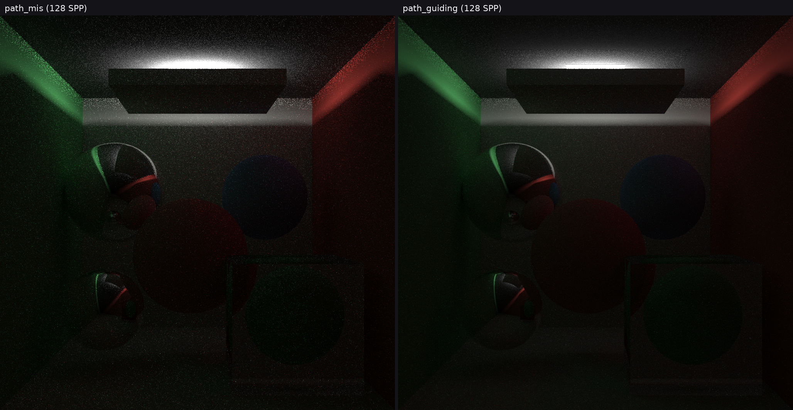

*图 2.1a：128 SPP 并列对比。**左**：`path_mis`。**右**：`path_guiding`。全图亮度接近；中央被挡板阴影区 guiding 更平滑。*

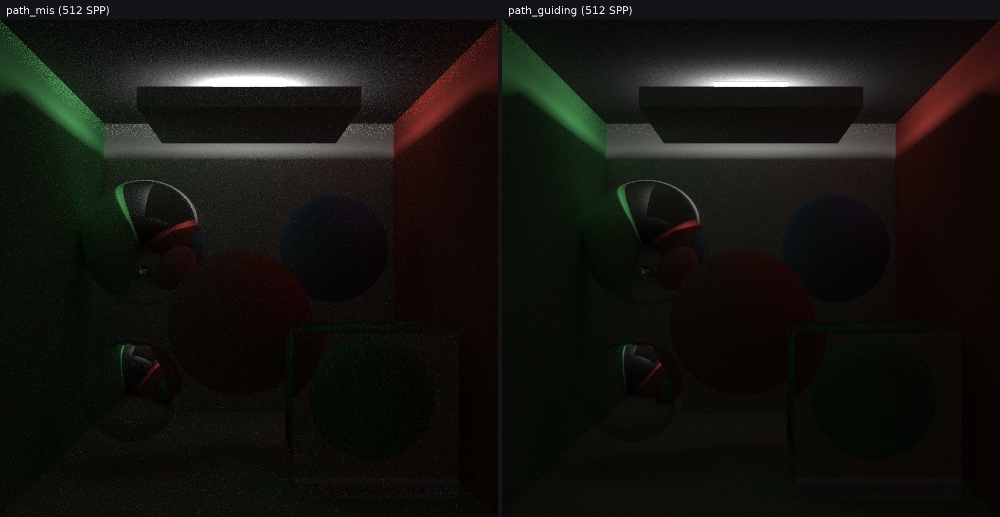

*图 2.1b：512 SPP 并列对比。基线也更干净，但放大细看仍可见 guiding 间接区更细。*

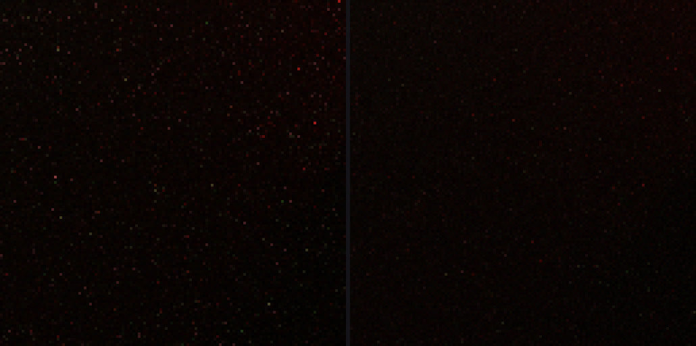

*图 2.1c：阴影 ROI（`(416,563)–(608,737)`）4× 放大。**左**：`path_mis` 颗粒粗。**右**：`path_guiding` 间接反弹更平滑；128 SPP 时阴影 ROI std 降约 **42%**，全图 mean 比 ≈ 1.01。*

**结论**：Path guiding 在相同 SPP 下主要 **降方差** 而非系统性增亮，适合遮挡导致的间接主导区域。


### 2.2 三角形网格纹理 / 法线贴图

#### 2.2.1 原理

**目标：** 在不增加几何细分的前提下，为漫反射面赋予 **空间变化的反照率** 与 **微观法线扰动**（bump mapping），使 Whitted / 路径追踪在命中点呈现灰泥颗粒、大理石脉理、墙面凹凸阴影。

**Albedo 纹理。** 设材质基色 $\mathbf{k}_d$，纹理 $T(u,v) \in [0,1]^3$，则着色反照率

$$
\mathbf{k}_d'(x) = \mathbf{k}_d \odot T\bigl(u(x), v(x)\bigr),
$$

其中 $(u,v)$ 由曲面参数化给出，$\odot$ 为逐分量乘。

**法线贴图与 TBN。** 法线贴图存储切线空间单位法线 $\mathbf{n}_t$（由 RGB 解码：$\mathbf{n}_t = 2\mathbf{c}-1$）。设几何法线 $\mathbf{N}$、切线 $\mathbf{T}$、副切线 $\mathbf{B} = \mathbf{N}\times\mathbf{T}$（右手系），则世界空间着色法线

$$
\mathbf{N}' = \mathrm{normalize}\bigl(n_{t,x}\mathbf{T} + n_{t,y}\mathbf{B} + n_{t,z}\mathbf{N}\bigr).
$$

再经 `faceShadingNormal` 保证 $\mathbf{N}'$ 与视线 $\mathbf{V}$ 同侧。Phong 高光 $\mathbf{R} = 2(\mathbf{N}'\cdot\mathbf{L})\mathbf{N}' - \mathbf{L}$ 与路径追踪 BRDF 均使用 $\mathbf{N}'$。

**UV 参数化（按图元类型）**

| 图元 | $(u,v)$ 计算 | TBN |
|------|--------------|-----|
| `Plane` | 命中点投影到切线/副切线基，$u,v$ 乘 2 后 `frac` 平铺 | $ \mathbf{T}=\mathrm{normalize}(\mathbf{up}\times\mathbf{n})$，$\mathbf{B}=\mathbf{n}\times\mathbf{T}$ |
| `Sphere` | 球面坐标：$u=0.5+\mathrm{atan2}(z,x)/2\pi$，$v=0.5-\arcsin(y/r)/\pi$ | $\mathbf{T}$ 沿纬线（$-\sin\phi, 0, \cos\phi$），$\mathbf{B}=\mathbf{N}\times\mathbf{T}$ |
| `TriangleMesh` | OBJ `vt` 重心插值：$\mathbf{uv}=\alpha\mathbf{uv}_0+\beta\mathbf{uv}_1+\gamma\mathbf{uv}_2$ | MikkTSpace 风格：由边与 $\Delta\mathbf{uv}$ 解 $\mathbf{T},\mathbf{B}$ |
| `Transform` | **保留** 子物体插值 UV | 仅变换 $\mathbf{N},\mathbf{T},\mathbf{B}$（`transform.transposed()` 作用于法线） |

**程序化贴图 `gen_textures`。** `Texture::generateShowcaseTextures` 用 fbm 噪声生成 `plaster_albedo.bmp`（多层频率灰泥色调）、`plaster_normal.bmp`（高度场 → 法线）、`marble_albedo.bmp`（正弦脉理 + fbm）。`encodeNormal` 将 $(n_x,n_y,n_z)$ 映射到 BMP 的 B,G,R 字节，与 `loadBMP` 读回的 `Vector3f(r,g,b)` 及 `sampleNormal` 的 $r\to n_x, g\to n_y, b\to n_z$ 一致。

**Panel B vs C（实验设计）**

| 面板 | 场景文件 | 后墙材质 |
|------|----------|----------|
| A | `scene_texture_cornell_notex.txt` | 纯色 `0.88³`，无法线 |
| B | `scene_texture_cornell.txt` | `texture plaster_albedo.bmp`，无法线 |
| C | `scene_texture_cornell_normal.txt` | albedo + `normalMap plaster_normal.bmp` + Phong `shininess 40` |

B 仅改变 **颜色纹理**；C 在相同 albedo 上用法线扰动 **光照与高光形状**，固定点光源下墙面呈现 subtle bump，无需加密网格。

#### 2.2.2 代码逻辑

**代码文件与功能**

| 文件 | 函数/模块 | 作用 |
|------|-----------|------|
| `include/texture.hpp`、`src/texture.cpp` | `loadBMP`、`sample`、`sampleNormal` | 加载 24-bit BMP；UV repeat 最近邻采样 albedo；RGB 解码为切线空间法线 |
| 同上 | `encodeNormal`、`generateShowcaseTextures` | 写法线 BMP（B,G,R 对应 $n_z,n_y,n_x$）；程序化生成灰泥/大理石贴图 |
| `include/material.hpp` | `getShadedDiffuse`、`getShadingNormal` | albedo 纹理乘基色；法线贴图经 TBN 变换到世界空间并做 face shading |
| 同上 | `GlossyMaterial`、`WardMaterial` | 覆写上述两函数，纹理逻辑与基类相同 |
| `include/plane.hpp`、`include/sphere.hpp` | `intersect` | 各图元计算 UV 与 TBN 基 |
| `src/mesh.cpp` | `Mesh::intersect` | OBJ `vt` 重心插值 UV；由边与 $\Delta$uv 解 MikkTSpace 风格 TBN |
| `src/scene_parser.cpp` | 材质解析 | 读取 `texture` / `normalMap` 路径并绑定到材质 |
| `include/raytracer.hpp` | `castRayWhitted`、`shadeDiffusePath` 等 | Whitted 与路径追踪着色时调用材质的纹理/法线接口 |
| `src/gen_textures.cpp` | `main` | 调用 `generateShowcaseTextures` 生成报告用 BMP |

**CPU 与 GPU 分工。** 纹理与法线贴图仅在 CPU 路径完整可用：`Plane` / `Sphere` / `Mesh` 在求交时写入 UV 与 TBN，`Material` 据此采样。GPU 扁平化（`SceneFlattener::buildMaterials`）只拷贝 diffuse/specular 等标量，**不上传** BMP 像素或 UV，故纹理验收须 **Whitted 或 CPU `path_nee`**，命令行 **勿加 `cuda`**。

**与作业要求的对应**

| 实验 | 命令（`code/` 下） | 说明 |
|------|-------------------|------|
| §2.2.3 Panel A | `./build/PA1-2 testcases/scene_texture_cornell_notex.txt ... whitted 1 gamma` | 无纹理对照 |
| Panel B | `scene_texture_cornell.txt` + plaster albedo | 仅颜色 |
| Panel C | `scene_texture_cornell_normal.txt` + albedo + normalMap | bump |
| 贴图生成 | `./build/gen_textures` | 生成 `textures/*.bmp` |

拼接脚本 `scripts/make_texture_showcase.py`。

#### 2.2.3 实验分析与对比

**对比设置**：Cornell 盒变体，Whitted 1 SPP + gamma，CPU only。

| 面板 | 场景 | 后墙 | 说明 |
|------|------|------|------|
| A | `scene_texture_cornell_notex.txt` | 纯色 | 对照 |
| B | `scene_texture_cornell.txt` | plaster albedo | 仅颜色纹理 |
| C | `scene_texture_cornell_normal.txt` | albedo + normalMap | bump 可见 |

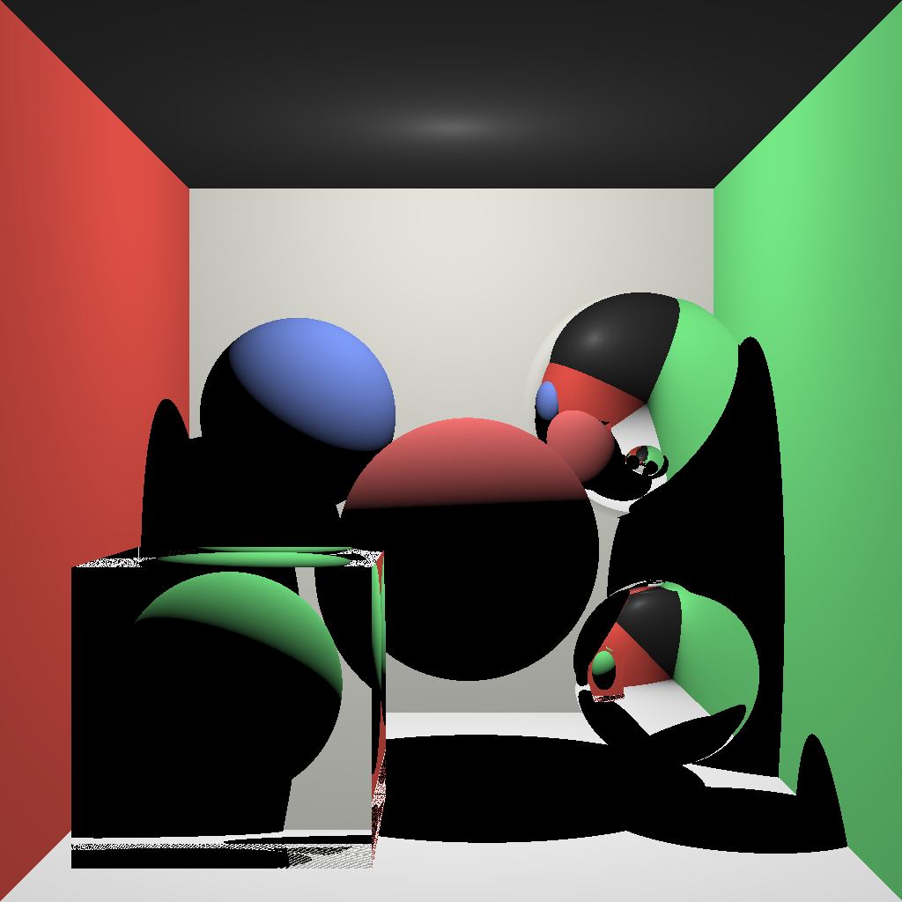

*图 2.2a：Panel A — 经典纯色 Cornell，无法线/纹理。*

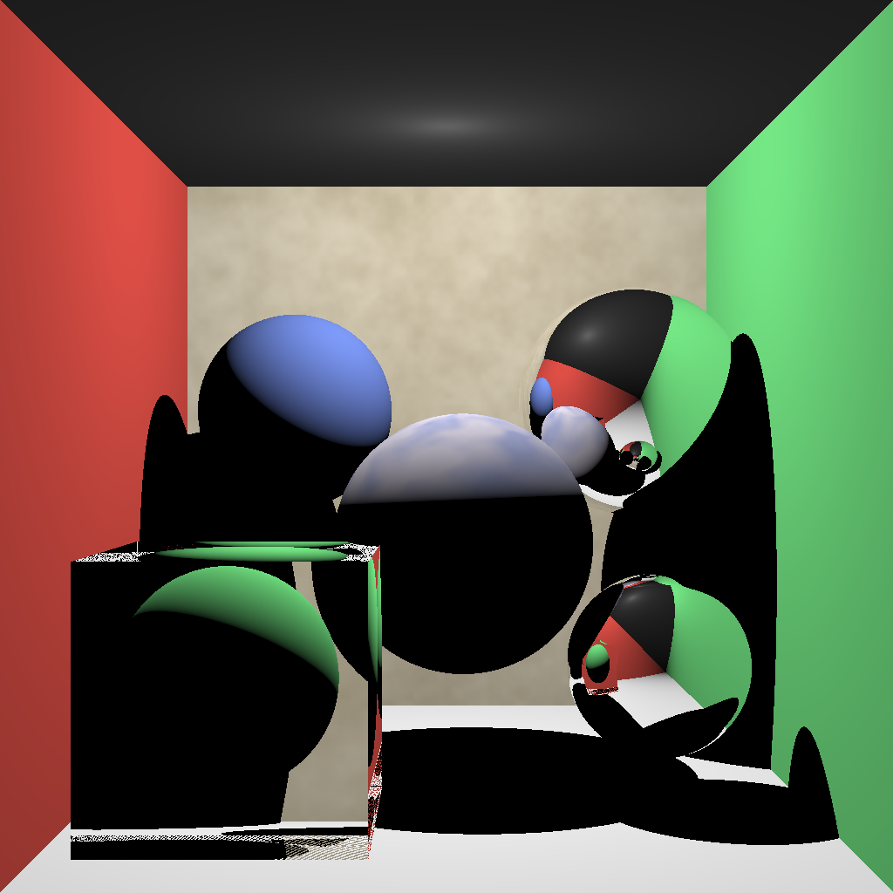

*图 2.2b：Panel B — 灰泥 albedo 纹理；墙仍近似平面 Phong。*

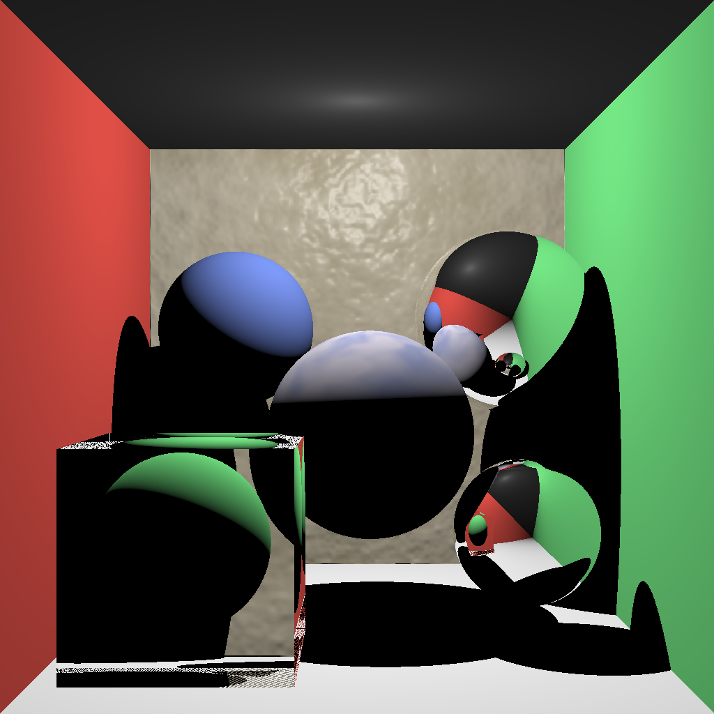

*图 2.2c：Panel C — 法线扰动改变每像素法线；Whitted 点光下高光与阴影边界随 bump 起伏。*

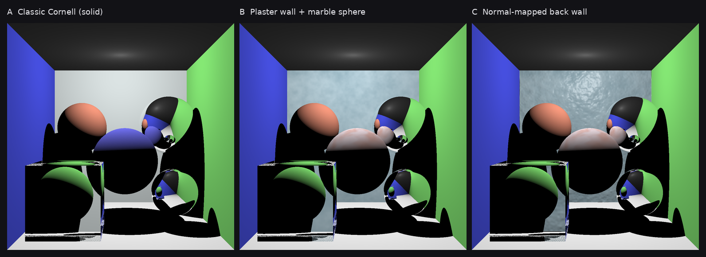

*图 2.2d：A | B | C 横向对比（`scripts/make_texture_showcase.py`）。*

**B vs C**：Panel B 只有颜色变化；Panel C 法线贴图在 **切线空间** 扰动法线，固定点光源下产生 subtle bump。


### 2.3 BVH 加速结构

#### 2.3.1 原理

三角形与射线的朴素求交为 $O(n)$。Stanford Bunny 约 $10^3$ 三角，路径追踪每像素 128 SPP × 数条弹射 × 每条射线扫全网格，GPU 时间主要耗在 `intersectTrianglesBruteForce` 上。

**层次包围盒（BVH）。** 将三角集递归划分为子集，每节点存轴对齐包围盒（AABB）。内部节点两个子节点；叶节点存 $\le 4$ 个三角。查询时仅当射线与节点 AABB 相交才深入，期望访问 $O(\log n)$ 个节点（均匀分布下树深 $\approx \log_2 n$）。

**AABB 合并（建树）.** 三角 $t$ 的 AABB 为三顶点 min/max。节点包围盒为子三角（或子节点）AABB 的并：

$$
\mathbf{b}_{\min} = \min_i \mathbf{p}_i,\quad \mathbf{b}_{\max} = \max_i \mathbf{p}_i.
$$

**划分策略（本实现）.** 对当前节点三角集合：

1. 计算质心包围盒，选 **延伸最长轴** $a \in \{x,y,z\}$。
2. 按质心坐标 $c_a = (v_{0,a}+v_{1,a}+v_{2,a})/3$ 用 `nth_element` 找 **中位数** 划分（等价 median split）。
3. 若 `count <= 4` 则建叶；否则递归左右子树。

**Slab 法射线–AABB 相交.** 射线 $\mathbf{o} + t\mathbf{d}$，对轴 $i$：

$$
t_{i}^{\mathrm{near}} = \min\left(\frac{b_{\min,i}-o_i}{d_i}, \frac{b_{\max,i}-o_i}{d_i}\right),\quad
t_{\mathrm{near}} = \max_i t_{i}^{\mathrm{near}},\quad
t_{\mathrm{far}} = \min_i t_{i}^{\mathrm{far}}.
$$

命中当且仅当 $t_{\mathrm{near}} \le t_{\mathrm{far}}$ 且 $t_{\mathrm{near}} < t_{\mathrm{hit}}$。实现中用 **逆方向** $\mathbf{d}^{-1}$（分母近零时置 $10^{30}$）减少除法。

**叶节点与三角重排.** DFS `flatten` 将叶内三角 **按遍历顺序** 追加到 `bvhTriangles`，叶节点 `leftChild` 存该连续段起始下标，`primitiveCount` 存个数；内部节点 `primitiveCount=0`，`leftChild`/`rightChild` 为子 **节点索引**（预分配式 DFS，左子紧挨父后）。

#### 2.3.2 代码逻辑

**涉及文件与职责**

| 文件 | 函数/模块 | 作用 |
|------|-----------|------|
| `src/bvh_builder.cpp` | `buildBVH`、`buildRecursive`、`flatten` | CPU 建树：最长轴 median 划分，叶节点 ≤4 三角；DFS 扁平化为 SOA 节点与重排三角 |
| `src/cuda_scene_builder.cpp` | `SceneFlattener`、`setGpuSceneBuildUseBVH` | 扁平化时可选调用 `buildBVH`；关闭时清空节点、GPU 走暴力求交 |
| `src/cuda_path_tracer.cu` | `intersectTrianglesBVH`、`intersectAABB` | GPU 栈式遍历 BVH（栈深 64）；叶内逐三角 `rayTriangle`，内部节点按远近压栈 |
| 同上 | `intersectScene` | 球/平面仍线性遍历；**仅 mesh 三角** 走 BVH |
| `src/main.cpp` | `no_bvh` 解析 | 传入 `renderWithCuda(..., useBvh=false)` 关闭 BVH |

**数据结构。** `GpuBVHNode`（32 B 对齐）存 AABB、`leftChild`、`rightChild`、`primitiveCount`。叶节点 `primitiveCount > 0` 时 `leftChild` 为 `bvhTriangles` 连续段起始下标；内部节点 `primitiveCount == 0` 时子字段为子节点索引。每射线预计算 `invDir3(dir)` 供全部 AABB 测试。

**范围说明。** BVH 为 **CUDA 三角求交** 优化；CPU Whitted / path 仍通过 `Group::intersect` 线性遍历 mesh，未接入 BVH。

**与作业要求的对应**

| 实验 | 设置 | 结果 |
|------|------|------|
| §2.3.3 | `scene_bvh_bunny.txt`，512²，`path_nee 128 cuda` | BVH ON ≈ **1.28 s** |
| 对照 | 同上 + `no_bvh` | ≈ **6.4 s**（约 **5×** 慢） |
| 画质 | 像素逐通道对比 | **一致**（同算法，仅求交路径不同） |

全帧加速约 **5×**（6.4/1.28）；单条射线对 ~1000 三角的 **求交次数** 可从 $O(n)$ 降至 $O(\log n)$ 量级（约数十次节点访问），若只计三角 intersection 环节，加速比可达 **数十倍**；全路径还含球/平面、着色、NEE 等，故帧时间比小于纯求交理论比。

命令见附录 C。

#### 2.3.3 实验分析与对比

**对比设置**：`testcases/scene_bvh_bunny.txt`（Cornell 小盒 + Stanford Bunny ~1000 三角），512×512，`path_nee 128`，CUDA。

| | BVH ON | BVH OFF（`no_bvh`） |
|--|--------|---------------------|
| 遍历 | GPU 栈式 BVH，$O(\log n)$ | 线性扫全三角，$O(n)$ |
| 128 SPP 耗时 | **≈1.28 s** | **≈6.4 s**（约 5× 慢） |
| 画质 | 一致 | 一致（同算法，仅加速） |

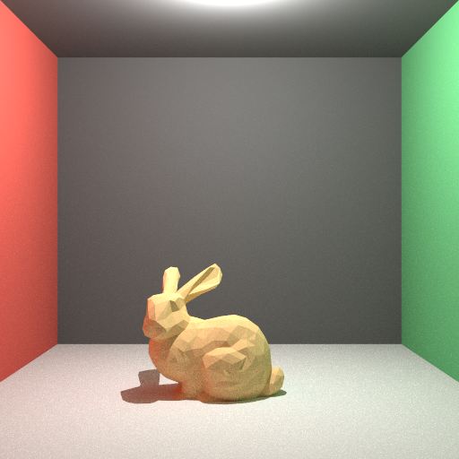

*图 2.3a：BVH **开启**。橙色 Bunny 正确可见；GPU 栈遍历 BVH。*

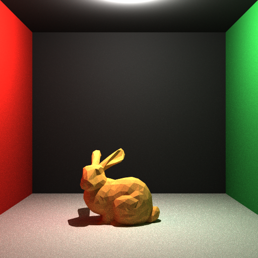

*图 2.3b：BVH **关闭**（`no_bvh`）。像素结果一致，渲染时间约 5× 更长。*

**结论**：BVH 为 **纯性能优化**，不改变光传输结果；对三角数多的 mesh 场景加速显著。


## 已经验收过的功能
### 2.4 Whitted-Style 光线追踪

#### 2.4.1 原理

对 **镜面/折射** 材质递归追踪反射/折射方向；对 **漫反射** 材质用 Phong 模型计算直接光照，向每个光源发射阴影射线判断可见性。玻璃在阴影射线中视为透明（不遮挡）。命中 **EmissiveMaterial** 直接返回发光色。

#### 2.4.2 代码逻辑

**涉及文件与职责**

| 文件 | 函数/模块 | 作用 |
|------|-----------|------|
| `include/raytracer.hpp` | `castRayWhitted` | 主入口：递归追踪反射/折射，漫反射面终止于 Phong |
| 同上 | `shadeDiffuse` | 遍历场景光源，`isInShadow` 后调用 `Material::Shade` |
| 同上 | 镜面/折射分支 | `ReflectiveMaterial` 发射反射子射线；`RefractMaterial` 做 Snell/TIR（可选 Fresnel，见附录 A） |
| `include/material.hpp` | `Material::Shade`、`EmissiveMaterial` | Phong 直接光；命中发光体直接返回 emission |
| `src/main.cpp` | CLI | 模式 `whitted`，默认 SPP=1 |


### 2.5 路径追踪

#### 2.5.1 原理

求解渲染方程：在漫反射/光泽命中点按 BRDF 采样出射方向，递归估计入射辐射度。

- **余弦加权半球采样**（Lambertian）：pdf 与 cosθ 相消，贡献为 `albedo × Li`。
- 命中 **EmissiveMaterial** 时返回 `throughput × emission`（NEE 开启时间接路径不重复计光，见 §2.6）。
- **俄罗斯轮盘赌（RR）**：深度 ≥ 8 时，以 `max(0.15, luminance(throughput))` 为存活概率终止路径，存活时除以概率保持无偏。

#### 2.5.2 代码逻辑

**涉及文件与职责**

| 文件 | 函数/模块 | 作用 |
|------|-----------|------|
| `include/raytracer.hpp` | `castRayPath` | 主路径循环：按材质分发到各 `shade*Path` |
| 同上 | `shadeDiffusePath`、`shadeGlossyPath`、`shadeWardPath` | 漫反射/光泽/Ward 命中点 BRDF 采样与递归 |
| 同上 | `sampleCosineHemisphere` | Lambertian 余弦加权半球采样 |
| 同上 | RR 常量 | `RR_START_DEPTH=8`、`RR_MIN_SURVIVAL=0.15` 控制俄罗斯轮盘赌 |
| `src/cuda_path_tracer.cu` | `castRayPath` | GPU 端镜像上述逻辑 |
| `src/main.cpp` | CLI、子像素 jitter | 模式 `path`，默认 SPP=64；SPP>1 时哈希抖动等价抗锯齿 |

### 2.6 Whitted vs 路径追踪对比

**对比设置**：同一场景 `testcases/scene_path.txt`（Cornell Box：五球 + 贴地玻璃立方体；发光天花板 + 两个 AreaLight；1024×1024）。Whitted 1 SPP；路径追踪 64 SPP + gamma + OpenMP。

| | Whitted | 路径追踪 |
|--|---------|----------|
| 模式 | `whitted 1 gamma` | `path 64 gamma omp` |
| 着色 | Phong 直接光 + 阴影射线 | 渲染方程 MC 估计 |
| 全局光照 | **无** 间接多次反弹 | 红/绿墙 **颜色渗透** |
| 噪声 | 无（确定性） | 64 SPP 仍有颗粒 |
| 阴影 | AreaLight 单样本 → 偏硬 | 软阴影、半影（面光 + 弹射） |
| 焦散 | 玻璃下清晰亮斑 | 可见但更模糊、带噪 |

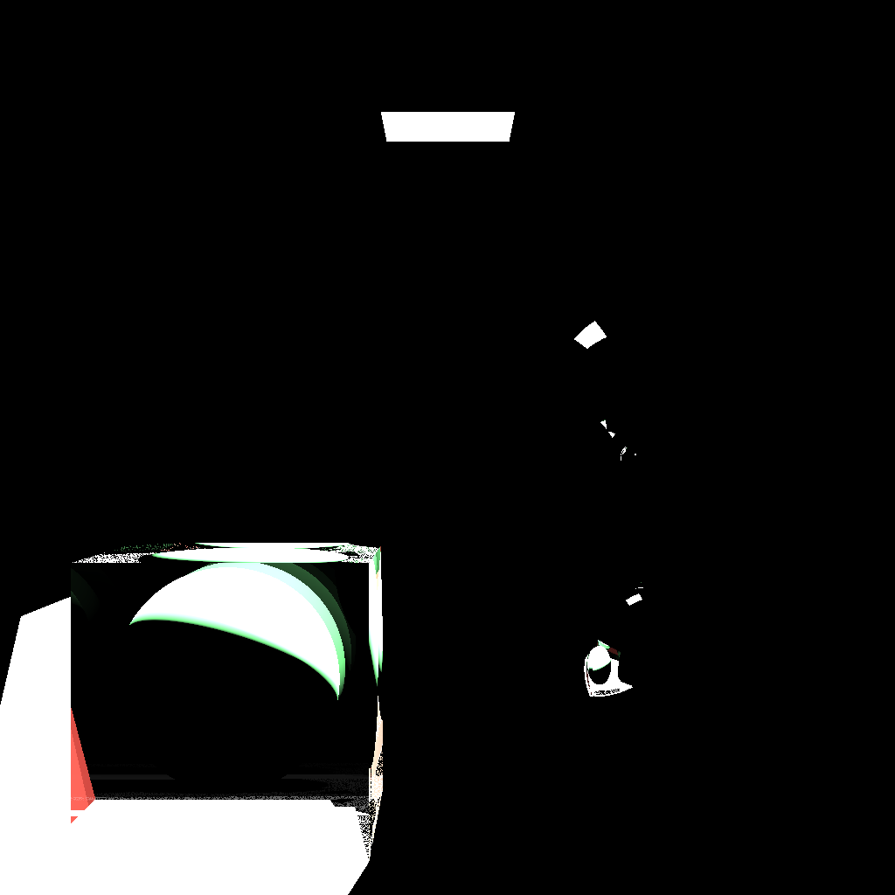

*图 2.8a：Whitted-Style 光线追踪。仅支持镜面/折射递归 + 直接光照，无全局间接光多次反弹；命中发光天花板直接返回 emission。*

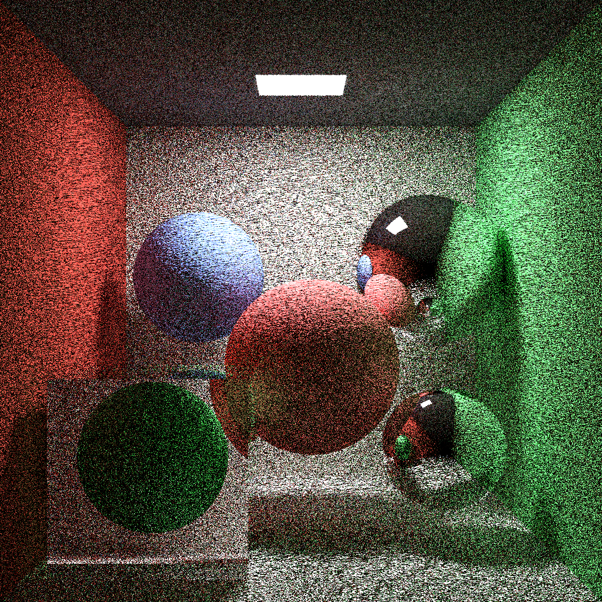

*图 2.8b：路径追踪（无 NEE）。蒙特卡洛估计半球积分；可见颜色渗透、软阴影与颗粒噪声；间接光仅靠随机弹射命中发光体，整体偏暗。*

**差异原因**：

1. **噪声**：路径追踪对积分做 MC 估计，有限 SPP 产生方差；Whitted 无积分估计。
2. **全局光照**：Whitted 在漫反射面终止；路径追踪继续弹射，间接光自然出现。
3. **阴影/焦散**：Whitted 确定性求和；路径追踪随机平均，边缘更软、更噪。
4. **亮度**：无 NEE 时大量像素未命中小面积发光体，贡献近 0（见 §2.6.3 对比）。

> 注：经典 Whitted 演示亦可用 `scene_whitted.txt`（点光源）；本报告 Whitted/Path 对比统一用 `scene_path.txt` 以保证 **同场景同光源布局**。

### 2.6 NEE（Next Event Estimation）

#### 2.6.1 原理

在 `path_nee` 模式下，漫反射/光泽命中点 **额外** 向光源采样直接光：

- **点光源**：`PointLight::getIllumination` 给方向，阴影射线判断遮挡，贡献 `BRDF × Le × cosθ`。
- **面光源**：三角形上均匀采样，立体角 pdf：`pdf_ω = pdf_area × r² / cosθ_l`，贡献  
  `Le × (albedo/π) × cosθ_o / pdf_ω`。
- **避免双重计数**：NEE 开启时，由漫反射弹射出去的间接光线 **不再** 对 `EmissiveMaterial` 累加辐射度；镜面/折射路径仍可命中发光体。
- **阴影射线**：法向偏移；发光体不再视为「透明」。

`path` 模式不启用 NEE，仅靠随机弹射间接命中发光体，方差大、收敛慢。

#### 2.6.2 代码逻辑

**涉及文件与职责**

| 文件 | 函数/模块 | 作用 |
|------|-----------|------|
| `include/raytracer.hpp` | `sampleOneAreaLightDiffuse/Glossy/Ward` | 面光源均匀采样 + 阴影可见性测试 |
| 同上 | `pdfAreaLightDirection`、`computeAreaLightPdf` | 立体角 pdf 计算 |
| 同上 | `castRayPath` | NEE 开启时间接子路径 `indirectEmissive=false`，避免与直接光双计 |
| `include/light.hpp` | `PointLight`、`AreaLight` | 点光方向与面光三角几何 |
| `src/scene_parser.cpp` | AreaLight 解析 | 从场景文件构建三角形面光源 |
| `src/cuda_path_tracer.cu` | NEE 分支 | GPU `castRayPath` 内嵌相同 NEE 逻辑 |

#### 2.6.3 实验分析与对比

**对比设置**：同场景 `scene_path.txt`、同 SPP=64、gamma、OpenMP；仅切换 `path` 与 `path_nee`。

| 指标 | `path`（无 NEE） | `path_nee`（含 NEE） |
|------|------------------|----------------------|
| 平均亮度 | 明显偏暗 | 整体照亮 |
| 非黑像素占比 | 低 | 高（≈89%） |
| 观感 | 大面积暗、颗粒重 | 颜色稳定、软阴影清晰 |
| 期望 | 同一渲染方程 | 同一渲染方程（无系统色差） |


*图 2.6a：路径追踪 **无 NEE**。直接光仅当随机弹射恰好命中发光三角形时出现；发光面积占比极小，方差极大。*

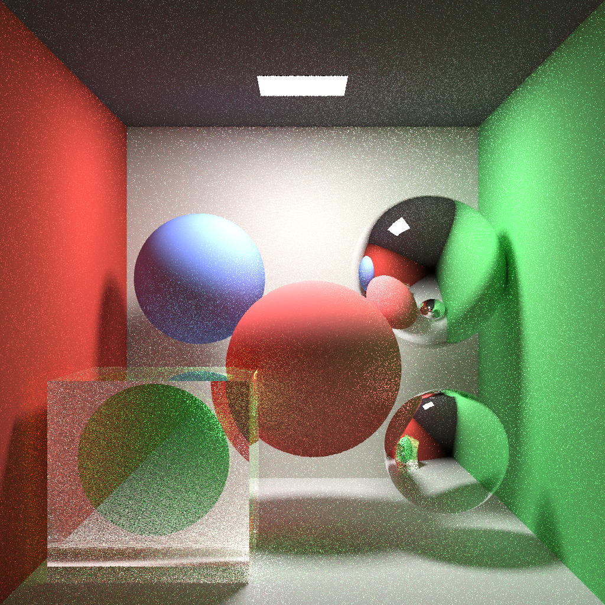

*图 2.6b：路径追踪 **含 NEE**。漫反射/光泽命中点显式向 AreaLight 采样 + 阴影测试；暗部被稳定照亮，收敛更快。*

**分析**：

1. **相同期望**：两模式求解同一方程；NEE 仅改变采样策略。亮度差异来自 **方差**——无 NEE 时大量样本贡献 ≈ 0，均值偏低；NEE 将低概率间接命中转为 $O(1)$ 直接估计。
2. **收敛速度**：NEE 对每个 AreaLight 显式采样，收敛速度显著提升；地板接触阴影在 NEE 下边缘柔和、无 NEE 下边界斑驳。
3. **实现要点**：NEE 开启时间接路径不对 EmissiveMaterial 重复计光；阴影射线用法向偏移。

---

### 2.7 MIS（多重重要性采样）

#### 2.7.1 原理

路径追踪在每个非镜面命中点需估计 **直接光** 与 **间接光**。本实现同时支持两条采样策略：

**BRDF 采样（`path` 模式的基础）。** 从材质 BRDF 按 pdf 采样出射方向 $\omega_i$，再追踪子路径得到 $L_i$，贡献 $f_r \cos\theta / \mathrm{pdf}_{\mathrm{BRDF}}$。

- **漫反射**：余弦加权半球 `sampleCosineHemisphere`，$\mathrm{pdf} = \cos\theta / \pi$。
- **GGX 光泽**：按 $k_d$/$k_s$ 能量比选择漫反射瓣或镜面瓣；镜面瓣对 GGX 半向量 `sampleGGXHalfVector` 采样，再反射得 $\omega_i$，用 `pdfGlossyBRDF` 归一化。
- **Ward**：类似瓣选择，半向量由 `sampleWardHalfVector` 采样。

**光源采样（NEE）。** 在 `path_nee` / `path_mis` 下，命中点额外向 AreaLight 均匀采样 + 阴影测试，估计直接光；间接路径默认 **不对 Emissive 重复计光**（`indirectEmissive=false`），避免与 NEE 双计。

**MIS 合并。** 当 BRDF 与光源两条策略均可估计同一项时，用 **power heuristic**（$\beta=2$）合并 pdf，降低 firefly：

$$
w(\omega_i) = \frac{p(\omega_i)^2}{p_{\mathrm{light}}(\omega_i)^2 + p_{\mathrm{BRDF}}(\omega_i)^2}
$$

- **`path`**：仅 BRDF 采样，无 NEE；直接光只能靠随机弹射命中发光体，方差极大（见 §2.6）。
- **`path_nee`**：NEE + BRDF 间接；光泽/Ward 面光 NEE 已启用 power-heuristic MIS（`useGlossyNEEMIS()`），避免掠射角 BRDF 爆炸。
- **`path_mis`**：在 `path_nee` 基础上，间接路径 **也对 Emissive 计光**（`indirectEmissive=true`），子路径命中发光体时用 `MisCtx` 携带 BRDF pdf，与 `computeAreaLightPdf` 做 power MIS 降权。

#### 2.7.2 代码逻辑

**涉及文件与职责**

| 文件 | 函数/模块 | 作用 |
|------|-----------|------|
| `include/raytracer.hpp` | `sampleCosineHemisphere`、`sampleGGXHalfVector` | 漫反射 / GGX 镜面 BRDF 方向采样 |
| 同上 | `pdfDiffuseBRDF`、`pdfGlossyBRDF`、`pdfWardBRDF` | 各瓣 BRDF 采样 pdf，供 MIS 分母 |
| 同上 | `shadeDiffusePath`、`shadeGlossyPath`、`shadeWardPath` | 间接路径：BRDF 采样 + 可选 `MisIndirectCtx` |
| 同上 | `sampleDirectEmissiveBRDF` 等 | NEE 直接光；光泽面光 NEE 内嵌 power MIS |
| 同上 | `misWeightPower`、`computeAreaLightPdf` | power heuristic 权重与光源 pdf |
| 同上 | `RenderMode::PATH_TRACE` / `_NEE` / `_MIS`、`useMIS()` | 三模式开关及间接 Emissive 策略 |
| `src/cuda_path_tracer.cu` | `MisCtx`、`castRayPath` | GPU 镜像 CPU：BRDF 采样、NEE、MIS 权重 |
| `src/main.cpp` | CLI | `path` / `path_nee` / `path_mis` 切换 |

#### 2.7.3 实验分析与对比

**对比设置**：`testcases/scene_mis_demo.txt`（Cornell + 5 颗 GGX 金属球），SPP=64，gamma，CUDA；三模式仅切换采样策略。

| 模式 | 直接光 | 间接 Emissive | 渲染时间 |
|------|--------|---------------|----------|
| `path`（BRDF only） | 随机弹射命中 | 计光 | 1.97 s |
| `path_nee` | NEE | 不计（避免双计） | 3.01 s |
| `path_mis` | NEE + 光泽 MIS | 计光 + power MIS | 3.73 s |

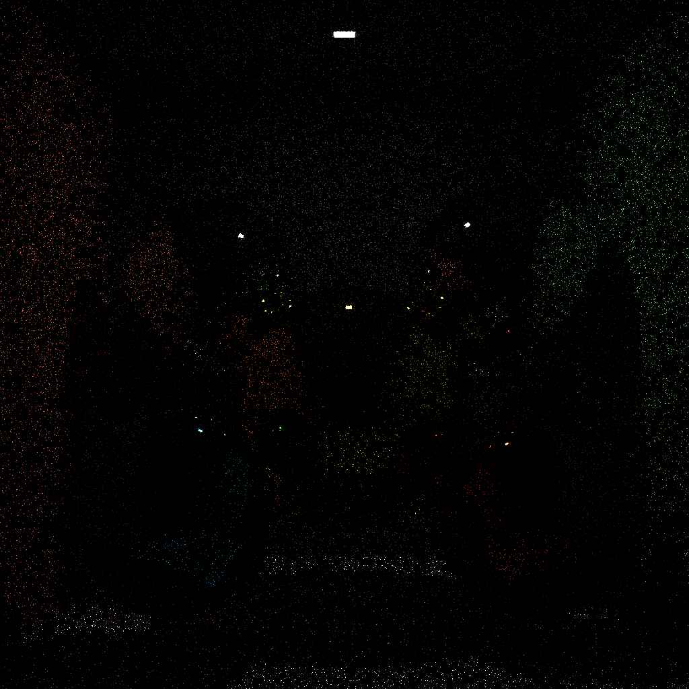

*图 2.7a：`path 64 gamma cuda`。纯 BRDF 采样、无 NEE；天花板面光极难被随机命中，整体极暗，仅强镜面反射可见。*

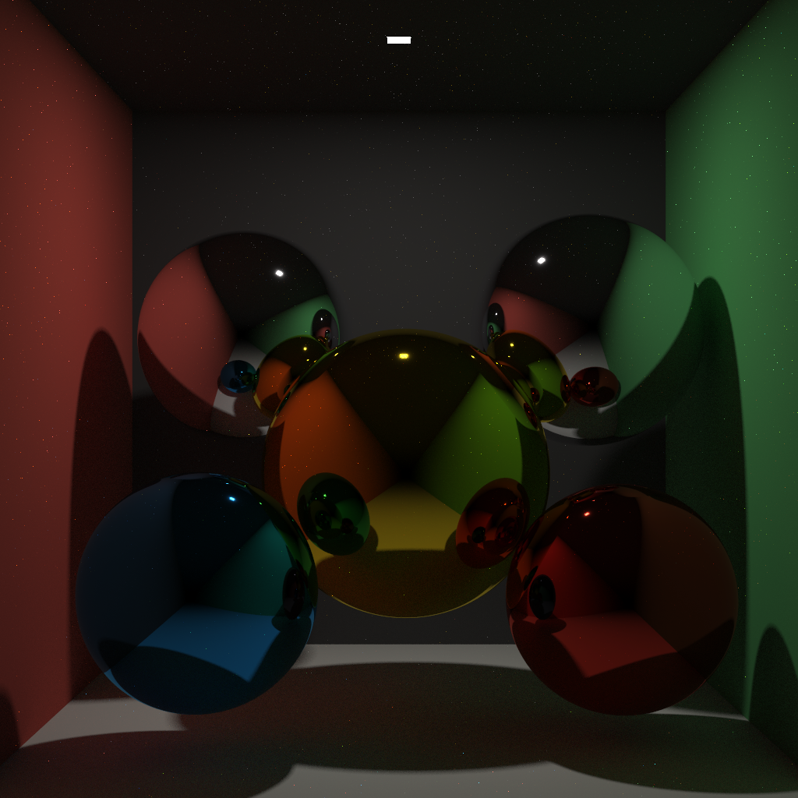

*图 2.7b：`path_nee 64 gamma cuda`。NEE 稳定照亮场景；光泽球 + 小面光在掠射角仍有 firefly。*


*图 2.7c：`path_mis 64 gamma cuda`。NEE 与 BRDF 采样经 power MIS 合并；高光区 firefly 减少，间接 Emissive 与 NEE 一致估计。*

**分析**：

1. **`path` vs `path_nee`**：与 §2.6 结论一致——无 NEE 时直接光方差主导，64 SPP 仍大面积欠曝；NEE 将低概率事件转为 $O(1)$ 估计。
2. **`path_nee` vs `path_mis`**：同场景同 SPP 下，`path_mis` 在金属高光与天花板反射处更平滑；power MIS 对 BRDF/光源 pdf 差异大的方向降权，抑制 firefly。
3. **实现要点**：`path_mis` 需在间接命中 Emissive 时携带 `MisCtx.pdfBrdf`，并用 `misWeightPower / pdfBrdf` 缩放贡献；`path_nee` 下 `indirectEmissive=false` 防止双计。


### 2.9 Cook-Torrance 光泽材质（GGX）

#### 2.9.1 原理

$$
f = k_d \frac{\rho_d}{\pi} + k_s \frac{D \cdot G \cdot F}{4 (n \cdot \omega_i)(n \cdot \omega_o)}
$$

- **D**：GGX 法线分布，$\alpha = m^2$（$m$ 为粗糙度）
- **G**：Smith 几何项（GGX 形式）
- **F**：Schlick 菲涅尔；电介质 $F_0=0.04$，金属 $F_0$ 取 albedo（$k_d \approx 0$）
- **采样**：按 $k_d$/$k_s$ 能量比选择漫反射瓣或 GGX 镜面瓣；NEE 对 AreaLight / 点光均可用

#### 2.9.2 代码逻辑

**涉及文件与职责**

| 文件 | 函数/模块 | 作用 |
|------|-----------|------|
| `include/material.hpp` | `CookTorranceBRDF`、`GlossyMaterial` | GGX D、Smith G、Schlick F 评估 |
| `include/raytracer.hpp` | `shadeGlossyPath` | 按 $k_d$/$k_s$ 能量比选择漫反射瓣或 GGX 镜面瓣采样 |
| `src/cuda_path_tracer.cu` | `evalGlossy`、`pdfGlossy` | GPU 端 BRDF 评估与 pdf |
| `include/raytracer.hpp` | `clampRadiance` | 抑制 firefly |
| `testcases/scene_glossy.txt` | — | 五球塑料+金属演示场景 |

#### 2.9.3 实验分析与对比

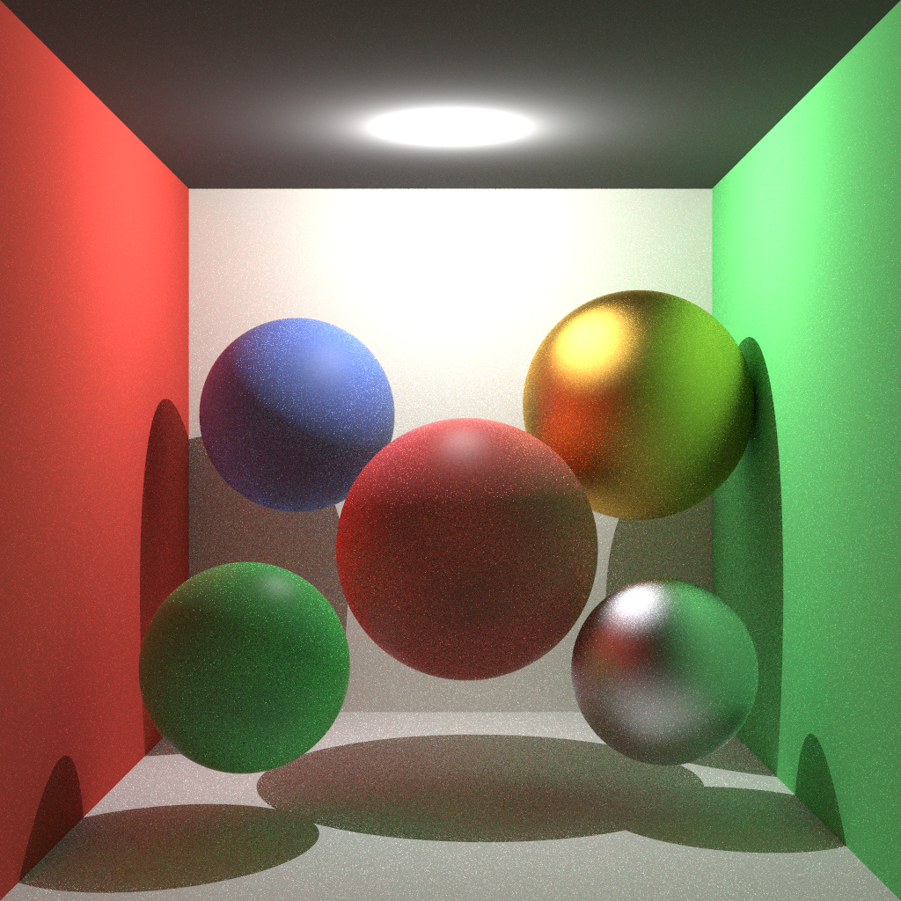

*图 2.9a：`scene_glossy.txt`，`path_nee 64`。塑料（有 $k_d$ + GGX 高光）与金属（$k_d=0$，宽软高光）对比。*

---

### 2.10 色散（Dispersion）

#### 2.10.1 原理

折射率随波长变化；实现中对 RGB 三通道使用 **独立 IOR**（`channelIor(baseIor, dispersionDelta, c)`），在折射界面按通道做 Snell 定律与 RR 分裂，产生棱镜色散效果。

#### 2.10.2 代码逻辑

**涉及文件与职责**

| 文件 | 函数/模块 | 作用 |
|------|-----------|------|
| `include/material.hpp` | `dispersionDelta` 字段 | 折射材质存储色散强度 |
| `include/raytracer.hpp` | `channelIor`、`castRayPath` | 按 RGB 通道独立 IOR；折射时分裂三条子射线 |
| `src/cuda_path_tracer.cu` | 色散分支 | GPU 镜像每通道独立 child ray |
| `src/main.cpp` | CLI | `dispersion` / `--dispersion` 开关 |
| `testcases/scene_dispersion.txt` | — | 棱镜 + 强顶光演示场景 |

#### 2.10.3 实验分析与对比

| 关闭色散 | 开启色散 |
|----------|----------|
| 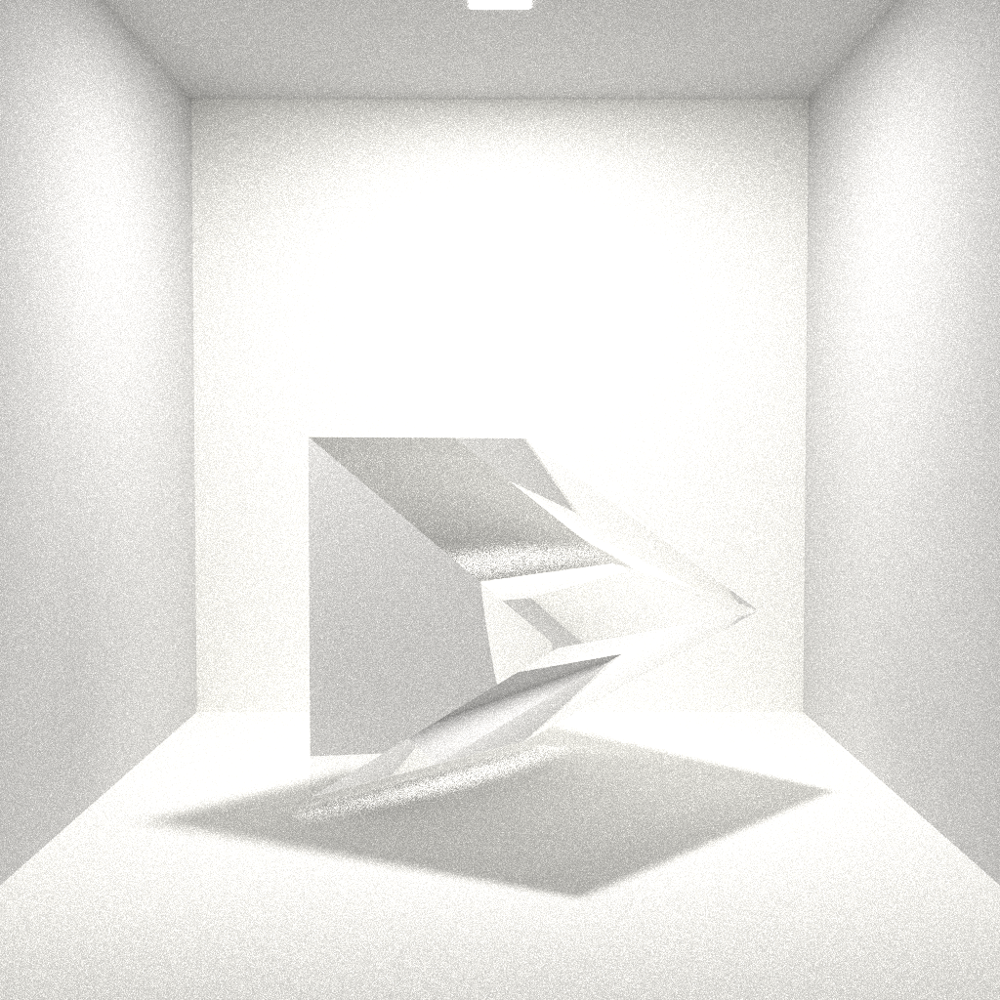 | 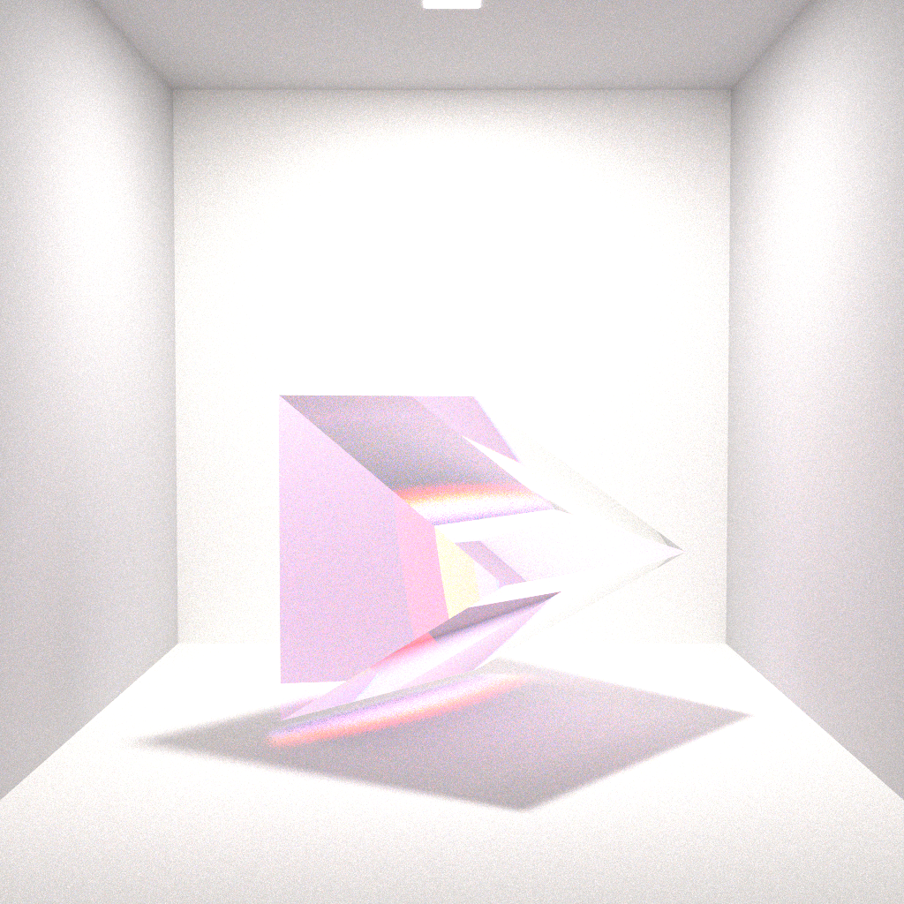 |

*图 2.10a：`scene_dispersion.txt`，左 `path_nee` 无色散，右 `path_nee dispersion`。RGB 独立 IOR 产生棱镜色散。*

---

### 2.11 Gamma 校正

#### 2.11.1 原理

**线性 radiance 与显示编码。** 渲染器内部累积的是 **物理线性** 辐射亮度 $L \in [0,\infty)$（float HDR）；标准 8-bit 显示器遵循近似 **sRGB** 非线性响应：人眼对暗部更敏感，若直接把线性值映射到 $[0,255]$，中间调会偏暗、高光细节被压缩。

**Gamma 编码（本实现）。** 保存 BMP 前可选对每通道做 **display gamma** 变换（标准近似 $\gamma \approx 2.2$）：

$$
C_{\mathrm{display}} = \mathrm{clamp}\bigl(C_{\mathrm{linear}}^{1/2.2},\, 0,\, 1\bigr),\quad
C_{8\mathrm{bit}} = \lfloor 255 \cdot C_{\mathrm{display}} \rfloor.
$$

- **关闭 `gamma`**：仅 `clamp(255·C_linear)`，文件内容为线性 radiance 的量化，在普通显示器上 **整体偏暗**。
- **开启 `gamma`**：先 $C^{1/2.2}$ 再量化，观感与常见图像查看器一致；**不改变** 追踪阶段的物理计算，仅影响 **写盘编码**。

**与路径追踪噪声的关系。** Gamma 不降低 MC 方差；它只改变 **亮度非线性映射**。对比实验应在 **同一 gamma 设置** 下进行，或明确标注 linear vs sRGB。

#### 2.11.2 代码逻辑

**涉及文件与职责**

| 文件 | 函数/模块 | 作用 |
|------|-----------|------|
| `src/image.cpp` | `EncodeColorComponent` | 可选对单通道做 $C^{1/2.2}$ 变换 |
| 同上 | `Image::SaveBMP` | 写 BMP 前逐像素 clamp + 编码；字节序 B,G,R |
| `src/main.cpp` | `parseGammaFlag` | 解析 `gamma` / `--gamma` 布尔标志 |
| 同上 | CPU/GPU 出口 | CPU 循环与 `renderWithCuda` 成功后均调用 `SaveBMP(..., applyGamma)` |

**行为说明。** Gamma 仅影响写盘编码，不改变追踪阶段线性 radiance。默认关闭；报告对比图通常开启以获得正常观感。`gamma` 可与其他 CLI 参数任意混排。

**与作业要求的对应**

| 实验 | 命令（`code/` 下） |
|------|-------------------|
| §2.11.3 线性 | `./build/PA1-2 testcases/scene_whitted.txt output/report/gamma_before.bmp whitted 1 cuda` |
| sRGB 编码 | `./build/PA1-2 testcases/scene_whitted.txt output/report/gamma_after.bmp whitted 1 gamma cuda` |

#### 2.11.3 实验分析与对比

**对比设置**：`testcases/scene_whitted.txt`（Cornell + 五球 + 玻璃），Whitted 1 SPP，CUDA；**唯一差异** 为是否传 `gamma`。

| | 无 gamma（线性写盘） | 有 gamma（$C^{1/2.2}$） |
|--|---------------------|------------------------|
| 中间调 | 偏暗、对比度「压缩」 | 接近显示器预期亮度 |
| 高光 | 易过早饱和到 255 | 高光 roll-off 更自然 |
| 追踪结果 | 相同线性 radiance | 相同（仅编码不同） |

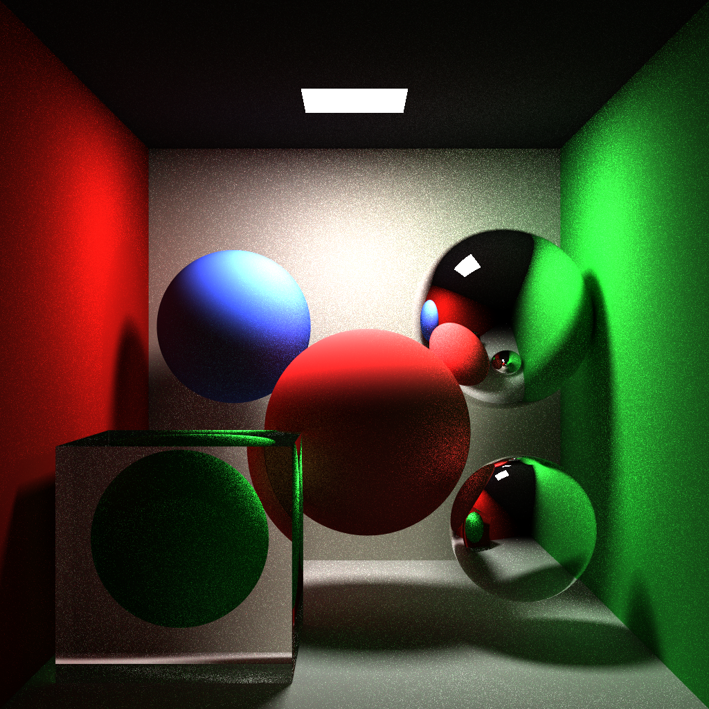

*图 2.11a：**无 gamma**。线性 radiance 直接映射 8-bit；暗部细节难辨，整体偏暗。*

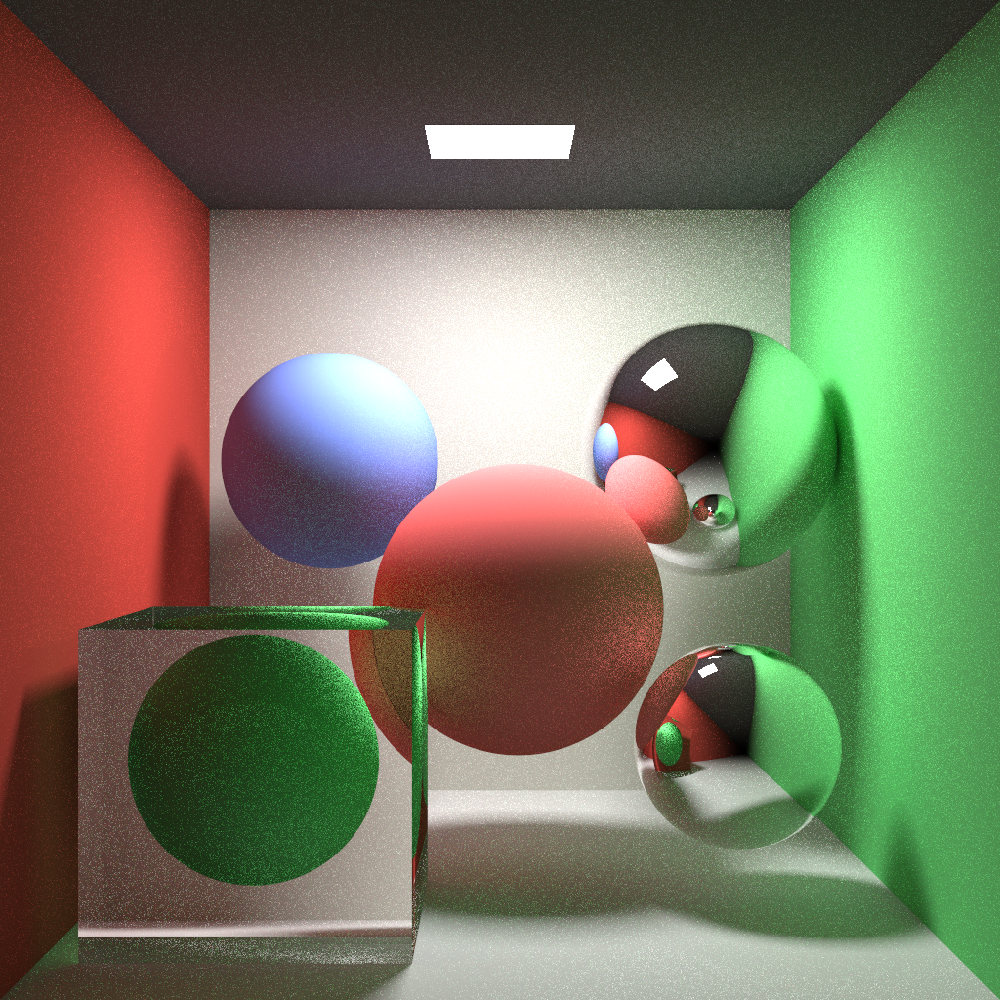

*图 2.11b：**有 gamma**。保存前 $C^{1/2.2}$；中间调与高光更接近日常看图体验。*

**结论**：Gamma 为 **显示适配** 步骤，与 Whitted / 路径追踪算法无关；正式出图建议始终加 `gamma`。


### 2.12 CPU 加速（OpenMP）

#### 2.12.1 原理

**数据并行性。** 本渲染器按像素独立追踪：每像素持有独立 RNG seed、独立 `RayTracer` 实例，像素间 **无写共享状态**（`Image::SetPixel(x,y)` 各写不同地址）。因此外层 **扫描线循环** `for (y)` 是 embarrassingly parallel 的典型场景。

**OpenMP 模型。** 编译期链接 OpenMP 运行时；运行时由 CLI `omp` / `parallel` 启用 `#pragma omp parallel for`：

- **并行粒度**：一行或多行 `y`（`schedule(dynamic, 4)` 以 4 行为一块动态分配）。
- **负载均衡**：Cornell 场景上方天空行较快、几何密集行较慢；dynamic 调度避免静态分块导致线程空闲。
- **与 CUDA 互斥**：`cuda` 成功时 `main` 在 GPU 路径 **直接 return**，不进入 OpenMP 循环（GPU 已像素级并行）。

**加速比预期。** 理想加速比 $\approx$ 物理核心数；实际受内存带宽、false sharing（本实现每像素独立 tracer，争用较小）、以及 Amdahl 串行部分（场景解析、BMP 写盘）限制。

#### 2.12.2 代码逻辑

**涉及文件与职责**

| 文件 | 函数/模块 | 作用 |
|------|-----------|------|
| `CMakeLists.txt` | OpenMP 链接 | `FIND_PACKAGE(OpenMP)` 并链接 `OpenMP::OpenMP_CXX` |
| `src/main.cpp` | `parseOmpFlag` | 解析 `omp` / `parallel`；未编译 OpenMP 时强制关闭 |
| 同上 | 扫描线并行循环 | `#pragma omp parallel for schedule(dynamic, 4) if (useOmp)` 并行 `y` 外层 |
| 环境变量 | `OMP_NUM_THREADS` | 控制线程数（标准 OpenMP，非程序参数） |

**设计要点。** 每像素独立 `RayTracer` 与 RNG seed，无写共享；并行 `y` 行配合 `dynamic, 4` 缓解行间负载不均。`cuda` 成功时 GPU 路径直接 return，不进入 OpenMP 循环。并行时关闭 scanline 日志以避免 `cout` 竞争。

**与作业要求的对应**

| 实验 | 命令 |
|------|------|
| §2.12.3 串行 | `./build/PA1-2 testcases/scene_path.txt output/report/omp_serial.bmp path_nee 32 gamma` |
| 并行 | `./build/PA1-2 testcases/scene_path.txt output/report/omp_parallel.bmp path_nee 32 gamma omp` |

#### 2.12.3 实验分析与对比

**对比 A（路径追踪，同算法负载）**：`testcases/scene_path.txt`（1024²），`path_nee 32`，gamma，**CPU only**（不加 `cuda`）。

| | 无 `omp` | 有 `omp`（10 线程） |
|--|----------|---------------------|
| 墙钟时间 | **≈799.9 s** | **≈104.9 s** |
| 加速比 | 1.0× | **≈7.6×** |
| 像素结果 | 一致（同 seed 公式） | 一致 |

**对比 B（Whitted 快速验证）**：同场景 `scene_path.txt`，`whitted 1`，gamma，CPU。

| | 无 `omp` | 有 `omp`（10 线程） |
|--|----------|---------------------|
| 墙钟时间 | **≈23.3 s** | **≈4.1 s** |
| 加速比 | 1.0× | **≈5.7×** |

**分析**：

1. **正确性**：并行仅改变调度顺序，每像素 seed 为 $f(x,y,s)$ 确定性函数，与串行 **统计同分布**。
2. **加速比低于 10×**：场景解析、单线程 BMP 写盘、以及 OS 调度开销构成串行尾部；路径模式单像素耗时更长，OpenMP 收益更明显。
3. **勿与 `cuda` 同用**：GPU 路径已一线程一像素，再开 OpenMP 无意义且被代码跳过。

**结论**：OpenMP 为 **纯 CPU 墙钟优化**，不改变渲染方程或采样；大分辨率路径追踪验收 **强烈建议** `omp`。


### 2.13 GPU 加速（CUDA）

#### 2.13.1 原理

**动机。** 路径追踪每像素需 `spp × 路径深度` 次射线求交与着色；1024² × 64 SPP 在 CPU 上即使用 OpenMP 仍可能需数分钟。GPU 拥有大量轻量线程，适合 **每像素一个线程** 的 SIMT 模型。

**本实现流水线（两阶段）**

1. **Host 准备**：`SceneFlattener` 将 C++ 场景树扁平化为 SOA 数组（`GpuMaterial`、`GpuTriangle`、光源等）；可选 `buildBVH` 加速 mesh 求交。
2. **Device 渲染**：`cudaMalloc` + `cudaMemcpy(H2D)` 上传；`renderKernel<<<grid, block>>>` 每线程负责一像素，内层 serial 循环 `spp` 次采样；`cudaMemcpy(D2H)` 回读 float RGB → `Image` → `SaveBMP`。

**并行粒度对比**

| 后端 | 并行单位 | 随机数 |
|------|----------|--------|
| CPU + OpenMP | 多 **行** `y` | 每像素 LCG seed |
| CUDA | 多 **像素** `(x,y)` | `curand` per-thread state |

**模式映射**：`whitted` / `path` / `path_nee` / `path_mis` / `path_guiding` 均可在 GPU 运行（`path_guiding` **必须** CUDA）。

#### 2.13.2 代码逻辑

**涉及文件与职责**

| 文件 | 函数/模块 | 作用 |
|------|-----------|------|
| `src/cuda_scene_builder.cpp` | `SceneFlattener`、`buildGpuSceneHost` | 将 C++ 场景树扁平化为 SOA（材质、三角、光源等） |
| `src/bvh_builder.cpp` | `buildBVH` | 可选 BVH 建树（§2.3） |
| `src/cuda_path_tracer.cu` | `uploadScene`、`renderWithCuda` | H2D 上传、kernel 调度、D2H 回读 |
| 同上 | `renderKernel` | 16×16 线程块，每线程一像素，内层 serial 循环 SPP 次采样 |
| 同上 | `castRayPath`、`castRayWhitted` | 与 CPU `raytracer.hpp` 镜像的着色与路径逻辑 |
| `include/cuda_renderer.hpp` | `cudaAvailable`、`renderWithCuda` | 对外 API；失败时 `main` 回退 CPU OpenMP |

**执行流程。** Host 扁平化场景并可选建树 → `cudaMalloc`/`cudaMemcpy` 上传 → `renderKernel` 写 float RGB → 回读 `Image` → `SaveBMP`。`main.cpp` 中 CUDA 成功则直接 return，不进入 OpenMP 循环。算法覆盖 NEE、MIS、GGX、色散、Fresnel 等，与 CPU 一致。

**与作业要求的对应**

| 实验 | 命令 |
|------|------|
| §2.13.3 CPU | `./build/PA1-2 testcases/scene_bvh_bunny.txt output/report/bunny_w_cpu.bmp whitted 1 gamma omp` |
| GPU | `./build/PA1-2 testcases/scene_bvh_bunny.txt output/report/bunny_w_cuda.bmp whitted 1 gamma cuda` |
| 路径模式 + BVH | `./build/PA1-2 testcases/scene_bvh_bunny.txt output/bvh_compare/bunny_gpu_bvh_on_path128.bmp path_nee 128 cuda`（§2.3.3） |

#### 2.13.3 实验分析与对比

**对比 A（Whitted，512² Bunny 盒）**：`testcases/scene_bvh_bunny.txt`，1 SPP，gamma。

| | CPU + OpenMP（10 线程） | CUDA |
|--|-------------------------|------|
| 墙钟时间 | **≈20.9 s** | **≈0.0028 s** |
| 加速比 | 1.0× | **≈7500×**（Whitted 负载极轻，GPU 占满） |

**对比 B（路径追踪 + BVH）**：512² Bunny，`path_nee 32`，gamma，OpenMP 10 线程 vs CUDA。

| SPP | CPU + OpenMP | CUDA + BVH |
|-----|--------------|------------|
| 32 | **≈3414 s**（≈57 min） | **≈0.32 s** |
| 128 | 分钟级（同场景更高 SPP） | **≈1.28 s**（§2.3.3） |

画质一致（同算法；CPU 无 mesh BVH，GPU 有 BVH）。

**对比 C（路径追踪，同场景低 SPP 计时）**：`scene_bvh_bunny.txt`，512²，`path_nee 8`，gamma。

| | CPU + OpenMP（10 线程） | CUDA + BVH |
|--|-------------------------|------------|
| 8 SPP 耗时 | **≈1285.5 s**（≈21 min） | **≈0.083 s** |
| 加速比 | 1.0× | **≈1.5×10⁴×** |


*图 2.13a：`scene_bvh_bunny.txt`，`path_nee 128 cuda`。GPU 栈式 BVH + 像素并行；约 **1.28 s** 完成 512²×128 SPP。*

**分析**：

1. **Whitted 对比** 展示 GPU **吞吐量** 优势；绝对加速比随场景复杂度变化，不宜外推到所有模式。
2. **路径模式** 单像素代价高，CPU 即使 OpenMP 仍远慢于 CUDA；复杂 mesh 场景 **BVH + CUDA** 为实用组合（§2.3）。
3. **局限**：纹理/法线未上传 GPU（§2.2）；`path_guiding` 仅 CUDA；大场景可能 OOM 并回退 CPU。

**结论**：CUDA 为 **同算法 GPU 移植**，显著缩短墙钟；与 OpenMP **二选一** 使用。


### 2.14 抗锯齿（Anti-aliasing）

#### 2.14.1 原理

**走样来源。** 像素中心单点采样等价于 **点采样** 重建：几何边缘、镜面高光、细长三角形投影会产生 **高频**，低于 Nyquist 限即出现锯齿（jaggies）与 moiré。

**超采样抗锯齿（SSAA）。** 每像素发射 `spp > 1` 条 **子像素** 光线，对结果取平均：

$$
\bar{C}(x,y) = \frac{1}{N}\sum_{s=0}^{N-1} L\bigl(x + \delta_x^{(s)},\, y + \delta_y^{(s)}\bigr),
$$

其中 $(\delta_x,\delta_y) \in [0,1)^2$ 为子像素偏移。

**抖动（Jitter）策略。** 本实现不用规则网格（易残留规则 moiré），而用 **确定性哈希** `hash01(x,y,s)` 在 $[0,1)$ 均匀偏移：

$$
j_x = x + \mathrm{hash01}(x,y,s),\quad j_y = y + \mathrm{hash01}(y,x,s+31).
$$

子样本在像素正方形内 **分层均匀** 的近似随机布局，平均效果等价于 **盒式滤波**（box filter）抗锯齿：分辨率提升 `√spp` 倍后下采样。

**模式差异**

| 模式 | 默认 SPP | AA 效果 |
|------|----------|---------|
| Whitted | 1 | 无 AA；需手动提高 SPP |
| path / path_nee / … | 64 | 默认已含 jitter + 平均 |

#### 2.14.2 代码逻辑

**涉及文件与职责**

| 文件 | 函数/模块 | 作用 |
|------|-----------|------|
| `src/main.cpp` | `hash01` | 确定性哈希，SPP>1 时为子像素生成 $[0,1)$ 偏移 |
| 同上 | CPU 主循环 | 累积 `spp` 次子样本后 `SetPixel(..., accum/spp)` |
| `include/camera.hpp` | `generateRay` | 接收带 jitter 的 `(jx, jy)` 生成相机射线 |
| `src/cuda_path_tracer.cu` | `hash01`、`generateCameraDir` | GPU 端相同 jitter 公式与累积逻辑 |
| `src/main.cpp` | CLI | 第 4 参数 `spp`（整数 ≥1）控制超采样次数 |

**行为说明。** Whitted 默认 SPP=1 无 jitter，边缘最锐也最锯齿；路径模式默认 64 SPP 已含 jitter，同时降低几何走样与 MC 噪声。CPU/GPU 使用相同 `hash01` 公式，RNG 发生器不同（LCG vs curand）。

**与作业要求的对应**

| 实验 | 命令 |
|------|------|
| §2.14.3 无 AA | `./build/PA1-2 testcases/scene_whitted.txt output/report/aa_before.bmp whitted 1 cuda` |
| SSAA | `./build/PA1-2 testcases/scene_whitted.txt output/report/aa_after.bmp whitted 16 cuda` |

#### 2.14.3 实验分析与对比

**对比设置**：`testcases/scene_whitted.txt`，Whitted（确定性，无 MC 噪），CUDA；**SPP=1** vs **SPP=16**。

| | SPP=1（像素中心） | SPP=16（jitter 超采样） |
|--|-------------------|-------------------------|
| 球体/立方体轮廓 | 明显阶梯锯齿 | 边缘平滑 |
| 渲染时间 | **≈0.006 s** | **≈0.028 s**（≈16× 样本） |
| 额外 CLI | 无 | 无（仅改 spp 整数） |


*图 2.14a：**SPP=1**。每像素单条过中心光线；球缘、玻璃棱边可见 jaggies。*

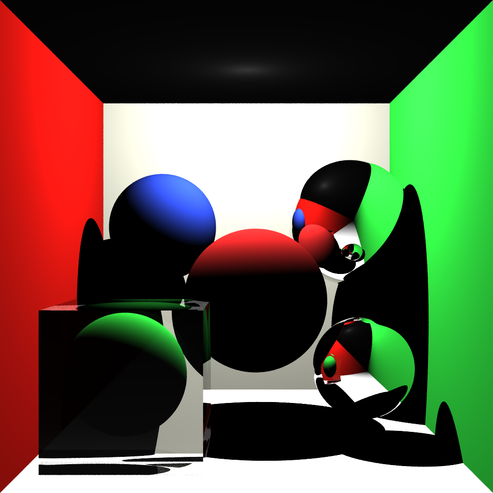

*图 2.14b：**SPP=16**。像素内 16 个 hash 抖动子样本取平均；几何边缘显著平滑。*

**分析**：

1. **Whitted + 低 SPP** 最直观展示几何 AA；路径模式默认 64 SPP 已含 jitter，边缘走样通常弱于 Whitted 1 SPP。
2. **无独立 `aa` 开关**：提高 `spp` 即加强抗锯齿（路径模式同时降 MC 方差）。
3. CPU/GPU 使用 **相同** `hash01` 公式，高 spp 统计一致（RNG 发生器不同：LCG vs curand）。

**结论**：抗锯齿通过 **SPP + 子像素 jitter + 盒式平均** 实现，零额外数据结构，与超采样路径追踪自然统一。

---

### 2.15 综合展示

将 **四项核心功能** 集中于单幅 Cornell Box 终稿（`testcases/scene_final_simple.txt`）：**MIS 路径追踪**、**Gamma 校正**、**纹理贴图**、**色散**（仅棱镜一处）。CPU `path_mis` 渲染以支持纹理与法线贴图；**不含** Ward / Fresnel 加分项，亦不含旧版 `scene_final_showcase.txt` 中的金兔 / 镜面 / 玻璃组合。

> **说明**：旧终稿 `scene_final_showcase.txt`（`masterpiece.png`，CUDA 多物体）已弃用，保留文件仅供对照；本报告以 `final_simple.png` 为准。

#### 2.15.1 场景构成

| 物体 | 位置 | 材质 | 展示功能 |
|------|------|------|----------|
| 后墙 `cornell_back_wall.obj` | 盒体后方 | 灰泥 albedo + `plaster_normal.bmp`，Phong `shininess 40` | **纹理 + 法线贴图**（Panel C） |
| 大理石球 | 中央偏左 | `marble_albedo.bmp` | 程序化 albedo 纹理 |
| 色散棱镜 `prism.obj` | 中央偏右地面 | 折射 IOR 1.50，`dispersionDelta 0.10` | **色散**（本场景唯一色散物体） |
| 红/绿墙 + 灰地面/后平面 | Cornell 盒 | 经典漫反射色 | 间接色溢与构图 |
| 天花板面光 | 顶部小窗 | AreaLight + Emissive `65` | **NEE + MIS** 直接光采样 |

> **曝光**：面光 `65`，无镜面/金属高光叠加，较旧版 masterpiece（面光 `35` 但含镜面组合）更易读且不易过曝。

#### 2.15.2 渲染命令

```bash
cd code/build && cmake .. && make -j
mkdir -p textures output/final results
cd ..
./build/gen_textures
./build/PA1-2 testcases/scene_final_simple.txt output/final/final_simple.bmp \
    path_mis 64 gamma omp dispersion
python3 -c "from PIL import Image; Image.open('output/final/final_simple.bmp').save('output/final/final_simple.png')"
cp output/final/final_simple.png results/final_simple.png
```

#### 2.15.3 终稿与功能对照

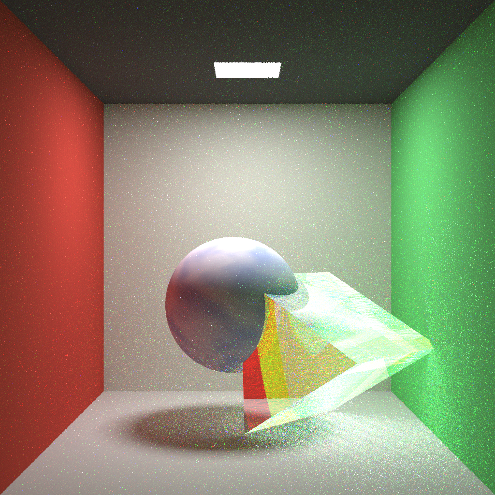

*图 2.15：PA1-2 综合展示 — `path_mis` 64 SPP，`gamma` + `omp` + `dispersion`（CPU，纹理可用）。*

画面中可辨认的对应关系：

1. **后墙灰泥颗粒与凹凸** → 纹理映射 + 法线贴图（CPU 路径）
2. **中央偏左大理石脉理** → 程序化 albedo 纹理
3. **棱镜底部彩虹光斑** → 色散（RGB 分通道 IOR + CLI `dispersion`；全场景仅此物体）
4. **天花板柔光、阴影与红/绿墙间接色** → `path_mis` 路径追踪 + 面光 NEE + MIS
5. **整体 sRGB 色调与边缘平滑** → Gamma 校正 + 64 SPP 子像素抖动抗锯齿 + OpenMP 并行

---

### 实验总览（快速索引）

以下图片均相对于 `code/` 目录；完整分析见各功能小节。

| 实验 | 所在小节 | 关键图 |
|------|----------|--------|
| Path Guiding vs `path_mis` | §2.1.3 | 图 2.1a–c |
| 纹理 A / B / C | §2.2.3 | 图 2.2a–d |
| BVH ON / OFF | §2.3.3 | 图 2.3a–b |
| NEE vs 无 NEE | §2.6.3 | 图 2.6a–b |
| BRDF / NEE / MIS 三模式 | §2.7.3 | 图 2.7a–c |
| Whitted vs Path | §2.8 | 图 2.8a–b |
| GGX 光泽 | §2.9.3 | 图 2.9a |
| 色散 | §2.10.3 | 图 2.10a |
| Gamma 开/关 | §2.11.3 | 图 2.11a–b |
| OpenMP 串行/并行 | §2.12.3 | （计时表；无专用图） |
| CUDA vs CPU | §2.13.3 | 图 2.13a |
| 抗锯齿 SPP 1/16 | §2.14.3 | 图 2.14a–b |
| **综合展示终稿** | §2.15.3 | 图 2.15 |
| Fresnel / Ward（加分） | 附录 A / B | 附录图 A.1–A.3、B.1–B.2 |

---

## 三、补充说明

### 3.1 场景与材质参考

#### Cornell Box 材质索引（`scene_path.txt` / `scene_whitted.txt`）

| 索引 | 用途 | 说明 |
|------|------|------|
| 0 | 地板 | 0.725 米白 |
| 1 | 天花板（非发光） | 0.10 深灰 |
| 2 | 左墙（红） | 0.630 0.065 0.050 |
| 3 | 蓝球 | 0.180 0.280 0.800 |
| 4 | 红球 | 0.800 0.150 0.150 |
| 5 | 右墙（绿）+ 绿球 | 0.150 0.680 0.200 |
| 6 | 镜面球 | ReflectiveMaterial |
| 7 | 玻璃立方体 | RefractiveMaterial, IOR 1.45 |
| 8 | 后墙 / 发光天花板 | Path: EmissiveMaterial；Whitted: 0.65 灰 |
| 9 | 后墙（Path） | 0.65 0.65 0.60 |

#### 玻璃立方体贴地

`mesh/cube.obj` 经 `Translate -0.55 0.36 0.62` + `UniformScale 0.36`：边长 0.72，底面 $y=0$ 贴地。Whitted 与路径追踪中地板接触阴影、焦散位置一致。

### 3.2 已知局限

| 局限 | 说明 |
|------|------|
| 玻璃 firefly | 高 IOR + 纯折射路径在 64 SPP 时偶见亮斑；radiance clamp 保留 |
| SPP=64 方差 | 路径对比图仍有可见噪点；提高 SPP 更干净 |
| 纹理 / 法线仅 CPU | GPU 扁平化不传 BMP |
| Path Guiding 仅 CUDA | 粗网格直方图；空 cell 等同 `path_nee` |
| CUDA 显存 | 大场景或 curand 初始化可能 OOM，回退 CPU |
| 默认线性输出 | 主结果未开 gamma 时为线性 radiance |

### 3.3 参考文献

- 清华大学 PA1 光线追踪框架（`code/`）
- 课程讲义：BRDF 与 Cook-Torrance
- 习题课：路径追踪、RR、NEE
- GAMES101 Lecture 16（NEE 面积采样）

---

## 附录 A：加分项 — 菲涅尔 Schlick 折射

> 本附录单独记录 Fresnel bonus，正文功能列表未包含。

### A.1 原理

电介质折射界面按 Schlick 近似分配反射能量：

$$F_r(\theta_i) = R_0 + (1 - R_0)(1 - \cos\theta_i)^5,\quad R_0=\left(\frac{n_1-n_2}{n_1+n_2}\right)^2$$

- **Whitted**：解析加权 $L = F_r L_{\mathrm{refl}} + (1-F_r) L_{\mathrm{refr}}$
- **路径追踪**：Russian Roulette 按 $F_r$ 选反射/折射，throughput 除以概率
- **TIR**：Snell 无解时 $F_r=1$；材质可用 `noFresnel` 关闭

### A.2 实验图

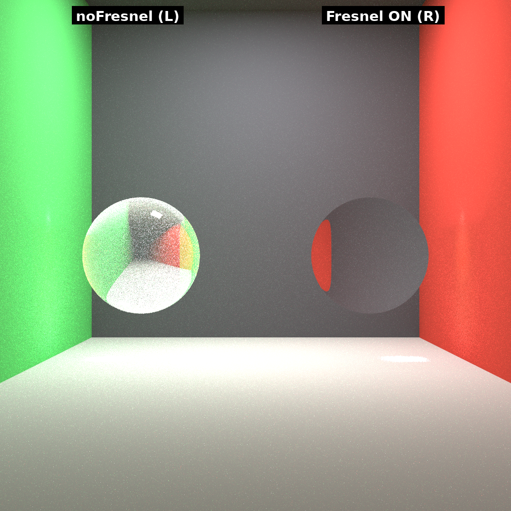

*附录图 A.1：`scene_fresnel_cornell_compare.txt`。Cornell 盒 + AreaLight；相机 $(0,0.50,3.8)$ 与球心同高、沿 $-Z$ 看向后墙；两球 $(\pm0.55,0.50,0)$、$r=0.28$（间隙 0.54）、IOR 1.50、`refractColor` 白；左 `noFresnel` 球心透视后墙（center→后墙 L2≈0.02–0.05），右 Fresnel ON 侧缘红/绿墙反射更强。*

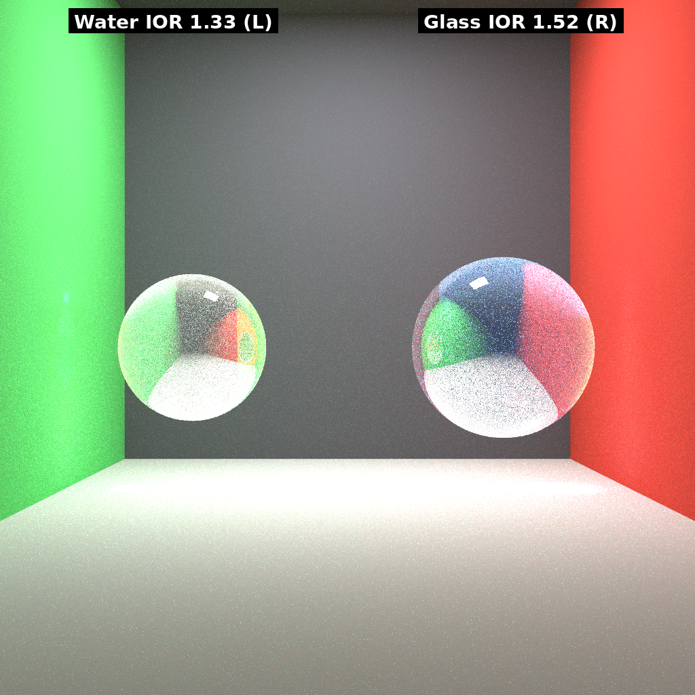

*附录图 A.2：同相机布局；左水球 IOR 1.33、`refractColor (0.30,0.55,1.0)` $r=0.32$；右玻璃球 IOR 1.60 无色 $r=0.26$；均 Fresnel ON，球心可见后墙，水球蓝 tint、玻璃更清晰。*

**透射调试场景**：`scene_fresnel_debug_transmit.txt` — 单球 $(0,0.50,0)$ $r=0.28$、`noFresnel`；相机 $(0,0.50,2.5)$ 与球心共轴。球心像素与后墙 L2 $<0.03$ 即确认折射出射路径正常；若双球对比场景仍只见侧墙色，优先检查相机高度是否与球心对齐、横向偏移是否过大（离轴折射会弯向红/绿侧墙而非后墙）。

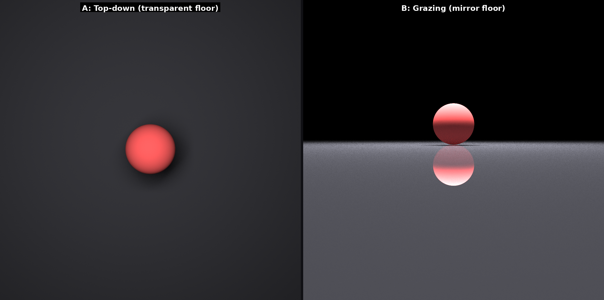

*附录图 A.3：`scene_fresnel_grazing_topdown.txt` / `scene_fresnel_grazing_low.txt`。玻璃地板 IOR 1.50 + 红漫反射球；俯视见透明地板与下方红球；贴地掠射 $F\to 1$ 地板镜面映红球。*

**场景参数摘要**

| 实验 | 场景文件 | 要点 |
|------|----------|------|
| 开/关 | `scene_fresnel_cornell_compare.txt` | 相机 $(0,0.50,3.8)$；球 $(\pm0.55,0.50,0)$ $r=0.28$；左 `noFresnel` 右 Fresnel |
| 水/玻璃 | `scene_fresnel_cornell_water_glass.txt` | 左 IOR 1.33 蓝 tint $r=0.32$，右 IOR 1.60 无色 $r=0.26$ |
| 透射调试 | `scene_fresnel_debug_transmit.txt` | 单球共轴相机；验证 center→后墙 L2 |
| 掠射 | `scene_fresnel_grazing_topdown.txt` / `_low.txt` | 地板 `RefractMaterial` IOR 1.5；红球 `(0,0.3,0)` $r=0.3$ |

**关键文件**：`include/material.hpp`、`include/raytracer.hpp`、`src/cuda_path_tracer.cu`（`isSegmentOccluded` 折射面透射 NEE 阴影）、`src/cuda_scene_builder.cpp`（`fresnelEnabled` 上传）。

复现：`bash scripts/fresnel_render.sh`；标注图与并排 `fresnel_grazing_compare.png`：`python3 scripts/fresnel_figures.py`。

---

## 附录 B：加分项 — Ward 各向异性 BRDF

> 本附录单独记录 Ward bonus，正文功能列表未包含。

### B.1 原理

Ward (1992) 各向异性微表面模型；$\alpha_x \neq \alpha_y$ 时高光沿切线 $T$ 方向拉伸为椭圆条纹。漫反射 Lambert + 能量守恒 $\rho_d'=\rho_d(1-\max\rho_s)$。

**关键**：在 **球面** 上用 `buildConsistentBasis` 构建确定性切线场，再按场景 `tangent` 旋转，形成随曲率弯曲的拉丝金属高光（经典 brushed metal）。

### B.2 实验图

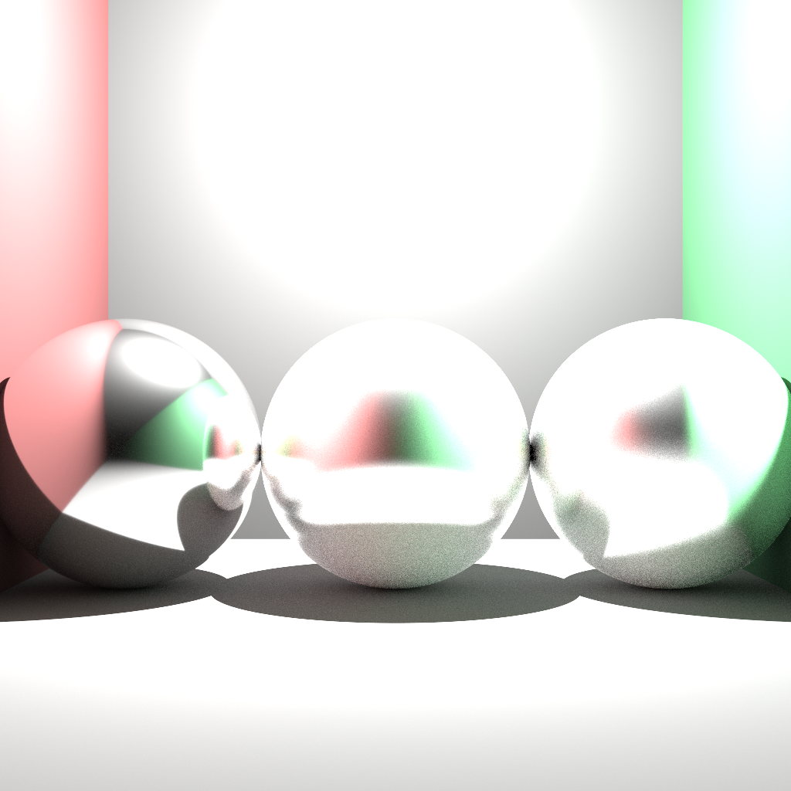

*附录图 B.1：`scene_brdf_metal_compare.txt`，512 SPP CUDA。暗室 + PointLight `(0,1.5,0)`；三球 $r=0.35$ 于 $x=-0.7,0,0.7$；左 Cook-Torrance GGX（$\mathrm{roughness}=0.1$），中 Ward $\alpha_x=0.2,\alpha_y=0.01$（水平条纹），右 Ward $\alpha_x=0.01,\alpha_y=0.2$（垂直条纹）；暗金属 $\rho_d=(0.01,0.01,0.01)$、$\rho_s=(1,1,1)$。*

> 旧版竖直 Triangle 面板场景（`scene_ward_aniso_showcase.txt` 等）已弃用，请用 `scene_brdf_metal_compare.txt`。

**关键文件**：`WardBRDF` / `WardMaterial`（`include/material.hpp`）、`shadeWardPath`（`include/raytracer.hpp`）、GPU `buildWardFrame` / `evalWardNEE`（`src/cuda_path_tracer.cu`）。

---

## 附录 C：推荐运行命令

```bash
cd code
cmake --build build -j$(nproc)

# —— Whitted / Path / NEE 对比（§2.6.3、§2.8）——
mkdir -p output/report
./build/PA1-2 testcases/scene_path.txt output/report/whitted_cornell.bmp whitted 1 gamma
./build/PA1-2 testcases/scene_path.txt output/report/path_cornell.bmp path 64 gamma omp
./build/PA1-2 testcases/scene_path.txt output/report/path_nee_cornell.bmp path_nee 64 gamma omp

# —— Path Guiding 对比（§2.1.3）——
mkdir -p output/guiding_compare
./build/PA1-2 testcases/scene_guiding_occluder.txt output/guiding_compare/mis_128.bmp path_mis 128 gamma cuda
./build/PA1-2 testcases/scene_guiding_occluder.txt output/guiding_compare/guiding_128.bmp path_guiding 128 gamma cuda train_spp 256
python3 scripts/guiding_compare_figures.py

# —— 纹理三面板（§2.2.3，CPU）——
./build/gen_textures
./build/PA1-2 testcases/scene_texture_cornell_notex.txt output/texture_cornell_notex.bmp whitted 1 gamma
./build/PA1-2 testcases/scene_texture_cornell.txt output/texture_cornell.bmp whitted 1 gamma
./build/PA1-2 testcases/scene_texture_cornell_normal.txt output/texture_cornell_normal.bmp whitted 1 gamma

# —— BVH Bunny（§2.3.3）——
./build/PA1-2 testcases/scene_bvh_bunny.txt output/bvh_compare/bunny_gpu_bvh_on_path128.bmp path_nee 128 cuda
./build/PA1-2 testcases/scene_bvh_bunny.txt output/bvh_compare/bunny_gpu_bvh_off_path128.bmp path_nee 128 cuda no_bvh

# —— 光泽 / 色散（§2.9、§2.10）——
./build/PA1-2 testcases/scene_glossy.txt output/glossy/glossy.bmp path_nee 64 gamma
./build/PA1-2 testcases/scene_dispersion.txt output/diag/dispersion.bmp path_nee 128 gamma dispersion

# —— Gamma / OpenMP / CUDA / AA（§2.11–§2.14）——
./build/PA1-2 testcases/scene_whitted.txt output/report/gamma_before.bmp whitted 1 cuda
./build/PA1-2 testcases/scene_whitted.txt output/report/gamma_after.bmp whitted 1 gamma cuda
./build/PA1-2 testcases/scene_path.txt output/report/omp_serial.bmp path_nee 32 gamma
./build/PA1-2 testcases/scene_path.txt output/report/omp_parallel.bmp path_nee 32 gamma omp
./build/PA1-2 testcases/scene_bvh_bunny.txt output/report/bunny_w_cpu.bmp whitted 1 gamma omp
./build/PA1-2 testcases/scene_bvh_bunny.txt output/report/bunny_w_cuda.bmp whitted 1 gamma cuda
./build/PA1-2 testcases/scene_whitted.txt output/report/aa_before.bmp whitted 1 cuda
./build/PA1-2 testcases/scene_whitted.txt output/report/aa_after.bmp whitted 16 cuda

# —— 综合展示终稿（§2.15）——
mkdir -p textures output/final results
./build/gen_textures
./build/PA1-2 testcases/scene_final_simple.txt output/final/final_simple.bmp path_mis 64 gamma omp dispersion
python3 -c "from PIL import Image; Image.open('output/final/final_simple.bmp').save('output/final/final_simple.png')"
cp output/final/final_simple.png results/final_simple.png

# —— Fresnel / Ward（见附录，需 CUDA）——
bash scripts/fresnel_render.sh
./build/PA1-2 testcases/scene_brdf_metal_compare.txt output/ward/brdf_metal_compare.bmp path_nee 512 gamma cuda
```
