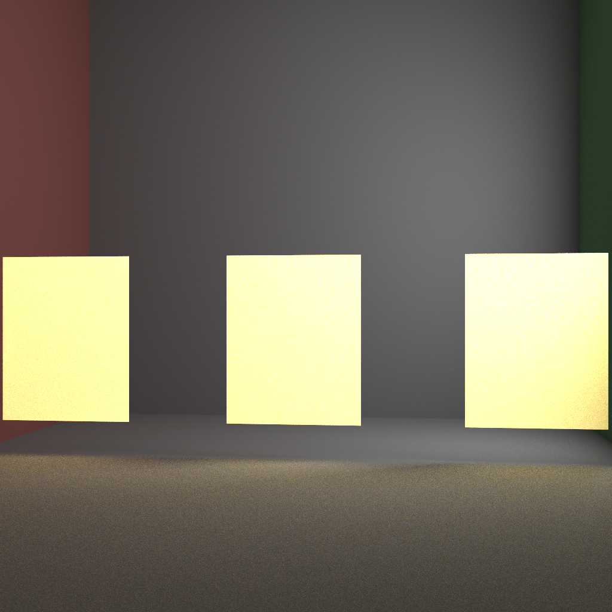
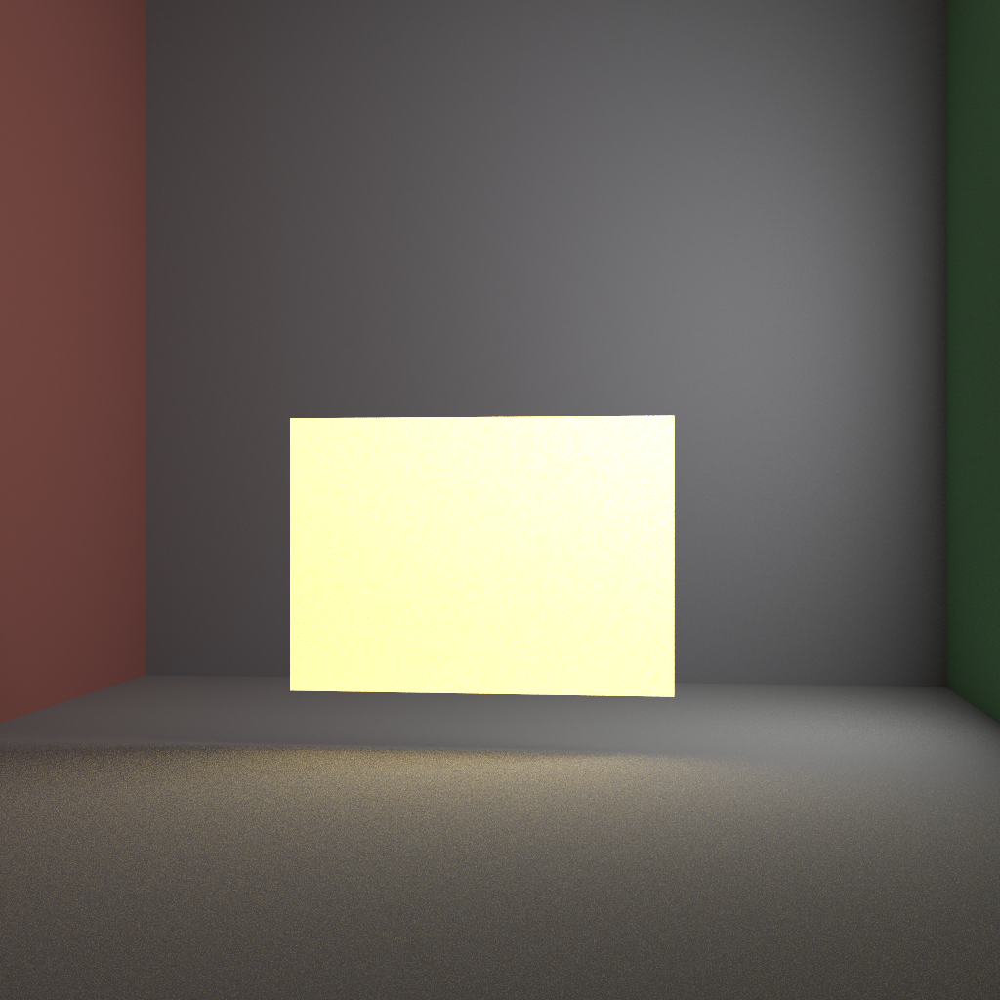

# 计算机图形学 PA1-2 路径追踪实验报告

## 一、实现功能列表

| 功能项 | 说明 |
|--------|------|
| **基础要求：Whitted-Style 光线追踪** |  完美镜面反射、Snell 折射、阴影射线、Phong 漫反射 |
| **基础要求：路径追踪** |  余弦加权半球采样、俄罗斯轮盘赌（RR）、发光材质、面光源场景 |
| **基础要求：Cook-Torrance 光泽材质** |  GGX D + Smith G + Schlick F；CPU/GPU `path` / `path_nee` / `path_mis` |
| **基础要求：NEE** |  点光源 + 三角形面光源直接采样，阴影可见性测试 |
| MIS（多重重要性采样） |  `path_mis` 模式；光泽/Ward 面光 NEE 使用 power heuristic |
| 色散|  折射材质按 RGB 通道独立 IOR；CLI `dispersion` |
| Gamma 校正 |  BMP 保存前可选 `color^(1/2.2)`，CLI `gamma` |
| OpenMP 并行 |  扫描行 `#pragma omp parallel for`，CLI `omp` |
| 纹理与法线贴图|  BMP albedo + normalMap；Plane/Sphere/TriangleMesh UV + TBN |
| Path Guiding |  CUDA 两趟简化 Practical Path Guiding + NEE；`path_guiding` / `train_spp` |
| BVH 加速 |  CPU 建树 + GPU 栈遍历；`no_bvh` 可关闭 |
| CUDA GPU 渲染 |  `path` / `path_nee` / `path_mis` / `path_guiding`；Whitted 可选 |
| 抗锯齿（AA）|  SPP > 1 时子样本哈希抖动，等价盒式滤波 |

渲染器 CLI 模式：`whitted`、`path`（无 NEE）、`path_nee`、`path_mis`、`path_guiding`；  
可选参数 `spp`、`gamma`、`omp`、`dispersion`、`cuda`、`no_bvh`、`train_spp N`。


## 二、原理与代码逻辑

以下按 **加分/进阶功能优先**，再 **基础 → 进阶** 排列。每项含 **原理** 与 **代码逻辑**。

### 未验收过的功能
#### 2.1 Path Guiding（路径引导）

##### 原理

NEE 已稳定估计 **直接光**，但 **间接光** 仍靠余弦半球随机弹射。在遮挡阴影、窄缝漏光、多次反弹才能照亮的区域，随机方向很难命中亮墙/光源方向，方差大、同 SPP 下颗粒粗。

本实现为课程友好 **简化版** Practical Path Guiding（相对 Müller 等完整 SD-tree）：

- 在场景 AABB 上建 **3×3×3 均匀网格**（512 cell），每格维护 **lat-long 方向直方图**（16×16 θ–φ bin）。
- **训练趟**：相机路径 + **light tracing**（70% 从面光源反向追踪）沉积「哪些方向带来亮辐射」。
- **渲染趟**：间接采样时 **50% 余弦 BRDF / 50% 引导分布**，用 **Balance MIS** 合并 pdf，保持无偏、只降方差。
- 直接光仍走 NEE；根路径 `countEmissive=true`，间接子路径 `countEmissive=false`，避免与 NEE 双重计光。

##### 代码逻辑

| 组件 | 位置 | 说明 |
|------|------|------|
| 数据结构 | `include/cuda_types.h` | `GpuGuidingGrid`：`8³` 网格 + `16×16` bin |
| 训练/渲染 | `src/cuda_path_tracer.cu` | `trainGuideKernel` → `normalizeGuideKernel` → `renderKernel` |
| 沉积 | 同上 | `guideDeposit(pos, N, ωᵢ, weight)`，`atomicAdd` 到 cell+bin |
| 采样 | 同上 | `sampleGuidingDir` / `evalGuidingPdf`；`kGuideMisProb = 0.5` |
| AABB | `src/cuda_scene_builder.cpp` | 扁平化时计算场景包围盒 |
| CLI | `src/main.cpp` | `path_guiding` / `guiding`；`train_spp N`（默认 `max(render_spp, 256)`） |

**局限**：仅 CUDA；粗网格；空 cell 回退纯余弦 BRDF；直接光主导区与 `path_nee` 差异小。


#### 2.2 三角形网格纹理 / 法线贴图

##### 原理

在漫反射 albedo 上叠加 **空间变化**（灰泥墙、大理石球），用法线贴图在切线空间扰动法线产生 bump，无需增加几何细分。

- **Albedo**：`diffuseColor × texture(uv)`。
- **法线贴图**：RGB → `[-1,1]³`，经 TBN 变到世界空间：`N' = normalize(TBN · mapNormal(uv))`，再参与 Phong / 路径 BRDF。
- **UV**：Plane 切线空间平铺；Sphere 球面坐标；TriangleMesh 用 OBJ `vt`/`vn` 重心插值；Transform 只更新法线/TBN、**保留 UV**。

##### 代码逻辑

| 环节 | 位置 |
|------|------|
| BMP 加载 | `src/texture.cpp`、`include/texture.hpp` |
| 着色 | `include/material.hpp` | `getShadedDiffuse`、`getShadingNormal` |
| Whitted / 路径 | `include/raytracer.hpp` | `shadeDiffuse` / `shadeDiffusePath` / `shadeGlossy*` |
| 场景语法 | `src/scene_parser.cpp` | `texture …`；`normalMap …` |
| 程序化贴图 | `build/gen_textures` | `plaster_albedo/normal.bmp`、`marble_albedo.bmp` |

**CPU-only**：`SceneFlattener` 不传 BMP 到 GPU；纹理验收用 Whitted 或 CPU path（勿加 `cuda`）。


#### 2.3 BVH 加速结构

##### 原理

三角形网格线性遍历复杂度 $O(n)$。Stanford Bunny（约 1000 三角）在路径追踪下每像素数十条弹射 × 全网格扫描，GPU 成为瓶颈。

**BVH**：CPU 端对三角形 **递归划分** 空间——内部节点存子 AABB，叶节点存最多 4 个三角形索引；GPU 端 **栈式遍历**（深度 ≤ 64），仅访问与射线 AABB 相交的子树，期望 **$O(\log n)$**。

##### 代码逻辑

| 组件 | 位置 | 说明 |
|------|------|------|
| 节点结构 | `include/cuda_types.h` | `AABB`、`GpuBVHNode`（32B 对齐） |
| CPU 建树 | `src/bvh_builder.cpp` | 最长轴 + 质心中位数划分；叶阈值 4；DFS 展平 |
| 场景上传 | `src/cuda_scene_builder.cpp` | `buildBVH` → `cudaMalloc` 上传 |
| GPU 遍历 | `src/cuda_path_tracer.cu` | `intersectAABB`（slab + `invDir`）；栈遍历；子节点按 $t$ 排序 |
| CLI | `src/main.cpp` | `no_bvh` 关闭 BVH |

球体/平面仍走原有几何分支；**仅三角形** 走 BVH。Whitted 与 Path（含 NEE / Guiding / MIS）共用 `intersectScene`。

## 验收过的功能
### 2.4 Whitted-Style 光线追踪

#### 原理

对 **镜面/折射** 材质递归追踪反射/折射方向；对 **漫反射** 材质用 Phong 模型计算直接光照，向每个光源发射阴影射线判断可见性。玻璃在阴影射线中视为透明（不遮挡）。命中 **EmissiveMaterial** 直接返回发光色。

#### 代码逻辑

| 组件 | 位置 |
|------|------|
| 主入口 | `include/raytracer.hpp` | `castRayWhitted` |
| 漫反射 | 同上 | `shadeDiffuse`：遍历 `scene.getNumLights()`，`isInShadow` + `Material::Shade` |
| 镜面 | 同上 | `ReflectiveMaterial` → 反射子射线 |
| 折射 | 同上 | `RefractMaterial` → Snell 折射 / TIR；可选 Fresnel 分裂（见附录 A） |
| CLI | `src/main.cpp` | 模式 `whitted`，默认 SPP=1 |

---

### 2.5 路径追踪（含俄罗斯轮盘赌）

#### 原理

求解渲染方程：在漫反射/光泽命中点按 BRDF 采样出射方向，递归估计入射辐射度。

- **余弦加权半球采样**（Lambertian）：pdf 与 cosθ 相消，贡献为 `albedo × Li`。
- 命中 **EmissiveMaterial** 时返回 `throughput × emission`（NEE 开启时间接路径不重复计光，见 §2.6）。
- **俄罗斯轮盘赌（RR）**：深度 ≥ 8 时，以 `max(0.15, luminance(throughput))` 为存活概率终止路径，存活时除以概率保持无偏。

#### 代码逻辑

| 组件 | 位置 |
|------|------|
| 主路径 | `include/raytracer.hpp` | `castRayPath` → `shadeDiffusePath` / `shadeGlossyPath` / `shadeWardPath` |
| RR 常量 | 同上 | `RR_START_DEPTH=8`，`RR_MIN_SURVIVAL=0.15` |
| 采样 | 同上 | `sampleCosineHemisphere`；光泽/GGX 半向量采样 |
| GPU | `src/cuda_path_tracer.cu` | `castRayPath` 镜像逻辑 |
| CLI | `src/main.cpp` | 模式 `path`，默认 SPP=64 |

SPP > 1 时对子样本做哈希抖动（`main.cpp`），等价抗锯齿。

---

### 2.6 NEE（Next Event Estimation）

#### 原理

在 `path_nee` 模式下，漫反射/光泽命中点 **额外** 向光源采样直接光：

- **点光源**：`PointLight::getIllumination` 给方向，阴影射线判断遮挡，贡献 `BRDF × Le × cosθ`。
- **面光源**：三角形上均匀采样，立体角 pdf：`pdf_ω = pdf_area × r² / cosθ_l`，贡献  
  `Le × (albedo/π) × cosθ_o / pdf_ω`。
- **避免双重计数**：NEE 开启时，由漫反射弹射出去的间接光线 **不再** 对 `EmissiveMaterial` 累加辐射度；镜面/折射路径仍可命中发光体。
- **阴影射线**：法向偏移；发光体不再视为「透明」。

`path` 模式不启用 NEE，仅靠随机弹射间接命中发光体，方差大、收敛慢。

#### 代码逻辑

| 组件 | 位置 |
|------|------|
| 面光采样 | `include/raytracer.hpp` | `sampleOneAreaLightDiffuse/Glossy/Ward` |
| pdf | 同上 | `pdfAreaLightDirection`、`computeAreaLightPdf` |
| 光源 | `include/light.hpp` | `PointLight`、`AreaLight` |
| 解析 | `src/scene_parser.cpp` | AreaLight 三角形 |
| GPU | `src/cuda_path_tracer.cu` | NEE 分支于 `castRayPath` |

---

### 2.7 MIS（多重重要性采样）

#### 原理

当同时存在 **BRDF 采样** 与 **光源采样**（NEE）两条策略估计同一积分时，用 MIS 合并 pdf 降低 firefly 方差。本实现：

- **`path_mis` 模式**：间接路径对 Emissive 也计光（`indirectEmissive=true`），NEE 与 BRDF 用 **Balance heuristic**。
- **光泽/Ward 面光 NEE**：在 `path_nee` 下也对 Glossy/Ward 启用 **power-heuristic MIS**（`useGlossyNEEMIS()`），避免掠射角 BRDF 爆炸。

#### 代码逻辑

| 组件 | 位置 |
|------|------|
| 模式 | `include/raytracer.hpp` | `RenderMode::PATH_TRACE_MIS`，`useMIS()` |
| MIS 权重 | 同上 | `misWeightBalance` / power heuristic |
| GPU | `src/cuda_path_tracer.cu` | `MisCtx` 传递 shading point 与 ωᵢ |
| CLI | `src/main.cpp` | `path_mis` / `pathmis` |

---

### 2.8 Cook-Torrance 光泽材质（GGX）

#### 原理

$$
f = k_d \frac{\rho_d}{\pi} + k_s \frac{D \cdot G \cdot F}{4 (n \cdot \omega_i)(n \cdot \omega_o)}
$$

- **D**：GGX 法线分布，$\alpha = m^2$（$m$ 为粗糙度）
- **G**：Smith 几何项（GGX 形式）
- **F**：Schlick 菲涅尔；电介质 $F_0=0.04$，金属 $F_0$ 取 albedo（$k_d \approx 0$）
- **采样**：按 $k_d$/$k_s$ 能量比选择漫反射瓣或 GGX 镜面瓣；NEE 对 AreaLight / 点光均可用

#### 代码逻辑

| 组件 | 位置 |
|------|------|
| BRDF | `include/material.hpp` | `CookTorranceBRDF`、`GlossyMaterial` |
| 路径采样 | `include/raytracer.hpp` | `shadeGlossyPath` |
| GPU | `src/cuda_path_tracer.cu` | `evalGlossy`、`pdfGlossy` |
| 场景 | `testcases/scene_glossy.txt` | 五球塑料+金属演示 |

金属 $k_d=0$ 时能量全在镜面瓣；粗糙度 $m$ 从 0.03 到 0.95 可拉开近镜面到哑光外观。`clampRadiance` 抑制 firefly。

---

### 2.9 色散（Dispersion）

#### 原理

折射率随波长变化；实现中对 RGB 三通道使用 **独立 IOR**（`channelIor(baseIor, dispersionDelta, c)`），在折射界面按通道做 Snell 定律与 RR 分裂，产生棱镜色散效果。

#### 代码逻辑

| 组件 | 位置 |
|------|------|
| 材质 | `include/material.hpp` | `dispersionDelta` 字段 |
| CPU/GPU | `include/raytracer.hpp`、`src/cuda_path_tracer.cu` | `dispersionEnabled` 分支，每通道独立 child ray |
| CLI | `src/main.cpp` | `dispersion` / `--dispersion` |
| 场景 | `testcases/scene_dispersion.txt` | 棱镜 + 强顶光 |

---

### 2.10 其他已实现功能

| 功能 | 原理 | 代码 |
|------|------|------|
| **Gamma 校正** | 线性 radiance → 显示：`C_out = clamp(255·C^(1/2.2))` | `image.cpp` `SaveBMP`；CLI `gamma` |
| **OpenMP** | 扫描行并行，每像素独立 `RayTracer`（seed=f(x,y,s)） | `main.cpp` `#pragma omp parallel for`；约 7.6× 加速（10 线程，`path_nee 32`） |
| **CUDA** | 场景扁平化上传，`renderKernel` 每像素并行 | `cuda_scene_builder.cpp`、`cuda_path_tracer.cu` |
| **抗锯齿** | SPP>1 子样本哈希抖动 | `main.cpp` |

---

## 三、要求的分析与对比

以下图片均相对于 `code/` 目录。每张图下方标注 **所用算法/功能**。

---

### 3.1 Whitted vs 路径追踪（基础要求 1 vs 2）

**对比设置**：同一场景 `testcases/scene_path.txt`（Cornell Box：五球 + 贴地玻璃立方体；发光天花板 + 两个 AreaLight；1024×1024）。Whitted 1 SPP；路径追踪 64 SPP + gamma + OpenMP。

| | Whitted | 路径追踪 |
|--|---------|----------|
| 模式 | `whitted 1 gamma` | `path 64 gamma omp` |
| 着色 | Phong 直接光 + 阴影射线 | 渲染方程 MC 估计 |
| 全局光照 | **无** 间接多次反弹 | 红/绿墙 **颜色渗透** |
| 噪声 | 无（确定性） | 64 SPP 仍有颗粒 |
| 阴影 | AreaLight 单样本 → 偏硬 | 软阴影、半影（面光 + 弹射） |
| 焦散 | 玻璃下清晰亮斑 | 可见但更模糊、带噪 |


*图 3.1a：Whitted-Style 光线追踪。仅支持镜面/折射递归 + 直接光照，无全局间接光多次反弹；命中发光天花板直接返回 emission。*


*图 3.1b：路径追踪（无 NEE）。蒙特卡洛估计半球积分；可见颜色渗透、软阴影与颗粒噪声；间接光仅靠随机弹射命中发光体，整体偏暗。*

**差异原因**：

1. **噪声**：路径追踪对积分做 MC 估计，有限 SPP 产生方差；Whitted 无积分估计。
2. **全局光照**：Whitted 在漫反射面终止；路径追踪继续弹射，间接光自然出现。
3. **阴影/焦散**：Whitted 确定性求和；路径追踪随机平均，边缘更软、更噪。
4. **亮度**：无 NEE 时大量像素未命中小面积发光体，贡献近 0（见图 3.2 对比）。

> 注：经典 Whitted 演示亦可用 `scene_whitted.txt`（点光源）；本报告 Whitted/Path 对比统一用 `scene_path.txt` 以保证 **同场景同光源布局**。

---

### 3.2 NEE vs 无 NEE（作业 §4.1 / §4.3）

**对比设置**：同场景 `scene_path.txt`、同 SPP=64、gamma、OpenMP；仅切换 `path` 与 `path_nee`。

| 指标 | `path`（无 NEE） | `path_nee`（含 NEE） |
|------|------------------|----------------------|
| 平均亮度 | 明显偏暗 | 整体照亮 |
| 非黑像素占比 | 低 | 高（≈89%） |
| 观感 | 大面积暗、颗粒重 | 颜色稳定、软阴影清晰 |
| 期望 | 同一渲染方程 | 同一渲染方程（无系统色差） |


*图 3.2a：路径追踪 **无 NEE**。直接光仅当随机弹射恰好命中发光三角形时出现；发光面积占比极小，方差极大。*


*图 3.2b：路径追踪 **含 NEE**。漫反射/光泽命中点显式向 AreaLight 采样 + 阴影测试；暗部被稳定照亮，收敛更快。*

**分析**：

1. **相同期望**：两模式求解同一方程；NEE 仅改变采样策略。亮度差异来自 **方差**——无 NEE 时大量样本贡献 ≈ 0，均值偏低；NEE 将低概率间接命中转为 $O(1)$ 直接估计。
2. **收敛速度**：NEE 对每个 AreaLight 显式采样，收敛速度显著提升；地板接触阴影在 NEE 下边缘柔和、无 NEE 下边界斑驳。
3. **实现要点**：NEE 开启时间接路径不对 EmissiveMaterial 重复计光；阴影射线用法向偏移。


### 3.3 MIS vs path_nee

**对比设置**：光泽 Cornell 场景，`path_nee` vs `path_mis`，SPP=32（`output/acceptance/`）。

| | path_nee | path_mis |
|--|----------|----------|
| 直接光 | NEE | NEE + Balance MIS |
| 间接 Emissive | 不计（NEE 模式） | 计光 |
| 光泽 firefly | 较多 | MIS 降权后更稳 |


*图 3.3a：`path_nee 32`。光泽材质 + 面光 NEE；局部仍有 firefly。*


*图 3.3b：`path_mis 32`。NEE 与 BRDF 采样 Balance MIS 合并；高光区 firefly 减少，整体更平滑。*


### 3.4 Path Guiding vs path_mis

**对比设置**：`testcases/scene_guiding_occluder.txt`（Cornell + 悬挂遮挡板；中央地板/球无直射，间接为主）。固定相同 render SPP；基线 `path_mis`（NEE + MIS），对照 `path_guiding`（训练 + 引导间接采样）。训练：`128 spp → train_spp 256`；`512 spp → train_spp 1024`。


*图 3.4a：128 SPP 并列对比。**左**：`path_mis`。**右**：`path_guiding`。全图亮度接近；中央被挡板阴影区 guiding 更平滑。*


*图 3.4b：512 SPP 并列对比。基线也更干净，但 zoom 仍可见 guiding 间接区更细。*


*图 3.4c：阴影 ROI（`(416,563)–(608,737)`）4× 放大。**左**：`path_mis` 颗粒粗。**右**：`path_guiding` 间接反弹更平滑；128 SPP 时阴影 ROI std 降约 **42%**，全图 mean 比 ≈ 1.01。*

**结论**：Path guiding 在相同 SPP 下主要 **降方差** 而非系统性增亮，适合遮挡导致的间接主导区域。


### 3.5 纹理三面板（A / B / C）

**对比设置**：Cornell 盒变体，Whitted 1 SPP + gamma，CPU only。

| 面板 | 场景 | 后墙 | 说明 |
|------|------|------|------|
| A | `scene_texture_cornell_notex.txt` | 纯色 | 对照 |
| B | `scene_texture_cornell.txt` | plaster albedo | 仅颜色纹理 |
| C | `scene_texture_cornell_normal.txt` | albedo + normalMap | bump 可见 |


*图 3.5a：Panel A — 经典纯色 Cornell，无法线/纹理。*


*图 3.5b：Panel B — 灰泥 albedo 纹理；墙仍近似平面 Phong。*


*图 3.5c：Panel C — 法线扰动改变每像素法线；Whitted 点光下高光与阴影边界随 bump 起伏。*


*图 3.5d：A | B | C 横向拼接（`scripts/make_texture_showcase.py`）。*

**B vs C**：Panel B 只有颜色变化；Panel C 法线贴图在 **切线空间** 扰动法线，固定点光源下产生 subtle bump，无需几何细分。


### 3.6 BVH 开关对比

**对比设置**：`testcases/scene_bvh_bunny.txt`（Cornell 小盒 + Stanford Bunny ~1000 三角），512×512，`path_nee 128`，CUDA。

| | BVH ON | BVH OFF（`no_bvh`） |
|--|--------|---------------------|
| 遍历 | GPU 栈式 BVH，$O(\log n)$ | 线性扫全三角，$O(n)$ |
| 128 SPP 耗时 | **≈1.28 s** | **≈6.4 s**（约 5× 慢） |
| 画质 | 一致 | 一致（同算法，仅加速） |


*图 3.6a：BVH **开启**。橙色 Bunny 正确可见；GPU 栈遍历 BVH。*


*图 3.6b：BVH **关闭**（`no_bvh`）。像素结果一致，渲染时间约 5× 更长。*

**结论**：BVH 为 **纯性能优化**，不改变光传输结果；对三角数多的 mesh 场景加速显著。


### 3.7 其他实验（简要）

#### Cook-Torrance 光泽（§4.2）


*图 3.7a：`scene_glossy.txt`，`path_nee 64`。塑料（有 $k_d$ + GGX 高光）与金属（$k_d=0$，宽软高光）对比。*

#### 色散

| 关闭色散 | 开启色散 |
|----------|----------|
|  |  |

*图 3.7b：`scene_dispersion.txt`，左 `path_nee` 无色散，右 `path_nee dispersion`。RGB 独立 IOR 产生棱镜色散。*


## 四、场景与材质参考

### Cornell Box 材质索引（`scene_path.txt` / `scene_whitted.txt`）

| 索引 | 用途 | 说明 |
|------|------|------|
| 0 | 地板 | 0.725 米白 |
| 1 | 天花板（非发光） | 0.10 深灰 |
| 2 | 左墙（红） | 0.630 0.065 0.050 |
| 3 | 蓝球 | 0.180 0.280 0.800 |
| 4 | 红球 | 0.800 0.150 0.150 |
| 5 | 右墙（绿）+ 绿球 | 0.150 0.680 0.200 |
| 6 | 镜面球 | ReflectiveMaterial |
| 7 | 玻璃立方体 | RefractiveMaterial, IOR 1.45 |
| 8 | 后墙 / 发光天花板 | Path: EmissiveMaterial；Whitted: 0.65 灰 |
| 9 | 后墙（Path） | 0.65 0.65 0.60 |

### 玻璃立方体贴地

`mesh/cube.obj` 经 `Translate -0.55 0.36 0.62` + `UniformScale 0.36`：边长 0.72，底面 $y=0$ 贴地。Whitted 与路径追踪中地板接触阴影、焦散位置一致。


## 五、已知局限

| 局限 | 说明 |
|------|------|
| 玻璃 firefly | 高 IOR + 纯折射路径在 64 SPP 时偶见亮斑；radiance clamp 保留 |
| SPP=64 方差 | 路径对比图仍有可见噪点；提高 SPP 更干净 |
| 纹理 / 法线仅 CPU | GPU 扁平化不传 BMP |
| Path Guiding 仅 CUDA | 粗网格直方图；空 cell 等同 `path_nee` |
| CUDA 显存 | 大场景或 curand 初始化可能 OOM，回退 CPU |
| 默认线性输出 | 主结果未开 gamma 时为线性 radiance |


## 六、参考

- 清华大学 PA1 光线追踪框架（`code/`）
- 课程讲义：BRDF 与 Cook-Torrance
- 习题课：路径追踪、RR、NEE
- GAMES101 Lecture 16（NEE 面积采样）


## 附录 A：加分项 — 菲涅尔 Schlick 折射

> 本附录单独记录 Fresnel bonus，正文功能列表未包含。

### A.1 原理

电介质折射界面按 Schlick 近似分配反射能量：

$$F_r(\theta_i) = R_0 + (1 - R_0)(1 - \cos\theta_i)^5,\quad R_0=\left(\frac{n_1-n_2}{n_1+n_2}\right)^2$$

- **Whitted**：解析加权 $L = F_r L_{\mathrm{refl}} + (1-F_r) L_{\mathrm{refr}}$
- **路径追踪**：Russian Roulette 按 $F_r$ 选反射/折射，throughput 除以概率
- **TIR**：Snell 无解时 $F_r=1$；材质可用 `noFresnel` 关闭

### A.2 实验图


*附录图 A.1：`scene_fresnel_cornell_compare.txt`。标准 Cornell 相机；Emissive 天花板 + AreaLight 90；两球 $r=0.32$、IOR 1.50；左 `noFresnel` 球心更透（center→后墙 L2≈0.02），右 Fresnel ON 侧缘红/绿墙反射更强。*


*附录图 A.2：左水球 IOR 1.33、`refractColor (0.4,0.65,1.0)`；右玻璃球 IOR 1.52 无色；均 Fresnel ON。*


*附录图 A.3：`scene_fresnel_grazing_topdown.txt` / `scene_fresnel_grazing_low.txt`。同一玻璃地板 IOR 1.50 + 红漫反射球；俯视 $R\approx R_0$ 地板近透明、反射弱；贴地掠射 $F\to 1$ 地板镜面映红球（低视角 floor 反射 lum 约 1.5× 俯视）。*

**场景参数摘要**

| 实验 | 场景文件 | 要点 |
|------|----------|------|
| 开/关 | `scene_fresnel_cornell_compare.txt` | 左 `noFresnel`，右 Fresnel；球心透视后墙 vs 侧缘 Schlick |
| 水/玻璃 | `scene_fresnel_cornell_water_glass.txt` | 左 IOR 1.33 蓝 tint，右 IOR 1.52 无色 |
| 掠射 | `scene_fresnel_grazing_topdown.txt` / `_low.txt` | 地板 `RefractMaterial` IOR 1.5；红球 `(0,0.3,0)` $r=0.3$ |

**关键文件**：`include/material.hpp`、`include/raytracer.hpp`、`src/cuda_path_tracer.cu`、`src/cuda_scene_builder.cpp`（`fresnelEnabled` 上传）。

复现：`bash scripts/fresnel_render.sh`；标注图与并排 `fresnel_grazing_compare.png`：`python3 scripts/fresnel_figures.py`。


## 附录 B：加分项 — Ward 各向异性 BRDF

> 本附录单独记录 Ward bonus，正文功能列表未包含。

### B.1 原理

Ward (1992) 各向异性微表面模型；$\alpha_x \neq \alpha_y$ 时高光沿切线 $T$ 方向拉伸为椭圆条纹。漫反射 Lambert + 能量守恒 $\rho_d'=\rho_d(1-\max\rho_s)$。

**关键**：在 **法线与切线场恒定** 的竖直 Triangle 面板上展示（非球面），避免 $T,B$ 随法线旋转导致乱纹。

### B.2 实验图



*附录图 B.1：`scene_ward_aniso_showcase.txt`，512 SPP CUDA。三块竖直金面板：各向同性圆斑 / 竖椭圆 / 切线旋转横条。*


*附录图 B.2a：`scene_ward_aniso_A.txt`，$\alpha_x=0.04,\alpha_y=0.45$，`tangent 1 0 0`。*



*附录图 B.2b：`scene_ward_aniso_B.txt`，同 $\alpha$，**仅** `tangent 0 1 0`；高光条纹方向旋转 90°。*

**关键文件**：`WardBRDF` / `WardMaterial`（`include/material.hpp`）、`shadeWardPath`（`include/raytracer.hpp`）、GPU `evalWardNEE`（`src/cuda_path_tracer.cu`）。


## 附录 C：推荐运行命令

```bash
cd code
cmake --build build -j$(nproc)

# —— 报告核心对比（§3.1–3.2）——
mkdir -p output/report
./build/PA1-2 testcases/scene_path.txt output/report/whitted_cornell.bmp whitted 1 gamma
./build/PA1-2 testcases/scene_path.txt output/report/path_cornell.bmp path 64 gamma omp
./build/PA1-2 testcases/scene_path.txt output/report/path_nee_cornell.bmp path_nee 64 gamma omp

# —— Path Guiding 对比 ——
mkdir -p output/guiding_compare
./build/PA1-2 testcases/scene_guiding_occluder.txt output/guiding_compare/mis_128.bmp path_mis 128 gamma cuda
./build/PA1-2 testcases/scene_guiding_occluder.txt output/guiding_compare/guiding_128.bmp path_guiding 128 gamma cuda train_spp 256
python3 scripts/guiding_compare_figures.py

# —— 纹理三面板（CPU）——
./build/gen_textures
./build/PA1-2 testcases/scene_texture_cornell_notex.txt output/texture_cornell_notex.bmp whitted 1 gamma
./build/PA1-2 testcases/scene_texture_cornell.txt output/texture_cornell.bmp whitted 1 gamma
./build/PA1-2 testcases/scene_texture_cornell_normal.txt output/texture_cornell_normal.bmp whitted 1 gamma

# —— BVH Bunny ——
./build/PA1-2 testcases/scene_bvh_bunny.txt output/bvh_compare/bunny_gpu_bvh_on_path128.bmp path_nee 128 cuda
./build/PA1-2 testcases/scene_bvh_bunny.txt output/bvh_compare/bunny_gpu_bvh_off_path128.bmp path_nee 128 cuda no_bvh

# —— 光泽 / 色散 ——
./build/PA1-2 testcases/scene_glossy.txt output/glossy/glossy.bmp path_nee 64 gamma
./build/PA1-2 testcases/scene_dispersion.txt output/diag/dispersion.bmp path_nee 128 gamma dispersion

# —— Fresnel / Ward（见附录，需 CUDA）——
bash scripts/fresnel_render.sh
./build/PA1-2 testcases/scene_ward_aniso_showcase.txt output/ward/ward_aniso_showcase.bmp path_nee 512 gamma cuda
```
