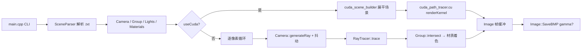

# PA1-2 代码框架

## 项目总览

清华大学 PA1 光线追踪作业：在课程框架上实现 Whitted 追踪、路径追踪、Cook-Torrance 光泽、NEE/MIS、色散、纹理与 CUDA 加速。

```
code/
├── CMakeLists.txt          # 构建 PA1-2 主程序与 gen_textures
├── IMPLEMENTATION.md       # 算法与验收答辩细节
├── REPORT.md               # 实验报告
├── run_all.sh / run_diag.sh# 批量渲染 / CPU-GPU 对比诊断
├── compare_bmp.py          # BMP 像素对比工具
├── include/                # 头文件（几何、材质、追踪器、CUDA 接口）
├── src/                    # 源文件（解析、渲染主循环、GPU 内核）
├── testcases/              # 场景描述 .txt
├── mesh/                   # OBJ 网格资产
├── textures/               # gen_textures 生成的 BMP（运行时创建）
├── build/                  # CMake 构建产物
├── output/                 # 脚本渲染输出（acceptance/、cun/、diag/ 等）
└── results/                # 精选结果图（PNG/BMP，用于报告展示）
```

---

## 目录结构

### include/ — 头文件

| 文件 | 作用 | 关键类/函数 |
|------|------|-------------|
| `camera.hpp` | 相机抽象与透视投影 | `Camera`、`PerspectiveCamera::generateRay()` |
| `ray.hpp` | 光线（原点 + 方向） | `Ray`、`pointAtParameter()` |
| `hit.hpp` | 求交结果（t、法线、UV、TBN） | `Hit`、`setUV()`、`setTBN()` |
| `object3d.hpp` | 可求交物体基类 | `Object3D::intersect()` |
| `sphere.hpp` | 球体求交 + 球面 UV | `Sphere::intersect()` |
| `plane.hpp` | 无限平面求交 + 平面 UV | `Plane::intersect()` |
| `triangle.hpp` | 单三角形求交（Möller 行列式法） | `Triangle::intersect()` |
| `mesh.hpp` | OBJ 三角网格 | `Mesh`、`TriangleIndex`、`intersect()` |
| `transform.hpp` | 4×4 变换包装子物体 | `Transform`、`transformPoint/Direction()` |
| `group.hpp` | 物体集合，遍历求最近交点 | `Group::intersect()`、`addObject()` |
| `material.hpp` | 材质类型与 BRDF | `Material`、`GlossyMaterial`、`ReflectMaterial`、`RefractMaterial`、`EmissiveMaterial`、`CookTorranceBRDF` |
| `texture.hpp` | 2D BMP 纹理采样与程序化生成 | `Texture::sample()`、`sampleNormal()`、`generateShowcaseTextures()` |
| `light.hpp` | 光源 | `DirectionalLight`、`PointLight`、`AreaLight` |
| `scene_parser.hpp` | 场景文件解析接口 | `SceneParser`（`getCamera()`、`getGroup()`、`getLight()` 等） |
| `raytracer.hpp` | **CPU 渲染核心**（header-only） | `RayTracer`、`RenderMode`、`trace()`、`castRayWhitted()`、`castRayPath()`、NEE/MIS 采样 |
| `image.hpp` | 帧缓冲 | `Image::SetPixel()`、`SaveBMP(applyGamma)` |
| `cuda_types.h` | GPU 侧扁平场景数据结构 | `GpuMaterial`、`GpuSphere`、`GpuTriangle`、`GpuSceneHost`、`GpuRenderMode` |
| `cuda_renderer.hpp` | CUDA 渲染入口声明 | `renderWithCuda()`、`cudaAvailable()`、`freeCudaSceneCache()` |
| `cuda_device.hpp` | `__host__`/`__device__` 宏 | `HOST_DEVICE`、`DEVICE` |
| `cuda_alloc.hpp` | CUDA 统一内存分配（可选） | `cudaManagedAlloc()`、`operator new/delete`（`__CUDACC__`） |

### src/ — 源文件

| 文件 | 作用 | 关键类/函数 |
|------|------|-------------|
| `main.cpp` | 程序入口：解析 CLI、加载场景、CPU/CUDA 渲染循环、保存 BMP | `main()`、`parseMode()`、`hash01()` 抖动采样 |
| `scene_parser.cpp` | 解析 `.txt` 场景：相机、背景、光源、材质、Group/Transform/Mesh | `SceneParser::parseFile()`、`parseGlossyMaterial()`、`parseTriangleMesh()` |
| `mesh.cpp` | 加载 OBJ、逐三角形求交、可选顶点法线 | `Mesh::intersect()`、`intersectTriangle()`、`computeNormal()` |
| `image.cpp` | PPM/TGA/BMP 读写；BMP 可选 Gamma 编码 | `SaveBMP()`、`LoadPPM()`、`EncodeColorComponent()` |
| `texture.cpp` | BMP 加载；程序化生成砖/木/石 albedo 与 normal map | `Texture::loadBMP()`、`writeBrickAlbedoBMP()` 等 |
| `gen_textures.cpp` | 独立小工具：生成 `textures/` 目录 | `main()` → `Texture::generateShowcaseTextures()` |
| `cuda_scene_builder.cpp` | 将 CPU `SceneParser` 场景展平为 GPU 数组 | `SceneFlattener`、`buildGpuSceneHost()` |
| `cuda_path_tracer.cu` | **CUDA 渲染内核**（与 CPU 算法对齐） | `renderKernel()`、`initCurandKernel()`、`renderWithCuda()` |

> 第三方依赖：`deps/vecmath/` 提供 `Vector3f`、`Matrix4f` 等线性代数类型，由 `CMakeLists.txt` 链接为静态库 `vecmath`。

### testcases/ — 场景

| 文件 | 用途 |
|------|------|
| `scene01_basic.txt` | 基础 Whitted：单点光 + 多材质球体 |
| `scene02_cube.txt` | 斜视角 `mesh/cube.obj` |
| `scene03_sphere.txt` | 方向光 + 球体 |
| `scene04_axes.txt` | 坐标轴演示（多个变换后的 cube） |
| `scene05_bunny_200.txt` | 低模兔子 `bunny_200.obj` |
| `scene06_bunny_1k.txt` | 高模兔子 `bunny_1k.obj` |
| `scene07_shine.txt` | 高光/镜面材质展示 |
| `scene08_whitted.txt` | **课程 Cornell Box**（点光 + 玻璃 cube），Whitted 验收 |
| `scene08_path.txt` | 同上布局，**面光源 + 发光天花板**，路径追踪 |
| `scene_whitted.txt` | 完整 Cornell Whitted（与 scene08 同类，报告常用） |
| `scene_path.txt` | 完整 Cornell 路径追踪（path vs path_nee 对比） |
| `scene09_glossy.txt` | 光泽球体（Cook-Torrance） |
| `scene_glossy.txt` | 光泽场景（点光；path_nee / path_mis 对比） |
| `scene_mis_demo.txt` | **MIS 三方对比**：小面光 + 近镜面光泽球（firefly 演示） |
| `scene_showcase.txt` | 综合展示：Cornell + 玻璃 cube（色散 before/after） |
| `scene_dispersion.txt` | 玻璃球色散（白地 + 红背景） |
| `scene_prism.txt` | 三角棱镜 `prism.obj`，天花板狭缝 → 后墙彩虹 |
| `scene_prism_darkside.txt` | 暗室棱镜演示（侧光 + 右侧投影屏） |
| `scene_texture.txt` | 纹理贴图（平面/球体 albedo） |
| `scene_texture_mesh_before.txt` | 纹理网格 **before**（无贴图） |
| `scene_texture_mesh.txt` | 纹理网格 **after**（砖/木 albedo） |
| `scene_texture_mesh_normal.txt` | 法线贴图网格（`cornell_*.obj` + normal map） |
| `scene_white_furnace.txt` | Path Guiding 白炉能量守恒自测 |
| `scene_guiding_door.txt` | **门缝狭缝**：暗室 + 后墙竖缝面光，中心球间接照亮 |
| `scene_guiding_indirect.txt` | **无顶棚光 Cornell**：仅左墙发光（三角形法线须指向室内 +X），球体以间接反弹为主 |
| `scene_guiding_window.txt` | **高窗**：暗室后墙高处小窗，地面球体漫反射照明 |
| `scene_guiding_demo.txt` | Path Guiding **报告 A/B 推荐**（门缝变体） |

### mesh/ — 模型

| 文件 | 用途 |
|------|------|
| `cube.obj` | Cornell 玻璃立方体、坐标轴、纹理演示 |
| `bunny_200.obj` / `bunny_1k.obj` | Stanford Bunny 低/高精度 |
| `cornell_floor.obj` / `cornell_left_wall.obj` / `cornell_back_wall.obj` | Cornell 分墙网格（纹理场景） |
| `prism.obj` | 玻璃三角棱镜（色散场景） |
| `textured_cube.obj` | 备用带 UV 立方体（当前 testcases 未引用） |

### output/ 与 results/

| 目录 | 用途 |
|------|------|
| `output/` | `run_all.sh` / 手动渲染的 BMP 输出根目录 |
| `output/acceptance/` | 验收用图 + `README.txt`（记录命令与期望效果） |
| `output/cun/` | CUDA 批量渲染结果 |
| `output/diag/` | `run_diag.sh` CPU/GPU 对比与耗时 |
| `results/` | 报告/答辩精选 PNG（由 acceptance 或手动转换） |

### 根目录其他文件

| 文件 | 作用 |
|------|------|
| `CMakeLists.txt` | 构建 `PA1-2`（可选 CUDA + OpenMP）与 `gen_textures` |
| `IMPLEMENTATION.md` | 算法原理、函数对照、验收坑点（**细节文档**） |
| `REPORT.md` | 实验报告（功能表、原理、截图说明） |
| `run_all.sh` | 批量 CUDA 渲染全部 testcases → `output/` |
| `run_diag.sh` | 选定场景 CPU/GPU 成对渲染 + `compare_bmp.py` |
| `compare_bmp.py` | 两幅 24bpp BMP 逐像素差异统计 |

**构建与运行**：

```bash
cmake -B build && cmake --build build -j$(nproc)
./build/PA1-2 testcases/scene_whitted.txt output/out.bmp whitted gamma cuda
# 用法: <场景> <输出bmp> [whitted|path|path_nee|path_mis] [spp] [gamma] [omp] [dispersion] [cuda]
```

---

## 渲染管线总流程



要点：

1. **场景加载**：`SceneParser` 读 `testcases/*.txt`，构建 C++ 对象树（`Group` + `Transform` + 几何体 + `Material`）。
2. **主循环**：对每个像素采样 `spp` 条光线（`hash01` 子像素抖动），累加后平均。
3. **追踪**：`RayTracer::trace()` 按 `RenderMode` 分发 Whitted 或路径追踪（含 NEE/MIS、色散、RR）。
4. **GPU 路径**：`buildGpuSceneHost()` 将场景转为 `GpuSceneHost`；`renderWithCuda()` 启动 per-pixel 内核，算法与 CPU 对齐。
5. **输出**：`Image::SaveBMP()` 写 24bpp BMP，可选 `gamma` 做 `color^(1/2.2)` 编码。

---

## 模块依赖关系

**include 依赖（自上而下）**：

```
main.cpp
  → scene_parser, image, camera, raytracer [, cuda_renderer]

raytracer.hpp
  → scene_parser, group, light, material, ray, hit

scene_parser.hpp  ←→  camera, light, material, group, mesh, sphere, plane, triangle, transform

object3d.hpp  →  ray, hit, material
group/sphere/plane/triangle/mesh/transform  →  object3d
material.hpp  →  texture, ray, hit

cuda_renderer.hpp  →  scene_parser, image, raytracer
cuda_path_tracer.cu  →  cuda_types, cuda_renderer, scene_parser, image, camera, raytracer
cuda_scene_builder.cpp  →  cuda_types + 全部几何/材质头文件
```

**数据流**：

| 阶段 | 数据结构 |
|------|----------|
| 磁盘 | `.txt` 场景 + `mesh/*.obj` + 可选 `textures/*.bmp` |
| 解析后 | `SceneParser` 持有 `Camera*`、`Group*`、`Light**`、`Material**` |
| CPU 渲染 | `Ray` → `Hit` → `Material::getType()` → `RayTracer` 递归/采样 |
| GPU 渲染 | `GpuSceneHost`（材质/球/面/三角/光源数组 + `GpuCamera`）→ device 内核 |
| 输出 | `Image`（`Vector3f*` 线性 HDR 缓冲）→ BMP 文件 |

---

## 与 IMPLEMENTATION.md 的关系

| 文档 | 定位 |
|------|------|
| **本文件（代码框架.md）** | **结构地图**：目录、文件职责、模块依赖、管线流程；帮助快速定位「代码在哪」。 |
| **IMPLEMENTATION.md** | **算法与验收**：Whitted/Path/NEE/MIS/色散/Gamma/OpenMP/CUDA 的原理、关键函数、伪代码、常见坑；面向答辩。 |
| **REPORT.md** | 实验报告：完成功能表、原理简述、对比图说明。 |

阅读顺序建议：**本文件** → 定位源文件 → **IMPLEMENTATION.md** 理解具体实现 → **REPORT.md** 看实验结论。

---

*生成说明：基于 `/data/PA1-2/code` 当前源码与 testcases 整理；`include/` 与 `src/` 下每个源文件均已列出。*
